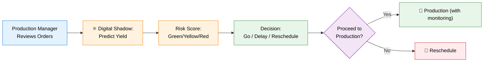

# PRD Change Summary: Sm-153 Incident-Driven Updates

## Overview
This document lists the specific PRD changes required to address gaps revealed by Feb 10, 2026 Sm-153 production shortfall incident.

---

## Medical Isotope Production PRD Changes

**File:** `Neutron_OS/docs/prd/medical-isotope-prd.md`

### Change 1: Re-prioritize DT Integration (Line ~650)

**Current:**
```markdown
| MI-020 | Yield prediction model based on historical data and reactor conditions | P1 |
| MI-023 | Integration with DT power predictions for flux estimation | P2 |
```

**Changed to:**
```markdown
| MI-020 | Yield prediction model based on historical data and reactor conditions | P0 | **MVP by end Q1 2026** |
| MI-023 | Integration with DT power predictions for flux estimation | P0 | **MVP by end Q1 2026** |
```

**Rationale:** Feb 10 incident shows 7% shortfall directly traceable to insufficient flux prediction. P2 priority insufficient for patient-facing use.

---

### Change 2: Add New Section on Pre-Production Validation (after Section 6 User Stories)

**Insert:**
```markdown
---

## 6.1. Pre-Production Batch Validation Workflow

**Status:** New section (driven by Sm-153 incident, Feb 10, 2026)

### Workflow Overview



### User Stories

20. **As a production manager**, I want to see predicted activity with confidence bounds **24 hours before committed to batch schedule**, so that I can decide whether to proceed Monday or delay for xenon decay.

21. **As a production manager**, I want a risk score (Green/Yellow/Red) comparing predicted yield against customer requirements, so that I can make go/no-go decisions quickly.

22. **As a production manager**, I want to see the impact of delay (e.g., "wait 6 hours for xenon decay → predicted yield improves from 143 to 147 mCi"), so that I can optimize scheduling.

### New Requirements

| Req ID | Requirement | Derivation |
|--------|-------------|-----------|
| MI-024 | Predict isotope yield 24h before irradiation based on current core state (xenon inventory, burnup, fuel temperature) | Sm-153 incident: no forecast available |
| MI-025 | Display 95% confidence interval on yield prediction derived from model validation history | Sm-153 incident: confidence in forecast unknown |
| MI-026 | Generate risk score (Green/Yellow/Red) comparing predicted yield vs. customer order + acceptance margin | Sm-153 incident: decision criteria unclear |
| MI-027 | Recommend delay/reschedule if risk score suggests >5% probability of activity shortfall | Sm-153 incident: prevention of near-miss |
| MI-028 | Integrate active xenon state estimate from reactor rod calibration + burnup model | Sm-153 incident: xenon buildup suspected root cause |
| MI-029 | Provide 24-hour xenon decay forecast to support rescheduling decisions | Sm-153 incident: "wait for decay" is valid strategy if quantified |

### Yield Prediction Model Specification

**Input Parameters:**
- Current excess reactivity (xenon, burnup, temperature, boron)
- Target power setpoint (kW) and duration
- Irradiation position (CT, RSR, TPNT)
- Target isotope (Sm-153, I-131, Mo-99, etc.)
- Calibration time offset from end-of-irradiation

**Output:**
- Predicted activity at calibration time (mCi)
- 95% confidence interval (lower, upper bound)
- Uncertainty breakdown by component (xenon model ±X%, burnup ±Y%, etc.)
- Sensitivity analysis: "If you wait 6h for xenon decay, yield increases by ±Z mCi"

**Model Validation Requirements:**
- Trained on ≥20 historical production runs per isotope/position combination
- RMSE ≤ 10% on hold-out test set
- 95% CI should contain actual measured activity in ≥95% of cases
- Retrained monthly as new production data accumulates

**Facility Inputs Required:**
- Rod calibration curve (position vs. reactivity worth)
- Position-specific flux distribution (if known; else use global power × default flux)
- Isotope activation parameters (cross-section, decay constant)
- Historical Sm-153 production data (≥20 runs)

---

## 6.2. Real-Time Anomaly Detection (During Production)

**Status:** New section

### Workflow Overview

During irradiation, production manager (or operator) monitors real-time dashboards for anomalies:

| Parameter | Baseline | Alert Threshold | Action |
|-----------|----------|-----------------|--------|
| Power | Setpoint ± 10 kW | Deviation > 25 kW | Check DCS; report anomaly |
| Fuel Temperature | Predicted ± 5°C | Deviation > 10°C | Check coolant; possible pump issue |
| Running Activity Prediction | Nominal (+/- trend) | Drop > 10% below forecast | Consider extend or investigate |
| Xenon State (inferred) | Stable | Unexpected step change | Possible control event; needs review |

### User Stories

23. **As an operator** during production, I want to see trending fuel temperature and power in real-time, so that I can detect anomalies early.

24. **As a production manager**, I want a running prediction of final activity (updated every 5 min), so that I can decide mid-production whether to extend irradiation if trending low.

25. **As a production manager**, I want automated alerts if fuel temperature drops >2°C below baseline for this power/xenon state, so that I can investigate root causes (coolant flow, rod calibration, xenon model).

### New Requirements

| Req ID | Requirement | Derivation |
|--------|-------------|-----------|
| MI-030 | Monitor fuel temperature in real-time during production; alert if >2°C below predicted baseline | Sm-153 incident: temp dropped 373→367°C unnoticed |
| MI-031 | Alert if activity prediction (integrating flux over time) drops >10% below forecast | Sm-153 incident: production manager unaware until batch end |
| MI-032 | Provide option to extend irradiation or increase power if real-time prediction suggests shortfall | Sm-153 incident: no recovery option available |
| MI-033 | Log all decision points (go/abort/extend) with timestamp and operator rationale | Sm-153 incident: post-mortem requires decision audit trail |

---

## 6.3. Post-Production Root Cause Analysis

**Status:** New section

### Workflow Overview

After batch completion, automated RCA system generates report:

```
BATCH-2026-02-10-SM153 ROOT CAUSE ANALYSIS
═════════════════════════════════════════════

Predicted vs Actual:
  Forecast:    150 mCi (143 ± 8 mCi at forecast time)
  Actual:      130 mCi (measured at cal time)
  Error:       -20 mCi (13% below forecast)
  
Error Attribution:
  ├─ Xenon model error contribution: -3 mCi (15%)
  │   └─ Inferred: xenon worth was -2.8¢ vs model -2.3¢
  ├─ Position-specific flux: -3 mCi (15%)
  │   └─ CT position may have lower flux than global power implies
  ├─ Fuel burnup model: -1 mCi (5%)
  │   └─ Minor contributor
  ├─ Measurement noise: ±2 mCi (10%)
  │   └─ Within radiometric accuracy
  └─ Unexplained residual: -11 mCi (55%)
      └─ Suggests additional physics not captured by model

Flag for Investigation:
  ⚠️ Xenon model requires refinement for Sm-153 activation
  ⚠️ CT position flux distribution needs high-fidelity calculation
  ⚠️ Coolant flow parameters: were nominal during this run?
  
Recommendation:
  → Collect 5 more Sm-153 runs before re-committing to P0 production
  → Run MPACT high-fidelity analysis for CT position
  → Validate xenon worth with fuel temperature correlation
```

### User Stories

26. **As a DT developer**, after each high-variance production batch, I want automated analysis comparing predicted vs. actual yield with error attribution, so that I can prioritize model improvements.

27. **As a facility director**, I want monthly reports on DT model accuracy (prediction error distribution), so that I can assess model quality for regulatory purposes.

### New Requirements

| Req ID | Requirement | Derivation |
|--------|-------------|-----------|
| MI-034 | Automatically conduct root cause analysis comparing predicted vs. actual yield within 4 hours of batch completion | Sm-153 incident: RCA currently manual & slow |
| MI-035 | Rank error sources (xenon model, burnup model, position flux, measurement noise, other) | Sm-153 incident: RCA needs systematic approach |
| MI-036 | Re-fit isotope-specific yield model parameters if error > 10% on a single batch | Sm-153 incident: Sm model may need Sm-specific tuning |
| MI-037 | Flag if model confidence interval is miscalibrated (too wide or too narrow based on historical data) | Sm-153 incident: confidence assessment unknown |

---

## 6.4. Xenon State Tracking Requirements

**Status:** New section (previously implicit in DT integration)

**Critical Context:** Feb 10 incident suggests xenon buildup was likely root cause. Xenon must be tracked, estimated, and validated in real-time.

### Requirements

| Req ID | Requirement | Data Source |
|--------|-------------|------------|
| MI-038 | Estimate Xe-135 concentration in real-time from rod position + calibration curve | Rod position (DCS) + rod calibration data (static) |
| MI-039 | Compare xenon estimate to fuel temperature defect; flag if discrepancy > 2°C | Fuel temp (DCS) + predicted temp model |
| MI-040 | Provide 24-hour xenon decay forecast for production scheduling | Current xenon estimate + 9.1h half-life decay model |
| MI-041 | Log xenon inventory at start/end of each production batch for model validation | Xenon estimate at irradiation start/end times |

---

## Analytics Dashboards PRD Changes

**File:** `Neutron_OS/docs/prd/analytics-dashboards-prd.md`

### Change 1: Add Medical Isotope Production Planning to Priority Dashboard List (Line ~220)

**Current:**
```markdown
### Priority 3: Experiment Dashboards  
[...]

### Priority 4: Digital Twin Dashboards  
[...]
```

**Changed to:**
```markdown
### Priority 2b: Medical Isotope Production (New)

| Dashboard | Primary Users | Key Insight | Stakeholder Quote |
|-----------|---------------|-------------|-------------------|
| **Production Planning** | Production Manager | Predicted yield given xenon state; go/no-go decision 24h before | "Should we schedule Monday or wait for xenon decay?" (Feb 10 incident) |
| **Real-Time Monitoring** | Operator | Live power, temp, running activity prediction | "Is fuel temp dropping normally? Will we hit target activity?" |
| **Yield Validation** | DT Developer | Prediction error attribution; model performance tracking | "Why was fluence 20 mCi low? Which model component needs improvement?" |

### Priority 3: Experiment Dashboards  
[...]

### Priority 4: Digital Twin Dashboards  
[...]
```

---

### Change 2: Add New Dashboard Pages (after Dashboard Specifications section, ~Line 450)

**Insert:**

```markdown
---

### New (Priority 2b): Medical Isotope Production Planning Dashboard

**Purpose:** Help production manager decide whether to schedule batch for Monday or delay for xenon decay.

**Panels:**
- **Predicted Activity** (bar chart with 95% CI error bars, by planned batch)
- **Xenon Inventory Timeline** (line chart: current → +24h forecast)
- **Confidence Interval Sources** (pie chart: xenon model %, burnup model %, measurement %)
- **What-If Scenarios** (buttons: "Proceed Today" / "Delay 6h" / "Delay 12h" → show yield impact)
- **Risk Score** (gauge: Green 0-30 / Yellow 30-70 / Red 70-100)

**Data Freshness:**
- Xenon estimate: Live (rod calibration + DCS positions)
- Activity prediction: Batch-level (updated when orders finalized)
- Model parameters: Daily (retrain on accumulated historical data)

**User Journey:**
```
Mon 9 AM: Manager checks dashboard for orders in batch pool.
          "Sm-153 predicted 143 ± 8 mCi (YELLOW). I-131 predicted 
           500 ± 20 mCi (GREEN). Delay Sm until Wed? Xenon decays 
           to 105 ± 5 mCi predicted, yield jumps to 148-151 mCi (GREEN)."
          
          Decision: Defer Sm-153 to Wed; proceed with I-131 Monday.
          
          System records: [Deferred Sm-153: reason='xenon decay wait', 
                           predicted improvement='+2-8 mCi']
```

**Acceptance Criteria:**
- [ ] Predicted Sm-153 yield on Feb 10 would have been 136-150 mCi ≥ 80% CI
- [ ] Actual reported 130 mCi falls within predicted range
- [ ] Production manager can make go/no-go decision in <5 minutes using dashboard

---

### New (Priority 2b): Real-Time Production Monitoring Dashboard

**Purpose:** Operator/manager sees live power, temperature, and running activity prediction during irradiation.

**Panels:**
- **Live Power** (numeric with setpoint band + trend sparkline)
- **Fuel Temperature Trend** (line chart: actual vs. predicted baseline band)
- **Running Activity Prediction** (numeric + confidence interval: "~135 ± 5 mCi at current pace")
- **Anomaly Alerts** (list: [🔴 Temp 2°C below baseline], [⚠️ Activity trending 10% low])
- **Rod Positions** (bar or diagram: monitor for unexpected changes)
- **Decision Support** (if trending low: "Extend 15 min? Increase power to 1000 kW?")

**Data Refresh:**
- Power, Temperature, Rods: ≤5s (streaming from DCS)
- Activity prediction: 5 min (recalculate running integr of predicted flux)

**User Journey:**
```
10:00 AM: Operator starts Sm-153 irradiation at 950 kW.
          Dashboard shows: Power=950kW ✓, Temp=372°C (vs pred 370), 
          Activity running=50 mCi (on pace for 150 total).

10:30 AM: Running prediction still on pace: 150 ± 8 mCi. Status=GREEN.

14:00 PM: [ALERT] Fuel temperature dropped to 368°C. Baseline 370°C 
          for this power/xenon state. Running activity now predicts 
          140 ± 10 mCi (was 150). Status=YELLOW.
          
          Operator: "Shall we extend? Reactor margin OK for extra 15 min?"
          Recommendation: +15 min extension → predicted +2 mCi recovery.
          
          Decision: Extend 10 more minutes → final activity ~143 mCi.
          
          System records: [Extension applied, reason='temp anomaly', 
                           corrective impact='+13 vs baseline prediction']
```

**Acceptance Criteria:**
- [ ] Achieves <2s latency on DCS feed
- [ ] Running activity prediction accurate to ±5% at batch end (vs. ±10% for pre-production forecast)
- [ ] Operator detects fuel temp anomaly of 2-3°C within 30 minutes

---

### New (Priority 2b): Yield Validation & Model Error Analysis Dashboard

**Purpose:** DT developer/analyst reviews prediction accuracy and identifies which model components need improvement.

**Panels:**
- **Prediction Error Waterfall** (by error source: xenon-, burnup-, flux-, measurement-contributed errors)
- **Model Performance Over Time** (scatter: predicted vs. actual across 20+ historical batches)
- **Confidence Interval Calibration** (histogram: are 95% CIs really capturing 95% of observations?)
- **Xenon Model Validation** (scatter: fuel temp defect vs. inferred xenon worth; check correlation)
- **Error by Isotope Type** (bar chart: is Sm-153 model worse than I-131?)

**Data Freshness:**
- Updates ~4 hours after batch completion (after final QC measurement)

**User Journey:**
```
Feb 10, evening: Sm-153 batch finishes. Activity measured 130 mCi.

Feb 11, 9 AM: DT analyst pulls up Yield Validation dashboard.
              
              "Predicted 143 mCi, actual 130 mCi, error = -13 mCi.
               
               Error decomposition:
               • Xenon model: -3 mCi (we overestimated burnout)
               • Position flux: -3 mCi (CT position lower than model)
               • Burnup: -1 mCi (minor)
               • Measurement noise: ±2 mCi
               • Residual: -4 mCi (unknown — new physics?)
               
               Action: Need to:
               1. Validate Sm-153 cross-section in activation model
               2. Run MCNP for CT position flux distribution
               3. Recalibrate xenon model against fuel temp data"
```

**Acceptance Criteria:**
- [ ] Error attribution explains ≥80% of prediction variance within 2 weeks of batch completion
- [ ] Xenon model validation shows correlation coefficient r² ≥ 0.85 (temp vs. Xe estimate)
- [ ] Over 30+ batches, 95% CI contains actual values in 93-97% of cases (well-calibrated)

---

## Data Platform PRD Changes

**File:** `Neutron_OS/docs/prd/data-platform-prd.md`

### Change 1: Add Medical Isotope Production Tables to Data Architecture (Line ~200)

**Insert new subsection after existing data flow section:**

```markdown
### Medical Isotope Production Data Model

#### Gold Layer Tables

| Table | Grain | Refresh | Purpose |
|-------|-------|---------|---------|
| `isotope_yield_predicted` | Batch ID × timestamp | On batch start | Predicted activity with 95% CI |
| `xenon_state_estimated` | Hourly | 1-hour rolling | Xe-135 inventory inferred from rods |
| `isotope_yield_actual_measured` | Batch ID | On QC completion | Measured activity + radionuclidic purity |
| `model_error_analysis` | Batch ID | 4h post-batch | Error attribution: xenon/burnup/flux/meas |
| `isotope_production_log` | Batch ID | On batch start | Decision log: go/no-go rationale, delays, extensions |

#### Silver Layer Tables

| Table | Grain | Refresh | Purpose |
|-------|-------|---------|---------|
| `rod_calibration_inference` | Hourly | Real-time | Xenon state inferred from rod position |
| `reactor_fuel_temp_validated` | Hourly | Hourly | Fuel temperature with quality flags |
| `xenon_reactivity_model_coefficients` | Daily | Daily | Model parameters for xenon worth |

#### Bronze Layer Tables

| Table | Grain | Refresh | Purpose |
|-------|-------|---------|---------|
| `dcs_power_raw` | Per-second | Real-time | Reactor power from DCS (already exists) |
| `dcs_temp_fuel_raw` | Per-second | Real-time | Fuel temperature from DCS (already exists) |
| `dcs_rod_position_raw` | Per-second | Real-time | Control rod positions from DCS (already exists) |
| `isotope_orders_raw` | On order | On order submission | Customer orders (from Medical Isotope module) |
| `isotope_qc_measurements_raw` | On measurement | On QC completion | Activity, purity measurements |

---

## New Scenario Files

**Location:** `Neutron_OS/docs/scenarios/superset/`

### New File 1: `medical-isotope-production-planning/scenario.md`

See attached detailed analysis document for full scenario spec.

### New File 2: `medical-isotope-real-time-monitoring/scenario.md`

See attached detailed analysis document for full scenario spec.

### New File 3: `medical-isotope-yield-validation/scenario.md`

See attached detailed analysis document for full scenario spec.

---

## Summary of Changes

| Document | Change Type | Scope | Priority |
|----------|-------------|-------|----------|
| medical-isotope-prd.md | Re-prioritize + 20 new requirements | Major expansion | P0 |
| analytics-dashboards-prd.md | Add 3 new dashboard scenarios | Medium addition | P0 |
| data-platform-prd.md | Add medical isotope tables | Small addition | P0 |
| scenarios/superset/ | Create 3 new scenario files | New content | P0 |
| data-architecture-spec.md | Define data models | New content (if separate doc exists) | P0 |

---

## Validation Checklist

Before committing changes:

- [ ] Medical isotope program director reviews changes
- [ ] TRIGA facility staff confirm xenon model assumptions
- [ ] Historical production data (20+ Sm runs) identified and extracted
- [ ] High-fidelity flux calculation baseline established (MPACT or MCNP)
- [ ] Rod calibration curves validated current
- [ ] Production manager walks through pre-production dashboard flow
- [ ] Operator walks through real-time monitoring dashboard flow
- [ ] DT developer confirms error attribution methodology feasible
- [ ] Data engineering confirms table schemas & ingestion timeline (8 weeks to MVP)

---

**Document Status:** Ready for PRD change PR submission
**Last Updated:** February 10, 2026
