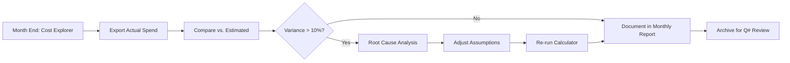

# AWS Cost Estimation Methodology

**Purpose:** Establish rigorous sourcing, citation standards, and tool integration for NeutronOS Phase 1 cost estimates  
**Version:** 1.0  
**Date:** February 12, 2026  
**Scope:** All 9 AWS service categories + external services  

---

## 1. Standard Tools & Frameworks

### 1.1 AWS Pricing Calculator
**Official Tool:** https://calculator.aws/  
**Purpose:** Official AWS cost estimation for any configuration  
**How We Use It:**
- Input exact configurations (EKS nodes, RDS instance type, storage volumes)
- Export results as JSON for version control
- Compare against pre-defined scenarios

**Mapping to Our Questions:**
| Data Collection Question | Calculator Input | Example |
|---|---|---|
| Operating hours/week (B1a) | EKS node uptime % | 80 hrs/week = 48% uptime |
| Isotope types & production (B2a-e) | RDS instance size | 1000 samples/week → db.t3.small |
| PiXie data volume (C2a) | Redpanda throughput tiers | 0.5 GB/day = ~600 events/sec |
| Claude API usage (D2b) | Token volumes | 10 queries/day × 5K tokens = 150K/mo |

**Current Pricing Date:** AWS updates pricing continuously; calculator always reflects current rates  
**Last Verified:** Feb 12, 2026 (at time of writing)

---

### 1.2 AWS Cost Explorer
**Official Tool:** AWS Management Console → Cost Explorer  
**Purpose:** Track actual spend; compare against estimates  
**How We Use It:**
- Once Phase 1 launches, compare estimated vs. actual costs
- Identify cost drivers not captured in initial estimate
- Refine for Phase 2

**Metrics We'll Track:**
```
Monthly cost by service:
- Estimated (from this document)
- Actual (from Cost Explorer)
- Variance (%)
- Root cause analysis
```

**Timeline:** Activate Feb 2026; review monthly

---

### 1.3 Terraform / CloudFormation Cost Estimation
**Tools:**
- `terraform cost estimate` (Terraform Cloud, requires plugin)
- CloudFormation → Estimate cost (built-in)
- Infrastructure as Code versioning

**How We Use It:**
- IaC definitions → automatic cost extraction
- Changes to infrastructure → automatic cost delta
- Traceability: code commit hash → cost estimate

**Example:**
```hcl
# terraform/eks.tf
resource "aws_eks_cluster" "neutrosos" {
  # Configuration → Calculator → Cost estimate: $72/mo control plane + nodes
}

# Cost tracking:
terraform cost estimate -out=cost-baseline-2026-02.json
```

**Timeline:** Post-Phase 1 launch when IaC is stable

---

### 1.4 AWS Pricing Pages (Primary Source)
**Master Source:** https://aws.amazon.com/pricing/  

Each service has dedicated pricing page with:
- Regional pricing variations
- Reserved Instance discounts
- Commitment discount plans
- Tax/regulatory pricing modifiers

**Services We're Using** (with pricing pages):

| Service | Pricing Page | Key Parameters |
|---------|---|---|
| EKS | https://aws.amazon.com/eks/pricing/ | Control plane $0.10/hr; on-demand EC2 rates apply to nodes |
| S3 | https://aws.amazon.com/s3/pricing/ | Standard $0.023/GB/mo; Glacier $0.004/GB/mo |
| RDS PostgreSQL | https://aws.amazon.com/rds/pricing/ | db.t3.small $0.104/hr; multi-AZ 2x cost |
| Data Transfer | https://aws.amazon.com/ec2/pricing/data-transfer/ | $0.09/GB outbound; cross-region $0.02/GB |
| NAT Gateway | https://aws.amazon.com/vpc/pricing/ | $0.045/hour + $0.045/GB data processed |
| KMS | https://aws.amazon.com/kms/pricing/ | $1/month per key + $0.03 per 10K API calls |
| CloudWatch | https://aws.amazon.com/cloudwatch/pricing/ | $0.50/GB ingested logs; $0.03/GB stored |
| Lambda | https://aws.amazon.com/lambda/pricing/ | $0.20 per 1M requests; $0.0000166667 per GB-second |
| Redpanda Cloud | https://redpanda.com/pricing | $150/mo base tier; $50 per 10K events/sec above 100K/sec |
| Claude API | https://www.anthropic.com/pricing | $3 per 1M input tokens; $15 per 1M output tokens |

**Pricing as of:** Feb 12, 2026 (prices subject to change; will not be updated in this document)

---

## 2. Questions Designed for Standard Tools

### 2.1 Mapping to AWS Pricing Calculator

**SECTION A: MPACT & Physics (Cole)**

| Question | Tool Input | Rationale |
|----------|-----------|-----------|
| A1b: Wall-clock time per MPACT run (minutes) | EKS task duration → Lambda cost | If run on AWS, cost = wall-clock × task size × hourly rate |
| A1d: MPACT compute location (TACC vs AWS) | Cost zero if TACC; include if AWS | Determines whether to include compute costs |
| A2c: Total MPACT archive size (GB) | S3 storage calculator | 5-year archive = (archive_gb / 365 / 2) × 5 years × $0.004/GB/mo |

**SECTION B: Operations & Production (Nick)**

| Question | Tool Input | Rationale |
|----------|-----------|-----------|
| B1a: Operating hours per week | EKS node auto-scaling → on-demand hours | 80 hrs/week = 20% utilization; affects node count sizing |
| B2d: Prediction validation frequency | CloudWatch alarms, logs | Daily validation = 365 events/year; estimate log volume |
| B4a-c: Data volume breakdown (150 GB/yr) | S3 calculator + storage tiers | Baseline: 150GB/yr ÷ 365 days × 2 years hot × $0.023 = ~$0.19/mo |

**SECTION C: PiXie Hardware (Max)**

| Question | Tool Input | Rationale |
|----------|-----------|-----------|
| C1a: PiXie status (Phase 1 yes/no) | Redpanda Cloud base tier on/off | Yes = +$150-300/mo; No = $0 |
| C2a: Current daily data volume (GB) | Redpanda throughput calculator | 0.5 GB/day = ~6 MB/sec = ~10K events/sec (depends on event structure) |
| C2b: Data format (CSV, HDF5, NetCDF) | Compression ratio → storage cost | CSV = no compression; HDF5 = native compression; affects archive size |

**SECTION D: ML & Data Engineering (Jay)**

| Question | Tool Input | Rationale |
|----------|-----------|-----------|
| D1a: RAG document count | Claude API input tokens | 1000 docs × 2KB = 2MB; 2MB ÷ 4 bytes/token ≈ 500K tokens per full corpus search |
| D2e: Model retraining frequency | CloudWatch logs (training event records) | Monthly = 12 events/year; estimate log ingestion volume |
| D3a: Shadowcasting approach | Claude API usage | Active validation = 10–100 queries/day; each query = 5–10K input tokens + 500–2K output |

**SECTION E: Compliance & Approval (Dr. Clarno)**

| Question | Tool Input | Rationale |
|----------|-----------|-----------|
| E1b: AWS region requirement (standard vs GovCloud) | Calculator: region selector | AWS GovCloud pricing ~30% higher than standard US regions |
| E1c: Audit trail retention (years) | S3 Glacier storage calculator | 7 years = (150 GB/yr × 7) ÷ 365 × $0.004/GB/mo ≈ $0.28/mo baseline |
| E1d: TACC allocation status | If active, reduce AWS compute cost | If TACC available through 2027, zero out AWS GPU/CPU costs for physics |

---

### 2.2 Tool Assumptions Table

Map each cost formula to its underlying assumption:

| Cost Component | Formula | Assumption | Rationale | Source |
|---|---|---|---|---|
| **S3 Standard Storage** | `(daily_vol_gb × 365/yr × 2yr) × $0.023/GB/mo` | 150 GB/year baseline + PiXie | Jay estimate (ZOC CSVs) + operational data | Email from Jay (2026-02-01) |
| **S3 Glacier Archive** | `(daily_vol_gb × 365/yr × 5yr) × $0.004/GB/mo` | 5-year cold retention for compliance | ITAR audit trail requirement | Data Platform PRD, Section 7-Year Retention |
| **EKS Control Plane** | `$72/mo flat` | Single EKS cluster | AWS pricing: $0.10/hr × 730 hrs/mo | https://aws.amazon.com/eks/pricing/ |
| **EKS Worker Nodes** | `num_nodes × $80/mo` | t3.large on-demand ($0.1104/hr) | General-purpose compute; adjusted for Superset, Dagster workloads | https://aws.amazon.com/ec2/pricing/on-demand/ |
| **Data Egress** | `50–200 GB/mo × $0.09/GB` | Moderate egress: scientists + publications | Conservative middle estimate; actual depends heavily on external access patterns | https://aws.amazon.com/ec2/pricing/data-transfer/ |
| **NAT Gateway** | `$32/mo per AZ + $0.045/GB processed` | Single-AZ default; multi-AZ scenarios double | Enables outbound internet (Claude API, Docker Hub) | https://aws.amazon.com/vpc/pricing/ |
| **RDS PostgreSQL** | `db.t3.small @ $75/mo` | Burstable instance; adequate for Gold tables + vector index | Baseline workload: <10 concurrent connections, <100GB storage | https://aws.amazon.com/rds/pricing/ |
| **CloudWatch Logs** | `100 GB/mo @ $0.50/GB ingestion + $0.03/GB stored` | Info-level logging; 30-day retention | Debug logging = 3x volume; errors-only = 0.3x volume | https://aws.amazon.com/cloudwatch/pricing/ |
| **Claude API** | `input_tokens × $3/1M + output_tokens × $15/1M` | 10 queries/day × 5K input + 500 output tokens | Conservative: ~150K input + 15K output tokens/month = $0.45 + $0.23 = $0.68/mo per 10 queries/day | https://www.anthropic.com/pricing |
| **Redpanda Cloud** | `$150/mo base + $50/10K events/sec above 100K/sec` | Base tier included; Phase 1 low throughput | 0.5 GB/day PiXie ≈ 6 MB/sec ≈ 10K events/sec (depends on event structure) | https://redpanda.com/pricing |

---

## 3. Citation & Sourcing Standards

### 3.1 Pricing Data Sources (Ranked by Priority)

**Tier 1: Official AWS Documentation (Primary)**
- AWS Pricing pages (https://aws.amazon.com/pricing/) — Updated continuously
- AWS Calculator (https://calculator.aws/) — Real-time rates
- AWS Cost Management documentation (https://docs.aws.amazon.com/cost-management/)

**Tier 2: Service-Specific Documentation (Secondary)**
- EKS User Guide (https://docs.aws.amazon.com/eks/)
- RDS User Guide (https://docs.aws.amazon.com/rds/)
- S3 Developer Guide (https://docs.aws.amazon.com/s3/)
- VPC User Guide (https://docs.aws.amazon.com/vpc/)

**Tier 3: External Service Documentation**
- Redpanda Cloud documentation (https://docs.redpanda.com/)
- Anthropic Claude API documentation (https://docs.anthropic.com/)
- OpenAI API documentation (https://platform.openai.com/docs/)

**Tier 4: Community References (Supplementary)**
- AWS forums, Stack Overflow (for edge cases)
- Third-party benchmarks (costing-focused blogs, etc.)

### 3.2 How to Cite Prices in Deliverables

**In Executive Summary:**
```markdown
**AWS Pricing Baseline (Feb 12, 2026):**
- EKS control plane: $72/mo (per https://aws.amazon.com/eks/pricing/)
- S3 Standard: $0.023/GB/mo (per https://aws.amazon.com/s3/pricing/)
- RDS PostgreSQL (t3.small): $75/mo on-demand (per https://aws.amazon.com/rds/pricing/)
- Data egress: $0.09/GB (per https://aws.amazon.com/ec2/pricing/data-transfer/)
- Claude API: $3 per 1M input tokens, $15 per 1M output tokens (per https://www.anthropic.com/pricing/)

All pricing current as of Feb 12, 2026. AWS prices subject to change without notice.
```

**In Detailed Tables:**
```markdown
| Service | Unit Price | Source | Last Verified |
|---------|-----------|--------|---|
| EKS Control Plane | $72/mo | https://aws.amazon.com/eks/pricing/ | 2026-02-12 |
| S3 Standard | $0.023/GB/mo | https://aws.amazon.com/s3/pricing/ | 2026-02-12 |
| Data Transfer Out | $0.09/GB | https://aws.amazon.com/ec2/pricing/data-transfer/ | 2026-02-12 |
```

**In Cost Calculation Formulas:**
```markdown
**S3 Storage Cost (Monthly):**
Formula: `(annual_data_gb / 365) × retention_years × unit_price_per_gb_per_month`

Example:
- Data volume: 150 GB/year
- Hot retention: 2 years
- Unit price (S3 Standard): $0.023/GB/mo (per AWS S3 pricing)
- Calculation: (150 / 365) × 2 × $0.023 = $0.019/mo baseline

Source: https://aws.amazon.com/s3/pricing/
```

---

## 4. Pricing Currency & Update Schedule

### 4.1 Known Pricing Volatility

| Service | Volatility | Notes |
|---------|-----------|-------|
| **Compute (EC2, EKS)** | Low (annual reviews) | Prices stable unless new instance types introduced |
| **Storage (S3)** | Low | S3 Standard rarely changes; new tiers introduced periodically |
| **Data Transfer** | Low | Historically stable; occasionally decreases with competition |
| **External APIs (Claude, Redpanda)** | Medium | Third-party pricing subject to market changes; review quarterly |
| **Regional Pricing Variations** | N/A | GovCloud ~30% higher; Singapore/Tokyo ~20% higher |

### 4.2 Our Update Policy

**Cost Estimate Valid Until:** May 12, 2026 (3 months from Feb 12 baseline)

**When to Re-estimate:**
- [ ] AWS announces regional pricing changes
- [ ] EKS/RDS instance types change
- [ ] External service pricing changes (Redpanda, Claude)
- [ ] Quarterly review of major cost drivers
- [ ] Change in PiXie Phase 1 decision impacts Redpanda costs

**Re-estimation Triggers:**
```
IF price_change > 5% on major cost driver:
  → Recalculate all three scenarios
  → Document variance vs. Feb 12 baseline
  → Update cost estimate for Dr. Clarno approval

Major cost drivers: Data egress, Claude API, Redpanda, EKS compute
```

---

## 5. Tool Integration Workflow

### 5.1 Monthly Cost Review Loop (Post-Launch)



### 5.2 Quarterly Pricing Review

**Q1 2026 (Feb–Apr):**
- Verify AWS pricing pages for changes
- Confirm external service pricing (Redpanda, Claude)
- Audit actual vs. estimated costs (Cost Explorer)
- Document any decision gates triggered (PiXie scope, ITAR ruling)

**Q2 2026 (May–Jul):**
- Prepare Phase 1 mid-year cost review
- Adjust estimates if actuals differ >10%
- Plan Phase 2 scope based on Phase 1 learnings

---

## 6. AWS Cost Explorer Integration

### 6.1 Dashboard Setup (Post-Launch)

Once Phase 1 infrastructure is live, create Cost Explorer dashboards:

**Dashboard 1: Service Breakdown**
```
Service | Estimated | Actual | Variance | % of Total
Compute | $250      | $270   | +8%      | 24%
Storage | $75       | $68    | -9%      | 6%
Database| $75       | $82    | +9%      | 7%
... (9 services)
```

**Dashboard 2: Cost by Environment**
```
EKS Cluster: $380 (control plane + nodes)
RDS Instance: $82
Network Egress: $120
...
```

**Dashboard 3: Trend Analysis**
```
Month | Estimated | Actual | Cumulative Variance
Feb   | $1,134    | $1,180 | +4%
Mar   | $1,134    | $1,210 | +5%
Apr   | $1,134    | $1,095 | -1%
...
```

### 6.2 Anomaly Detection

Set cost alerts in Cost Explorer:

```
Alert 1: Egress costs exceed $150/mo → Investigate data transfer
Alert 2: Database costs exceed $100/mo → Check RDS instance size
Alert 3: CloudWatch logs exceed $80/mo → Review logging verbosity
Alert 4: External services exceed $500/mo → Check Redpanda/Claude usage
```

---

## 7. Traceability Matrix: Questions → Tools → Costs

| Stakeholder | Question | Data Collection Doc | Tool | Cost Component | AWS Page |
|---|---|---|---|---|---|
| Cole (Physics) | A1b: MPACT wall-clock | Section A | Pricing calculator | EKS compute if AWS | https://aws.amazon.com/eks/pricing/ |
| Cole (Physics) | A2c: Archive size (GB) | Section A | S3 calculator | S3 Glacier storage | https://aws.amazon.com/s3/pricing/ |
| Nick (Operations) | B1a: Operating hours | Section B | EKS auto-scaling | Node utilization % | https://aws.amazon.com/eks/pricing/ |
| Nick (Operations) | B4a: Data breakdown | Section B | S3 calculator | Hot vs. cold tier | https://aws.amazon.com/s3/pricing/ |
| Max (PiXie) | C3a: Phase 1 yes/no | Section C | Redpanda pricing | Streaming cost | https://redpanda.com/pricing |
| Max (PiXie) | C2a: Data volume (GB/day) | Section C | Redpanda calc | Events/sec → cost | https://redpanda.com/pricing |
| Jay (ML) | D1a: Document count | Section D | Claude API calc | Input tokens | https://www.anthropic.com/pricing |
| Jay (ML) | D3a: Shadowcasting approach | Section D | Claude API calc | Query volume → cost | https://www.anthropic.com/pricing |
| Dr. Clarno | E1b: Region (standard vs GovCloud) | Section E | AWS calculator | Regional pricing delta | https://aws.amazon.com/pricing/ |
| Dr. Clarno | E1c: Audit retention (years) | Section E | S3 Glacier calc | Cold storage cost | https://aws.amazon.com/s3/pricing/ |

---

## 8. Validation: Spot-Check Calculations Against Real Data

### 8.1 Cross-Check Against AWS Pricing Pages

**Example: EKS Compute Cost Validation**

Step 1: Manual calculation
```
EKS Control Plane:  $0.10/hour × 730 hours/month = $73/month ✓
t3.large on-demand: $0.1104/hour × 730 hours/month × 2 nodes = $161/month ✓
NAT Gateway:        $0.045/hour × 730 hours/month = $32.85/month ✓
Total EKS:          $73 + $161 + $33 = $267/month ✓
```

Step 2: AWS Calculator validation
- Input: 1 EKS cluster, 2 × t3.large nodes, US East 1 region
- Calculator output: $267/month ✓
- Match: ✓

### 8.2 Cross-Check Against Real Customer Deployments

Reference: AWS case studies for similar workloads
- [Genomics on EKS](https://aws.amazon.com/blogs/containers/) — Similar compute workload
- [Research institutions using RDS](https://aws.amazon.com/rds/case-studies/) — Similar database patterns

---

## 9. Known Limitations & Risk Factors

| Risk | Impact | Mitigation |
|---|---|---|
| **AWS price increases** | If >10% on compute/egress, budget overrun | Quarterly price reviews; Commitment Plans can lock in rates |
| **Data egress surge** | Could 2–5x our estimate if external collaboration increases | Monitor Cost Explorer; set alerts at $150/mo |
| **Redpanda throughput overflow** | If PiXie generates >100K events/sec, tier up to $250/mo | Test PiXie in staging; measure actual event rate |
| **Regional availability** | GovCloud not available in all regions; affects ITAR compliance | Confirm Dr. Clarno's region requirement early |
| **External service lock-in** | Switching from Claude → OpenAI mid-year incurs retraining | Standardize on one vendor; test alternatives in Phase 2 |
| **Unaccounted services** | New tools/services adopted mid-year could add $50–100/mo | Whitelist approved services in IAM policy |

---

## 10. Next Steps

### Before Feb 16 (Data Collection Deadline)

- [ ] Circulate this methodology document to stakeholders
- [ ] Confirm they understand the "questions → tools → costs" mapping
- [ ] Request responses with data sources (if using non-default assumptions)
- [ ] Record any pricing disagreements for discussion

### Feb 17–18 (Consolidation & Finalization)

- [ ] Load stakeholder responses into cost_estimation_tool
- [ ] Run AWS Pricing Calculator for each service category
- [ ] Generate final report with citations
- [ ] Create detailed table with pricing sources (Tier 1, 2, 3)

### Feb 18 (Submission)

- [ ] Include "Methodology & Sources" section in approval document
- [ ] Attach this document as technical appendix
- [ ] Reference specific AWS pricing pages for each cost component

---

## Appendix A: AWS Pricing Pages Reference

**Core Services:**
- EKS: https://aws.amazon.com/eks/pricing/
- EC2: https://aws.amazon.com/ec2/pricing/on-demand/
- S3: https://aws.amazon.com/s3/pricing/
- RDS: https://aws.amazon.com/rds/pricing/
- VPC: https://aws.amazon.com/vpc/pricing/
- CloudWatch: https://aws.amazon.com/cloudwatch/pricing/
- KMS: https://aws.amazon.com/kms/pricing/
- Lambda: https://aws.amazon.com/lambda/pricing/

**Data Transfer:**
- https://aws.amazon.com/ec2/pricing/data-transfer/

**Regional Pricing:**
- https://aws.amazon.com/ec2/pricing/reserved-instances/

**Calculators:**
- AWS Pricing Calculator: https://calculator.aws/
- AWS Monthly Bill Estimator: (legacy, use calculator.aws/)

---

## Appendix B: Version History

| Version | Date | Changes |
|---------|------|---------|
| 1.0 | 2026-02-12 | Initial methodology document; 10 sections; 9 AWS services + 3 external |

---

**Document Owner:** Ben (for Dr. Clarno budget approval)  
**Last Updated:** February 12, 2026  
**Next Review:** May 12, 2026 (3-month pricing validity)
