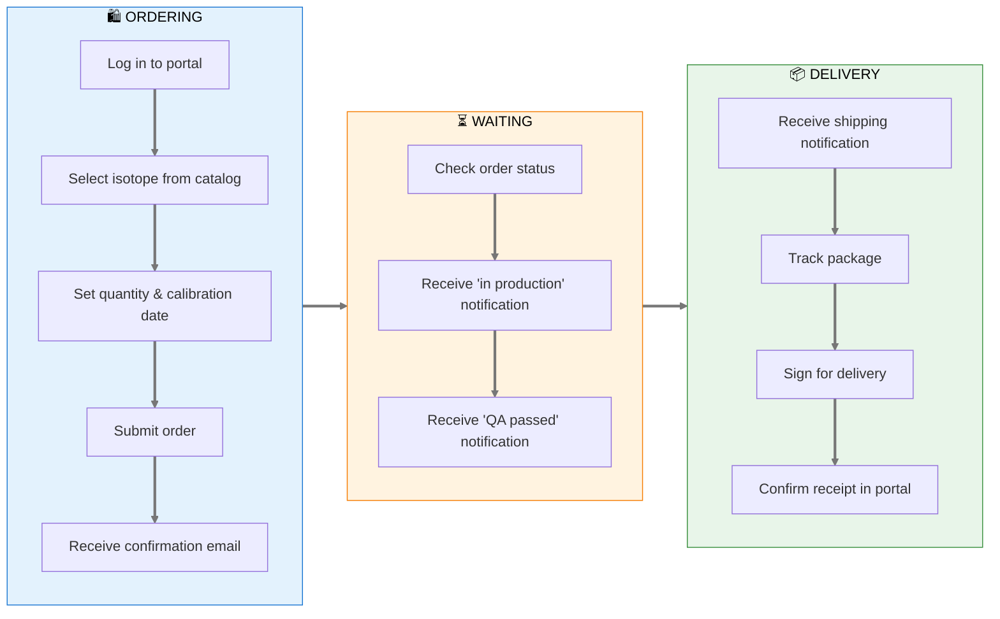
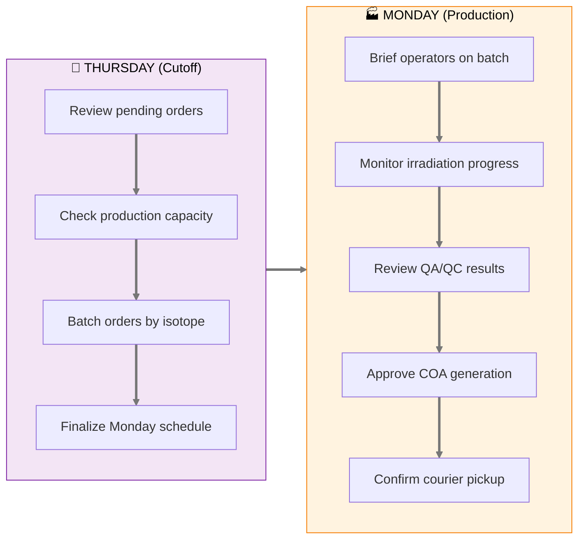
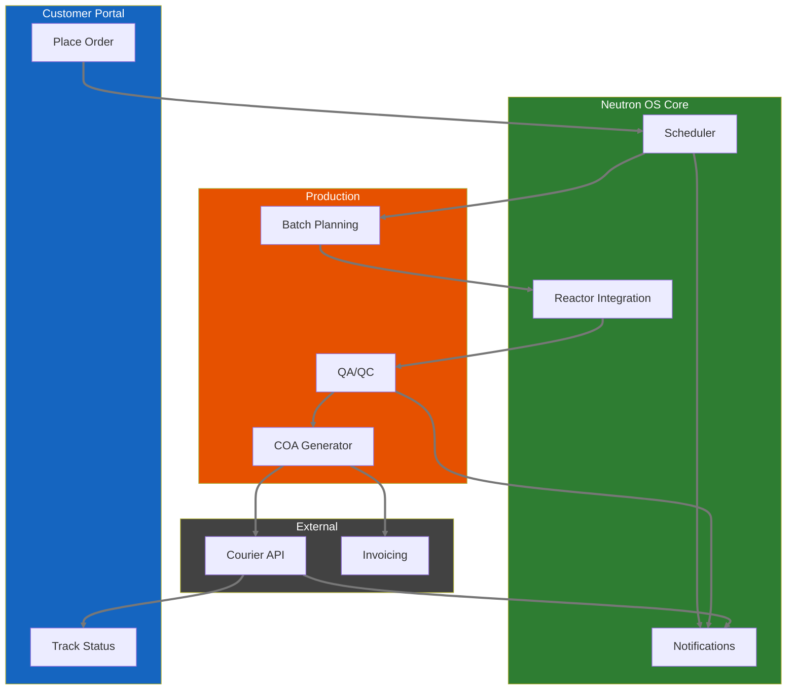
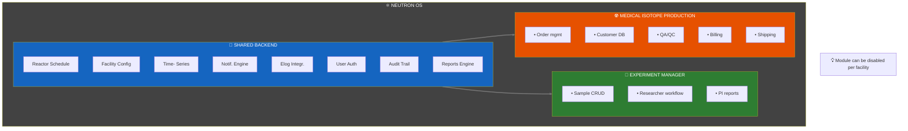

# Product Requirements Document: Medical Isotope Production

**Module:** Medical Isotope Production & Fulfillment  
**Status:** Draft  
**Last Updated:** January 21, 2026  
**Module Type:** Optional (configurable on/off per facility mission)  
**Related Module:** [Experiment Manager](experiment-manager-prd.md) (shared backend, different workflow)  
**Parent:** [Executive PRD](neutron-os-executive-prd.md)

---

## Executive Summary

The Medical Isotope Production module manages the end-to-end workflow for producing and delivering medical radioisotopes to healthcare providers. It replaces the current manual process (phone calls, spreadsheets, weekly production schedules) with a digital system that handles ordering, production scheduling, quality assurance, fulfillment, and delivery tracking.

**Key Distinction from Experiment Manager:**
- **Experiment Manager:** Researcher-initiated, variable samples, research outcomes
- **Medical Isotope Production:** Customer-initiated orders, standardized products, patient care outcomes

Both share technical backend (scheduling, tracking, reactor integration) but serve fundamentally different workflows and stakeholders.

---

## User Journey Map

### Hospital Customer: Order to Delivery



### Production Manager: Weekly Batch



### Order State Machine

```mermaid
stateDiagram-v2
    [*] --> Ordered: Customer submits
    Ordered --> Scheduled: PM assigns to batch
    Scheduled --> Producing: Irradiation starts
    Producing --> QA_Pending: Irradiation complete
    
    QA_Pending --> Passed: All tests pass
    QA_Pending --> Rejected: Any test fails
    
    Passed --> Packaged: Shipping prep
    Packaged --> Shipped: Courier pickup
    Shipped --> Delivered: Customer confirms
    Delivered --> [*]
    
    Rejected --> Reordered: Customer notified
    Reordered --> Scheduled: Next batch
    linkStyle default stroke:#777777,stroke-width:3px
```

### System Integration



---

## Current State (to be validated)

Based on typical research reactor medical isotope programs:

> **Production cadence:** Weekly, typically Mondays
> 
> **Ordering process:** Phone calls and emails to reactor staff
> 
> **Tracking:** Spreadsheets, paper records
> 
> **Delivery:** Courier pickup on production day
> 
> **Customers:** Hospital nuclear medicine departments, radiopharmacies, research institutions

**Pain points (hypothesized):**
- No self-service ordering for repeat customers
- Manual coordination between customer requests and production schedule
- Limited visibility into order status
- Paper-based QA/QC records
- Reactive (not proactive) communication about delays

---

## User Stories

### Primary Users

| User | Need |
|------|------|
| **Hospital/Radiopharmacy Staff** | Order isotopes reliably, know when they'll arrive |
| **Reactor Production Manager** | See all orders, plan production batch, track fulfillment |
| **QA/QC Officer** | Document quality checks, certify shipments |
| **Courier/Logistics** | Know pickup times, receive shipping documentation |
| **Billing/Admin** | Generate invoices, track payments |
| **Facility Director** | See production metrics, revenue, capacity utilization |

### User Stories: Ordering

1. **As a hospital nuclear medicine tech**, I want to place a standing order for I-131 (same quantity, same day each week) so that I don't have to call every week.

2. **As a hospital buyer**, I want to see available isotopes and current lead times so that I can plan patient treatments.

3. **As a new customer**, I want to request an account and see pricing before committing.

4. **As an existing customer**, I want to view my order history and reorder with one click.

5. **As a customer**, I want to receive automatic confirmation when my order is accepted and updates when it ships.

### User Stories: Production

6. **As a production manager**, I want to see all orders for the upcoming production cycle so that I can batch similar isotopes efficiently.

7. **As a production manager**, I want to flag when demand exceeds capacity so that I can prioritize or reschedule orders.

8. **As an operator**, I want a production checklist that guides me through irradiation steps for each isotope type.

9. **As a production manager**, I want to record actual production quantities (may differ from target due to yield variations).

### User Stories: Quality & Compliance

10. **As a QA officer**, I want to record quality measurements (activity, purity, sterility) against acceptance criteria.

11. **As a QA officer**, I want to generate a Certificate of Analysis (COA) for each shipment.

12. **As a compliance officer**, I want immutable records of all production and QA activities for FDA/NRC inspection.

13. **As a QA officer**, I want to reject a batch if it doesn't meet specifications and notify the customer.

### User Stories: Fulfillment & Delivery

14. **As a shipping coordinator**, I want to generate shipping labels and DOT-compliant documentation.

15. **As a courier**, I want to know exactly when packages are ready for pickup.

16. **As a customer**, I want real-time tracking of my shipment.

17. **As a customer**, I want proof of delivery with timestamp and signature.

### User Stories: Analytics

18. **As a facility director**, I want to see monthly production volume, revenue, and on-time delivery rate.

19. **As a production manager**, I want to see yield trends over time (are we getting better or worse at production?).

---

## Isotope Catalog (Configurable)

Example products for a TRIGA facility (actual catalog varies):

| Isotope | Half-Life | Common Use | Typical Order Unit | Production Method |
|---------|-----------|------------|-------------------|-------------------|
| I-131 | 8.0 days | Thyroid treatment | mCi | Fission product extraction |
| Mo-99/Tc-99m | 66h / 6h | Diagnostic imaging | Generator | Fission product or (n,γ) |
| Lu-177 | 6.7 days | Cancer therapy | mCi | (n,γ) on Lu-176 |
| Ir-192 | 74 days | Brachytherapy | Seeds | (n,γ) on Ir-191 |
| Co-60 | 5.3 years | Radiation therapy | Sources | (n,γ) on Co-59 |
| P-32 | 14.3 days | Research/therapy | mCi | (n,γ) on S-32 |

**Configurable per facility:**
- Which isotopes are offered
- Pricing per unit
- Minimum/maximum order quantities
- Lead time requirements
- Available production days

---

## Workflow Stages

```mermaid
flowchart LR
    subgraph ROW1[" "]
        direction LR
        ORDERED["**ORDERED** Customer submits"]
        SCHEDULED["📅 **SCHEDULED** Batched for production"]
        PRODUCING["⚛️ **PRODUCING** In reactor or lab"]
        QAQC["🔬 **QA/QC** Activity, purity test"]
    end

    subgraph ROW2[" "]
        direction LR
        PASSED["✅ **PASSED** COA issued"]
        PACKAGED["📦 **PACKAGED** DOT ready for pickup"]
        SHIPPED["🚚 **SHIPPED** In transit"]
        DELIVERED["🎯 **DELIVERED** Confirmed receipt"]
    end

    REJECTED["❌ **REJECTED** Customer notified"]

    ORDERED --> SCHEDULED --> PRODUCING --> QAQC
    QAQC --> PASSED
    QAQC -->|"if failed"| REJECTED
    PASSED --> PACKAGED --> SHIPPED --> DELIVERED

    style ORDERED fill:#1565c0,color:#fff
    style SCHEDULED fill:#1565c0,color:#fff
    style PRODUCING fill:#e65100,color:#fff
    style QAQC fill:#7b1fa2,color:#fff
    style PASSED fill:#2e7d32,color:#fff
    style PACKAGED fill:#2e7d32,color:#fff
    style SHIPPED fill:#2e7d32,color:#fff
    style DELIVERED fill:#2e7d32,color:#fff
    style REJECTED fill:#c62828,color:#fff
    style ROW1 fill:none,stroke:none
    style ROW2 fill:none,stroke:none
    linkStyle default stroke:#777777,stroke-width:3px
```



### Stage Transitions

| From | To | Trigger | Data Captured |
|------|-----|---------|---------------|
| Ordered | Scheduled | Manager assigns to production batch | Production date, batch ID |
| Scheduled | Producing | Irradiation begins | Start time, reactor conditions |
| Producing | QA/QC | Irradiation complete, sample ready | End time, actual activity |
| QA/QC | Passed | All QC checks pass | QC measurements, COA |
| QA/QC | Rejected | Any QC check fails | Failure reason |
| Passed | Packaged | Package prepared | Package ID, DOT class |
| Packaged | Shipped | Courier picks up | Tracking number, pickup time |
| Shipped | Delivered | Customer confirms receipt | Delivery time, signature |

---

## Order Schema

| Field | Type | Description | Example |
|-------|------|-------------|---------|
| order_id | UUID | System-assigned | 550e8400-... |
| order_number | string | Human-readable | MIP-2026-0042 |
| customer_id | UUID | Link to customer record | |
| isotope_code | enum | From catalog | I-131 |
| quantity_ordered | decimal | Requested amount | 50.0 |
| quantity_unit | enum | mCi, µCi, MBq, etc. | mCi |
| calibration_datetime | timestamp | When activity should be calibrated to | 2026-01-27T12:00:00Z |
| requested_delivery_date | date | Customer's requested date | 2026-01-27 |
| actual_delivery_date | date | When actually delivered | |
| order_status | enum | Current stage | producing |
| production_batch_id | UUID | Link to production batch | |
| total_price | decimal | Calculated from catalog | 1250.00 |
| special_instructions | text | Customer notes | "Need by 10 AM for patient treatment" |
| created_at | timestamp | Order submission time | |
| updated_at | timestamp | Last status change | |

---

## Production Batch Schema

| Field | Type | Description | Example |
|-------|------|-------------|---------|
| batch_id | UUID | System-assigned | |
| batch_number | string | Human-readable | BATCH-2026-W04 |
| production_date | date | Scheduled production | 2026-01-27 |
| isotope_code | enum | Isotope being produced | I-131 |
| target_quantity | decimal | Sum of orders | 500.0 |
| actual_quantity | decimal | What was actually produced | 485.0 |
| yield_percentage | decimal | Actual/target | 97.0 |
| reactor_power_kw | decimal | Power during irradiation | 950.0 |
| irradiation_start | timestamp | Start time | |
| irradiation_end | timestamp | End time | |
| irradiation_facility | enum | Which facility | TPNT |
| batch_status | enum | Current status | qa_pending |
| orders | array[UUID] | Orders in this batch | |

---

## QC Record Schema

| Field | Type | Description | Example |
|-------|------|-------------|---------|
| qc_id | UUID | System-assigned | |
| batch_id | UUID | Link to batch | |
| order_id | UUID | Link to specific order (if split batch) | |
| measured_activity | decimal | Measured activity | 52.3 |
| activity_unit | enum | Unit | mCi |
| calibration_datetime | timestamp | When measured | |
| radionuclidic_purity | decimal | % purity | 99.8 |
| radiochemical_purity | decimal | % purity | 99.5 |
| sterility_test | enum | pass/fail/na | pass |
| endotoxin_test | enum | pass/fail/na | pass |
| overall_result | enum | pass/fail | pass |
| qc_officer_id | string | Who performed QC | |
| notes | text | Additional observations | |
| coa_generated | boolean | COA issued | true |
| coa_file_uri | string | Link to PDF | |

---

## UI Mockup Concepts

### Customer Order Portal

```
┌─────────────────────────────────────────────────────────────────────┐
│  NETL MEDICAL ISOTOPES                       [My Orders] [Account] │
├─────────────────────────────────────────────────────────────────────┤
│                                                                     │
│  PLACE NEW ORDER                                                    │
│  ───────────────────────────────────────────────────────────────── │
│                                                                     │
│  Isotope: [I-131 (Sodium Iodide) ▼]                                │
│                                                                     │
│  Quantity: [____] mCi      Calibrated to: [Jan 27, 2026 12:00 PM]  │
│                                                                     │
│  💡 Based on your history, typical order is 50 mCi. [Use 50 mCi]   │
│                                                                     │
│  Delivery Date: [Monday, Jan 27, 2026 ▼]                           │
│                                                                     │
│  ⚠️ Note: Orders must be placed by Thursday 5 PM for Monday        │
│     delivery.                                                       │
│                                                                     │
│  Special Instructions: [_______________________________________]    │
│                                                                     │
│  ───────────────────────────────────────────────────────────────── │
│  Estimated Price: $1,250.00                                         │
│                                              [Add to Cart] [Submit] │
│                                                                     │
│  ═══════════════════════════════════════════════════════════════   │
│  STANDING ORDERS                                                    │
│  ═══════════════════════════════════════════════════════════════   │
│                                                                     │
│  ┌─────────────────────────────────────────────────────────────┐   │
│  │ I-131 │ 50 mCi │ Every Monday │ Active │ [Edit] [Pause]    │   │
│  │ Mo-99 │ 100 mCi│ Every Monday │ Active │ [Edit] [Pause]    │   │
│  └─────────────────────────────────────────────────────────────┘   │
│                                                                     │
└─────────────────────────────────────────────────────────────────────┘
```

### Production Manager Dashboard

```
┌─────────────────────────────────────────────────────────────────────┐
│  PRODUCTION PLANNING                   [This Week] [Next Week ▶]   │
│  Week of January 27, 2026                                          │
├─────────────────────────────────────────────────────────────────────┤
│                                                                     │
│  MONDAY PRODUCTION BATCH (BATCH-2026-W05)                          │
│  ═══════════════════════════════════════════════════════════════   │
│                                                                     │
│  ┌────────────────────────────────────────────────────────────┐    │
│  │ Isotope │ Total Ordered │ Orders │ Facility │ Status      │    │
│  ├────────────────────────────────────────────────────────────┤    │
│  │ I-131   │ 350 mCi       │ 7      │ TPNT     │ Scheduled   │    │
│  │ Mo-99   │ 500 mCi       │ 4      │ CT       │ Scheduled   │    │
│  │ Lu-177  │ 25 mCi        │ 2      │ RSR      │ Scheduled   │    │
│  └────────────────────────────────────────────────────────────┘    │
│                                                                     │
│  ORDERS PENDING SCHEDULING (3)                                      │
│  ┌────────────────────────────────────────────────────────────┐    │
│  │ Customer       │ Isotope │ Qty    │ Req. Date │ Action    │    │
│  ├────────────────────────────────────────────────────────────┤    │
│  │ Memorial Hosp  │ I-131   │ 75 mCi │ Feb 3     │ [Schedule]│    │
│  │ UT Health      │ P-32    │ 10 mCi │ Feb 3     │ [Schedule]│    │
│  │ Research Lab   │ Co-60   │ 5 mCi  │ Feb 10    │ [Schedule]│    │
│  └────────────────────────────────────────────────────────────┘    │
│                                                                     │
│  ⚠️ CAPACITY ALERT: I-131 demand (350 mCi) is 87% of weekly       │
│     capacity (400 mCi). Consider second production run.            │
│                                                                     │
└─────────────────────────────────────────────────────────────────────┘
```

### QA/QC Entry Form

```
┌─────────────────────────────────────────────────────────────────────┐
│  QC RECORD — BATCH-2026-W05 — I-131                                │
├─────────────────────────────────────────────────────────────────────┤
│                                                                     │
│  Batch Info: 350 mCi ordered across 7 orders                       │
│  Irradiation: Jan 27 06:00 - 10:00 (TPNT, 950 kW)                 │
│                                                                     │
│  ═══════════════════════════════════════════════════════════════   │
│  MEASUREMENTS                                                       │
│  ═══════════════════════════════════════════════════════════════   │
│                                                                     │
│  Total Activity Measured: [____] mCi                               │
│  Calibration Time: [Jan 27, 2026 12:00 PM]                         │
│                                                                     │
│  Radionuclidic Purity: [____] %    (Spec: ≥99.0%)  [Pass/Fail]    │
│  Radiochemical Purity: [____] %    (Spec: ≥95.0%)  [Pass/Fail]    │
│                                                                     │
│  Sterility Test: [Pass ▼]                                          │
│  Endotoxin Test: [Pass ▼]                                          │
│                                                                     │
│  Notes: [_____________________________________________________]    │
│                                                                     │
│  ───────────────────────────────────────────────────────────────── │
│  QC Officer: J. Martinez                                            │
│                                                                     │
│                              [Reject Batch] [Approve & Generate COA]│
└─────────────────────────────────────────────────────────────────────┘
```

---

## Integration Points

### Shared with Experiment Manager

| Component | Shared? | Notes |
|-----------|---------|-------|
| **Reactor scheduling** | Yes | Both need to book reactor time |
| **Reactor time-series** | Yes | Both correlate with reactor conditions |
| **Facility definitions** | Yes | Same irradiation positions |
| **Reactor Ops Log integration** | Yes | Production activities logged |
| **User authentication** | Yes | Same identity system |
| **Notification engine** | Yes | Both send emails/SMS |

### Medical Isotope-Specific

| Component | Description |
|-----------|-------------|
| **Customer database** | Hospitals, radiopharmacies with billing info |
| **Pricing engine** | Catalog prices, volume discounts |
| **COA generator** | PDF certificates with regulatory formatting |
| **Shipping integration** | DOT compliance, tracking APIs (FedEx, UPS) |
| **Billing/invoicing** | Connect to accounting system |

---

## Regulatory Considerations

### NRC Requirements
- 10 CFR Part 30: Specific licenses for byproduct material
- 10 CFR Part 35: Medical use of byproduct material
- Package labeling and shipping documentation

### FDA Requirements (if applicable)
- Drug Master Files (DMF) for certain radiopharmaceuticals
- cGMP compliance for radiopharmaceutical production

### DOT Requirements
- 49 CFR 173: Packaging requirements
- Proper shipping names, UN numbers
- Activity limits per package

**System Support:**
- Templates for required documentation
- Validation that activity limits aren't exceeded
- Audit trail for all production and QC activities

---

## Configurability

| Aspect | Configurable | Notes |
|--------|--------------|-------|
| **Isotope catalog** | Yes | Each facility offers different isotopes |
| **Pricing** | Yes | Facility-specific pricing |
| **Production days** | Yes | Some facilities produce multiple days/week |
| **QC parameters** | Yes | Acceptance criteria may vary by product |
| **Customer tiers** | Yes | Academic vs. commercial pricing |
| **Lead time rules** | Yes | Order cutoff times |
| **Shipping carriers** | Yes | Which couriers are used |
| **Documentation templates** | Yes | Facility branding, format preferences |

**Module On/Off:**
- Facility director can enable/disable entire module
- Facilities without medical isotope programs don't see this module at all
- When enabled, appears as separate section in Neutron OS navigation

---

## Success Metrics

| Metric | Target | Measurement |
|--------|--------|-------------|
| Order-to-delivery time | <24 hours from production | Timestamp tracking |
| On-time delivery rate | >98% | Delivered by requested date |
| QC pass rate | >99% | Batches passing all QC |
| Customer self-service | >80% of orders via portal | vs. phone/email |
| Repeat order rate | Track | Customer loyalty indicator |
| Revenue per production day | Track | Operational efficiency |

---

## Open Questions

1. **Existing customer list:** Who are current medical isotope customers? What's order volume?

2. **Pricing structure:** How is pricing determined? Volume discounts?

3. **Production capacity:** What's max weekly production per isotope?

4. **Shipping logistics:** Which carriers? Who schedules pickups?

5. **Billing integration:** What accounting system is used?

6. **Standing order patterns:** What % of orders are recurring vs. one-time?

7. **Regulatory documentation:** What COA format is currently used?

---

## Relationship to Experiment Manager



**Shared code estimate:** ~60% of backend logic is reusable between modules.

---

*Document Status: Draft - Needs validation with NETL medical isotope program staff*
