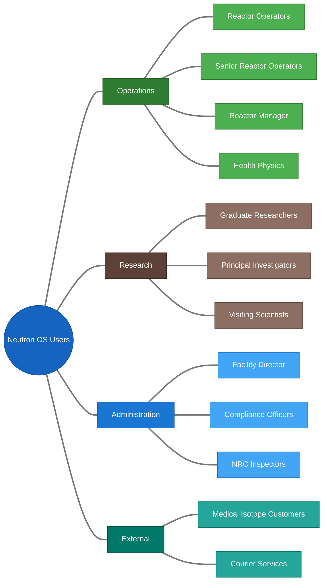
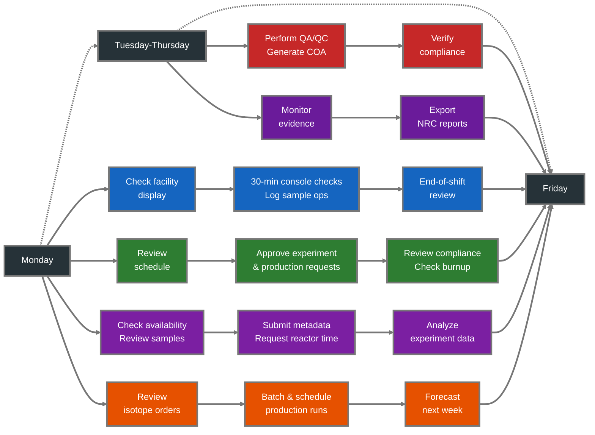
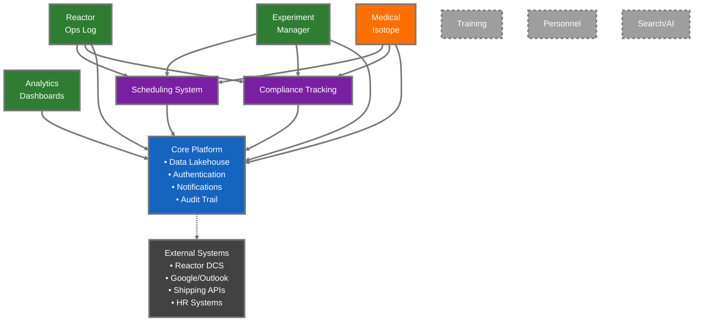
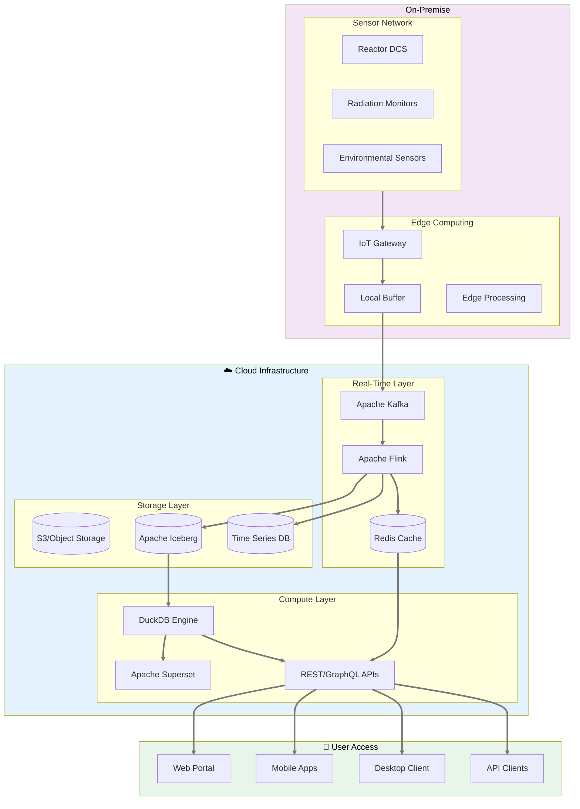
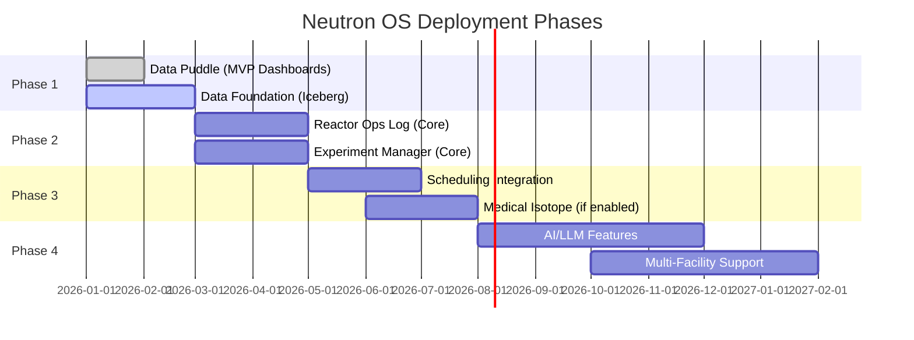
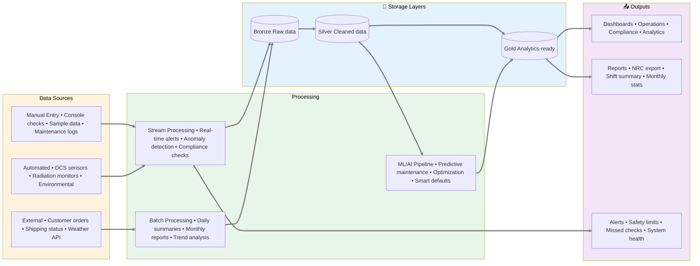
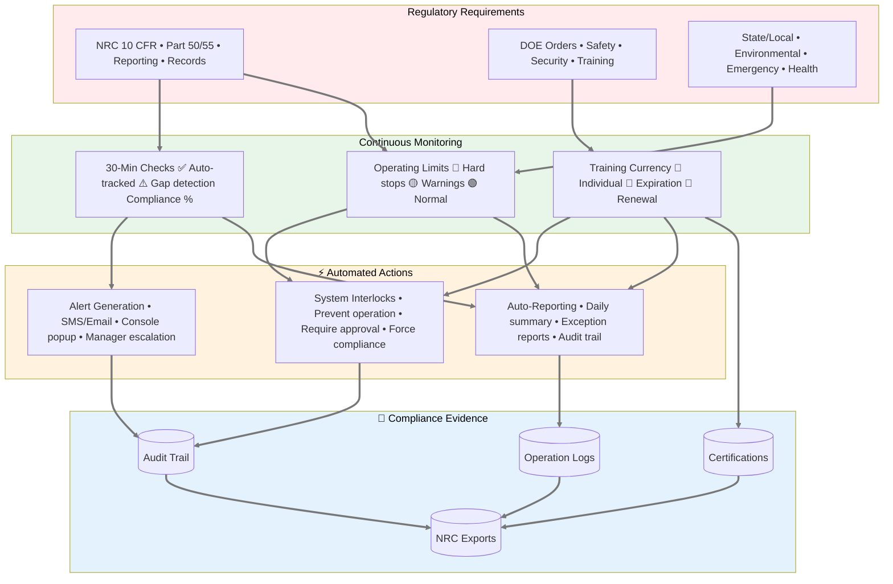
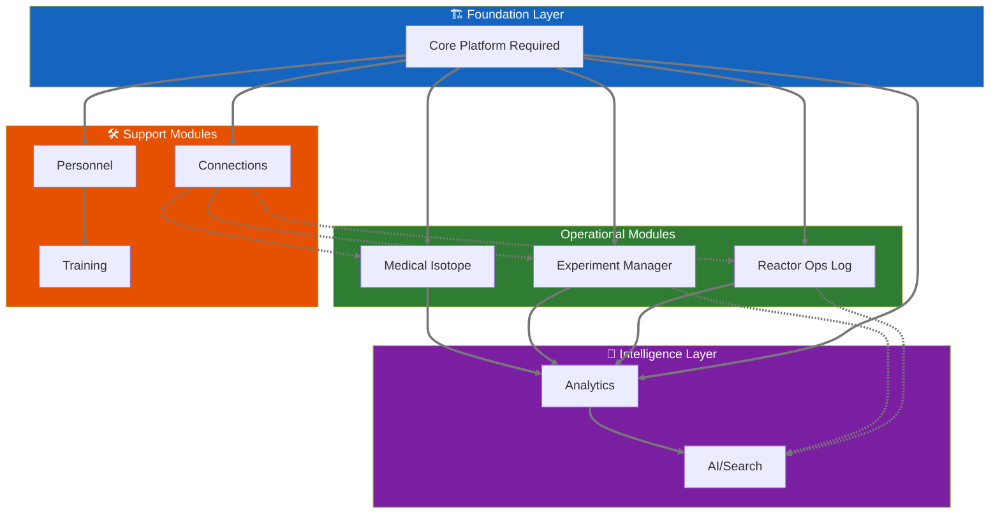

# Neutron OS — Executive Product Requirements

**Nuclear Energy Unified Technology for Research, Operations & Networks**

---

| Property | Value |
|----------|-------|
| Version | 1.0 |
| Last Updated | 2026-01-21 |
| Status | Active |
| Product Owner | Ben Booth |

---

## What is Neutron OS?

Neutron OS is a **modular digital platform for nuclear facilities** that unifies data management, operations tracking, experiment scheduling, and analytics into a single system. It replaces fragmented workflows (paper logs, spreadsheets, phone calls, email calendars) with integrated digital tools.

---

## Who is it for?

---

## Product Modules

Neutron OS is modular. Facilities enable only what they need.

### Core Infrastructure

| Module | Purpose | PRD | Default |
|--------|---------|-----|---------|  
| **Core Platform** | Data lakehouse, authentication, dashboards | [Data Platform PRD](data-platform-prd.md) | Required |
| **Scheduling System** | Cross-cutting time management, resource allocation | [Scheduling System PRD](scheduling-system-prd.md) | Required |
| **Compliance Tracking** | Cross-cutting regulatory monitoring, evidence generation | [Compliance Tracking PRD](compliance-tracking-prd.md) | Required |

### Application Modules

| Module | Purpose | PRD | Default |
|--------|---------|-----|---------|  
| **Reactor Ops Log** | Operations logging, console checks, shift handoffs | [Reactor Ops Log PRD](reactor-ops-log-prd.md) | On |
| **Experiment Manager** | Sample lifecycle, metadata, results correlation | [Experiment Manager PRD](experiment-manager-prd.md) | On |
| **Analytics Dashboards** | Superset visualizations, KPIs, trending | [Analytics PRD](analytics-dashboards-prd.md) | On |
| **Medical Isotope Production** | Customer orders, QA/QC, shipping | [Medical Isotope PRD](medical-isotope-prd.md) | Off |

### Future Modules

| Module | Purpose | PRD | Default |
|--------|---------|-----|---------|  
| **Training** | Qualification tracking, requal scheduling, records | *(future PRD)* | Off |
| **Personnel** | Staff directory, certifications, contact info | *(future PRD)* | Off |
| **Search / AI** | RAG, workflow agents, tuned LLMs | *(future PRD)* | Off |
| **Connections** | External system integrations | *(future PRD)* | Off |

This swimlane diagram shows how different users interact with Neutron OS throughout a typical week:

---

## Module Architecture

### Module Status Legend

| Symbol | Status | Description |
|--------|--------|-------------|
| 🟢 Green | **Priority** | First release modules, enabled by default |
| 🟠 Orange | **Optional** | First release modules, off by default |
| ⬜ Grey Dashed | **Future** | Planned for later releases |
| 🟣 Purple | **Cross-cutting** | Shared services used by multiple modules |
| 🔵 Blue | **Core** | Required platform infrastructure |
| ⬛ Dark Grey | **External** | Third-party integrations |

---

## Key Value Propositions

### For Operations Staff

| Pain Point | Neutron OS Solution |
|------------|---------------------|
| Paper logbooks are hard to search | Full-text search across all entries |
| 30-minute checks sometimes missed | Timer alerts, gap detection dashboard |
| Shift handoffs lose context | Digital shift summary, persistent state |
| NRC inspection prep takes days | One-click evidence export |

### For Researchers

| Pain Point | Neutron OS Solution |
|------------|---------------------|
| Scheduling via email is slow | Self-service time slot booking |
| Sample tracking in personal spreadsheets | Unified sample lifecycle management |
| "What were reactor conditions during my experiment?" | Automatic correlation with time-series data |
| Repeating experiment setup is tedious | Templates, smart defaults, AI assistance |

### For Facility Management

| Pain Point | Neutron OS Solution |
|------------|---------------------|
| No visibility into facility utilization | Usage dashboards, capacity planning |
| Compliance gaps discovered during audits | Real-time compliance monitoring |
| Medical isotope orders via phone calls | Customer self-service portal |
| Revenue tracking in spreadsheets | Integrated billing and reporting |

---

## Key Design Decisions

Neutron OS architecture embodies several foundational decisions documented in our [Architecture Decision Records](../adr/README.md):

| Decision | Implication | ADR |
|----------|-------------|-----|
| **Streaming-first architecture** | Real-time is the default; batch processing for aggregations and fallback | [ADR 007](../adr/007-streaming-first-architecture.md) |
| **Open lakehouse (Iceberg + DuckDB)** | No vendor lock-in; on-premise deployment possible | [ADR 003](../adr/003-lakehouse-iceberg-duckdb-superset.md) |
| **Multi-facility via configuration** | Same codebase serves NETL, NRAD, etc. with facility-specific settings | Tech Spec §1.5 |
| **Module-based architecture** | Facilities enable only what they need; Medical Isotope off by default | This PRD |

### Streaming-First Philosophy

**Designed for commercial reactor scale from day one.**

As nuclear commercialization accelerates, fleet operators will manage dozens of units generating petabytes of telemetry. Streaming-first architecture enables:
- **Fleet-wide anomaly detection** — correlate signals across multiple units in real-time
- **Instant operating limit propagation** — safety parameter changes flow immediately to all systems
- **Coordinated load-following** — respond to grid demands across a fleet, not just one unit
- **Graceful scaling** — same architecture handles one research reactor or fifty commercial units

With streaming-first:
- **🟢 Live** is the default — users assume data is current
- **⚠️ Stale** warnings only appear when streaming is degraded
- Batch processing handles historical aggregations and disaster recovery

### Deployment Architecture

---

## Phased Rollout

---

## Data Flow & Integration

---

## Compliance & Safety Framework

---

## Success Metrics (Platform-Wide)

| Metric | Target | Timeline |
|--------|--------|----------|
| **Adoption** | 90% of daily operations use Neutron OS | 6 months post-launch |
| **Data Entry Time** | 50% reduction vs. current workflows | 6 months |
| **Compliance Gaps** | Zero missed 30-minute checks | 3 months |
| **Self-Service Rate** | 80% of scheduling via portal (not email) | 6 months |
| **NRC Prep Time** | 75% reduction in inspection prep | 12 months |

---

## Constituent PRDs

Each module has a detailed PRD with user stories, schemas, and mockups:

### Core Infrastructure

1. **[Data Platform PRD](data-platform-prd.md)**
   - Lakehouse architecture (Bronze/Silver/Gold)
   - Time-series ingestion
   - Query layer (DuckDB, Superset)
   - Streaming and batch processing

2. **[Scheduling System PRD](scheduling-system-prd.md)** *(Cross-Cutting)*
   - Unified time slot management
   - Resource allocation and conflicts
   - Multi-module integration
   - Calendar synchronization

3. **[Compliance Tracking PRD](compliance-tracking-prd.md)** *(Cross-Cutting)*
   - Regulatory monitoring (NRC, DOE)
   - 30-minute check enforcement
   - Evidence package generation
   - Real-time compliance dashboards

### Application Modules

4. **[Reactor Ops Log PRD](reactor-ops-log-prd.md)**
   - Console check logging
   - Shift handoffs and summaries
   - Maintenance tracking
   - Tamper-proof audit trail

5. **[Experiment Manager PRD](experiment-manager-prd.md)**
   - Sample lifecycle tracking
   - Metadata and chain of custody
   - Results correlation
   - ROC authorization tracking

6. **[Analytics Dashboards PRD](analytics-dashboards-prd.md)**
   - Reactor Operations dashboard
   - Utilization metrics
   - Fuel burnup visualization
   - Data quality monitoring

### Optional Modules

5. **[Medical Isotope Production PRD](medical-isotope-prd.md)**
   - Customer order portal
   - Production batching
   - QA/QC workflow
   - Shipping and delivery tracking

---

## Module Feature Comparison

| Module | Complexity | Business Value | Priority |
|--------|------------|----------------|----------|
| **Reactor Ops Log** | Medium | Critical | First release |
| **Experiment Manager** | Medium | High | First release |
| **Analytics Dashboards** | Low | High | First release |
| **Medical Isotope Production** | High | Medium | Optional |
| **Scheduling System** | Low | Critical | Core infrastructure |
| **Compliance Tracking** | Low | Critical | Core infrastructure |
| **Training Module** | Medium | Medium | Future |
| **AI/Search** | Very High | High | Future |
| **Personnel** | Low | Low | Future |

### Module Interdependencies

---

## Technical Foundation

For technical architecture, schemas, and implementation details, see:

- **[Neutron OS Master Tech Spec](../specs/neutron-os-master-tech-spec.md)** — Full technical specification
- **[Executive Technical Summary](../specs/neutron-os-executive-summary.md)** — 2-page technical overview

---

## Feedback & Stakeholder Input

This PRD incorporates feedback from:

| Stakeholder | Role | Input Incorporated |
|-------------|------|-------------------|
| Khiloni Shah | Post-Doctoral Nuclear Engineering Researcher | Experiment workflow, facility names, sample metadata |
| Jim (TJ) | NETL TRIGA Manager | Reactor Ops Log requirements, 30-min checks, compliance |
| Nick Luciano | Post-Doctoral Nuclear Engineering Researcher | Time-series data, security, dashboards |

---

*Document Status: Active — Updated with stakeholder feedback January 2026*
