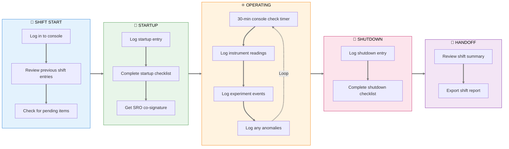
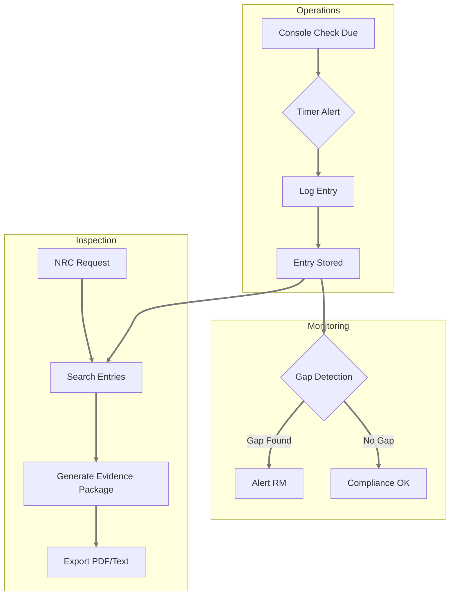
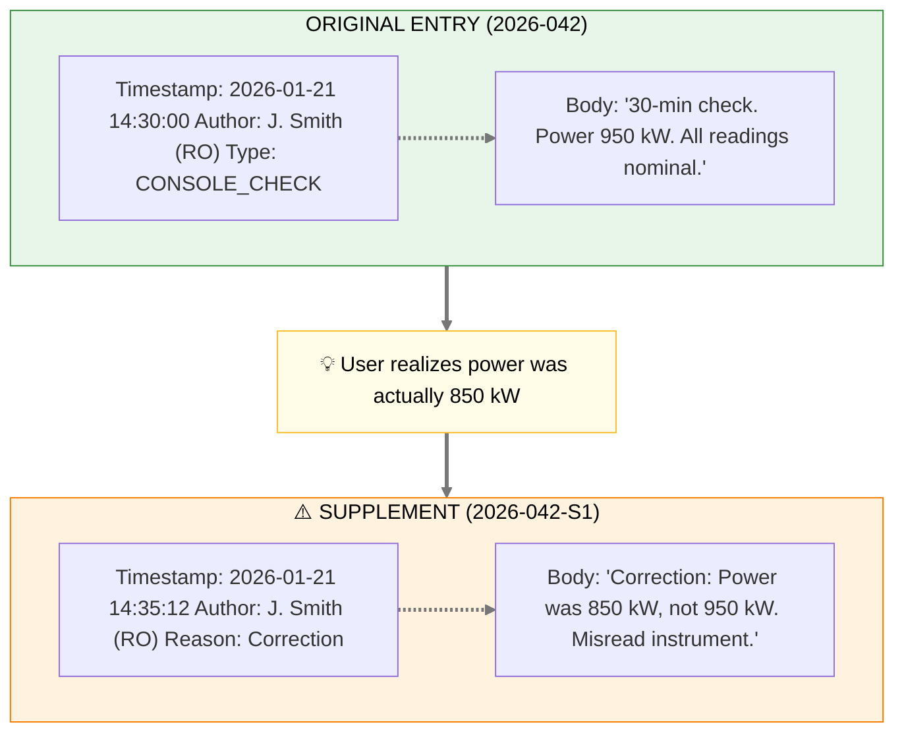
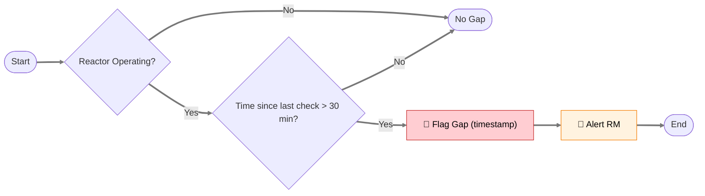
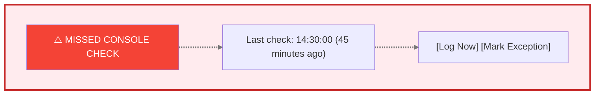
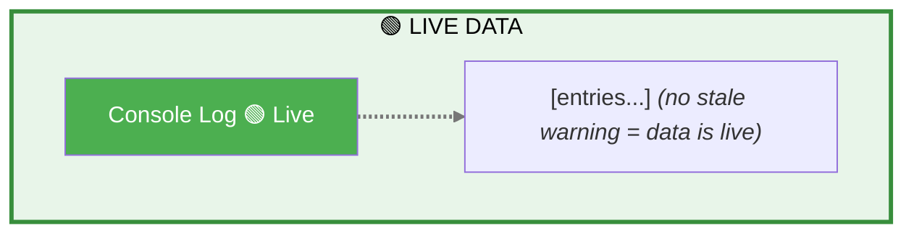

# Product Requirements Document: Reactor Ops Log

**Module:** Reactor Ops Log  
**Status:** Draft  
**Last Updated:** January 22, 2026  
**Stakeholder Input:** Jim (TJ), Nick Luciano (Jan 2026)  
**Parent:** [Executive PRD](neutron-os-executive-prd.md)  
**Historical Reference:** Previously referred to as "elog" in some contexts

---

## Executive Summary

The Reactor Ops Log captures reactor operations events, mandatory safety checks, and operational notes in a tamper-evident format that satisfies NRC regulatory requirements. It replaces the current paper-based console logbook with a digital system that maintains 10 CFR 50.9 compliance while enabling searchability, correlation with time-series data, and export for inspection.

---

## Ops Log vs. Experiment Log: A Unified System

### Background

Historically at NETL, Jim maintains **two separate physical logbooks**:
1. **Reactor Ops Log** — Console operations, 30-minute checks, startups/shutdowns, anomalies
2. **Reactor Experiment Log** — Experiment activities, sample insertions/removals, research notes

This separation exists due to **physical logistics** (different binders at different locations), not regulatory mandate. NRC cares about completeness and tamper-evidence, not which binder an entry lives in.

### Our Approach: Unified System, Separate Views

Neutron OS combines both logs into a **single system** with:
- **Entry type classification**: Each entry is tagged as `OPS` or `EXPERIMENT` (or both)
- **Filtered views**: Users can view Ops-only, Experiment-only, or combined chronological
- **Seamless navigation**: One-click toggle between views; cross-references visible in both
- **Single search**: Find any entry regardless of type
- **Unified audit trail**: All entries share the same tamper-evident infrastructure

### Why Combine?

| Benefit | Description |
|---------|-------------|
| **Correlation** | Ops events and experiment activities are often related—see both in context |
| **Single source of truth** | No confusion about which log to check |
| **Simpler compliance** | One export for NRC, filterable as needed |
| **Reduced duplication** | Operators don't log the same event in two places |
| **Training efficiency** | One system to learn, one interface |

### User Stories (Unified System)

- **As a reactor operator**, I want to quickly toggle between Ops view and All Entries view so I can focus on console operations but still see experiment context when needed.

- **As a researcher**, I want to filter to Experiment entries for my samples while still seeing relevant Ops entries (startups, power changes) that affected my irradiation.

- **As an NRC inspector**, I want to export all entries for a date range and filter by type as needed during review.

### Entry Type Examples

| Entry | Type | Notes |
|-------|------|-------|
| 30-minute console check | `OPS` | Mandatory operational |
| Reactor startup | `OPS` | Operational milestone |
| Sample insertion (NAA-042) | `EXPERIMENT` | Researcher activity |
| Sample removal with dose rate | `OPS` + `EXPERIMENT` | Both (ops performed, experiment record) |
| Power change for experiment | `OPS` | Operational, but linked to experiment |
| Anomaly during irradiation | `OPS` + `EXPERIMENT` | Safety-relevant to both |

---

## User Journey Map

### Reactor Operator: Daily Shift



### Entry Lifecycle

```mermaid
stateDiagram-v2
    [*] --> Draft: Start entry
    Draft --> Submitted: Submit
    Submitted --> Signed: Co-sign (if required)
    Signed --> Archived: Automatic
    
    Submitted --> Supplemented: Add correction
    Signed --> Supplemented: Add correction
    Supplemented --> Archived: Automatic
    
    note right of Supplemented: Original entry immutable\nSupplement linked
    linkStyle default stroke:#777777,stroke-width:3px
```

### Compliance Flow



---

## Stakeholder Insights

### Current State and Challenges (from Jim)

> "We have attempted to use the elog software as a training exercise to familiarize ourselves with digital/electronic elog software. We found that it is a steep learning curve for the 'older' ops staff. I believe it would be useful to have a modeler/designer come to the NETL and investigate and review our current system. Perhaps we could have a designer come to the NETL while operating and then design/massage the elog software according to our users' needs."

*Note: "elog" here refers to third-party electronic logbook software Jim evaluated, not Neutron OS.*

### Mandatory Checks Gap

> "A gap would mean that the :30 minute check was not performed when operating. When operating at the NETL, we are required to perform a console 'walkdown' every 30 minutes. During this check, we take readings from various instruments and log them in the elog."

*Note: "elog" here refers to the reactor operations logbook, now the Reactor Ops Log in Neutron OS.*

### Regulatory Context

> "NRC inspects documents yearly... they normally only look at half of the records, and we don't have to go back past the 2 years of operation in many cases. They prefer electronic documents."

**Key Compliance Numbers (from Jim):**
- **Inspection periodicity**: NRC inspects half of records each year (effectively 2-year coverage)
- **Evidence package scope**: 2 years of operational records
- **Preferred format**: Electronic (PDF + plain text archive)
- **Operator requalification**: 4 hours/quarter minimum console time required

### Tamper-Proof Requirements

> "Supplemental comments. The only way to 'edit' an entry should be a supplement. No deleting an entry—you should simply be able to add a supplement which identifies and corrects the mistake."

### Experiment Categories

> "We have a schedule of Authorized Experiments. These experiments are authorized by the ROC (Reactor Oversight Committee) after review through NETL Staff (Reactor Manager/HP/Director - Then ROC chair). Routine Experiments are performed as they are covered under an Authorized Experiment."

---

## User Stories

### Primary Users

| User | Need |
|------|------|
| **Reactor Operator (RO)** | Log events quickly without disrupting console attention |
| **Senior Reactor Operator (SRO)** | Review and co-sign entries, see shift summary |
| **Reactor Manager (RM)** | Review logs, authorize routine experiments, generate reports |
| **NRC Inspector** | Search and export records for compliance verification |
| **Health Physics (HP)** | Access radiation survey entries, correlate with dosimetry |

### User Stories

1. **As a reactor operator**, I want to log the 30-minute console check with minimal clicks so that I can return attention to the console quickly.

2. **As a reactor operator**, I want a timer/reminder for mandatory checks so that I don't miss the 30-minute window.

3. **As a SRO**, I want to see all entries from my shift in chronological order so that I can review before sign-off.

4. **As a RM**, I want to be alerted if mandatory checks are missed so that I can follow up.

5. **As an NRC inspector**, I want to search entries by date range, category, and operator so that I can efficiently review records.

6. **As any user**, I want to add supplemental comments to correct errors without modifying the original entry so that the audit trail is preserved.

7. **As a reactor manager**, I want to track each operator's console hours per quarter so that I can ensure they meet the 4-hour/quarter minimum for requalification.

8. **As a reactor manager**, I want to generate NRC evidence packages covering the most recent 2 years of records so that I can efficiently prepare for inspections.

---

## Entry Types and Categories

Based on stakeholder feedback:

### Mandatory Entry Types

| Type | Trigger | Required Fields | Interval |
|------|---------|-----------------|----------|
| `CONSOLE_CHECK` | Timer / Manual / **Auto-sense (TBD)** | Instrument readings, operator initials | Every 30 min while operating |
| `STARTUP` | Manual | Startup checklist items, authorization | Per startup |
| `SHUTDOWN` | Manual | Shutdown reason, checklist | Per shutdown |
| `SCRAM` | Manual (or auto-triggered) | Cause, rod positions, recovery actions | Per event |
| `RADIATION_SURVEY` | Manual | Location, reading, instrument | Per survey |

### Optional Entry Types

| Type | Use Case |
|------|----------|
| `EXPERIMENT_LOG` | Experiment start/stop, sample insertion/removal |
| `MAINTENANCE` | Equipment issues, repairs, calibrations |
| `VISITOR` | Visitor log entries |
| `GENERAL_NOTE` | Anything not fitting other categories |
| `SUPPLEMENT` | Correction/addition to existing entry |
| `EXCESS_REACTIVITY` | Burnup measurement via excess reactivity after long shutdown |
| `DOSE_RATE` | Radiation survey results, dose rate measurements |

### Experiment Authorization Categories

From Jim:

| Category | Approval Level | Description |
|----------|----------------|-------------|
| **Authorized Experiment** | ROC (Reactor Oversight Committee) | Full safety review through RM/HP/Director chain |
| **Routine Experiment** | RM or SSRO | Covered under existing Authorized Experiment |

### Entry Tags (User-Assignable)

From Jim: Categories help with searchability and NRC inspection preparation.

| Tag | Use Case | Example |
|-----|----------|--------|
| `pnt-sample` | Pneumatic transfer operations | Sample insertion/removal via TPNT/EPNT |
| `excess-reactivity` | Core performance tracking | Post-shutdown reactivity measurement (~-49 cents) |
| `dose-rate` | Radiation protection | Frisker readings, survey results |
| `startup` | Reactor mode change | Criticality approach, power ascension |
| `shutdown` | Reactor mode change | Planned or unplanned shutdown |
| `maintenance` | Equipment-related | Calibrations, repairs, replacements |
| `visitor` | Personnel tracking | Tours, inspections, vendor visits |

---

## Data Schema

### Entry Schema

```yaml
entry:
  id: uuid (system-generated)
  entry_number: integer (sequential within year, e.g., 2026-001)
  timestamp: datetime (system clock, immutable)
  entry_type: enum (see types above)
  author_id: uuid (logged-in operator)
  author_name: string (display name)
  co_signer_id: uuid (optional, for dual-sign entries)
  
  # Content
  title: string (brief summary)
  body: text (detailed entry)
  
  # Structured data (type-dependent)
  instrument_readings: json (for CONSOLE_CHECK)
  checklist_items: json (for STARTUP/SHUTDOWN)
  
  # Metadata
  reactor_mode: enum (shutdown, startup, steady-state, power-change)
  reactor_power_kw: decimal (auto-populated from time-series)
  
  # Supplements
  supplements: array of supplement objects
  
  # Audit
  created_at: datetime
  ip_address: string (for audit trail)
  signature_hash: string (cryptographic verification)
```

### Supplement Schema

```yaml
supplement:
  id: uuid
  parent_entry_id: uuid
  timestamp: datetime
  author_id: uuid
  author_name: string
  reason: enum (correction, clarification, addition)
  body: text
  signature_hash: string
```

---

## Tamper-Evidence Implementation

Per Jim's requirement ("No deleting an entry—you should simply be able to add a supplement"):

### Design Principles

1. **Append-only storage**: Entries are INSERT-only. No UPDATE or DELETE operations on entry content.

2. **Cryptographic signatures**: Each entry is hashed with the previous entry's hash (blockchain-style chain), making retroactive modification detectable.

3. **Supplements for corrections**: Any modification is captured as a linked supplement with its own timestamp and author.

4. **Audit log**: All access (read/write) is logged with user ID, timestamp, and IP address.

### Example: Correcting an Error



---

## Mandatory Check Timer

### Requirements

- Visual countdown timer showing time until next mandatory check
- Audible alert at 25 minutes (5-minute warning) and 30 minutes (deadline)
- Entry form pre-populated when timer triggers
- Dashboard indicator showing "missed checks" count per shift

### Gap Detection

From Jim: "A gap would mean that the :30 minute check was not performed when operating."

**Detection logic:**



**Dashboard alert:**



---

## Export Requirements

From Jim: "Export to PDF would work, but a simple text file for archive and future proof would also work."

### Export Formats

| Format | Use Case | Contents |
|--------|----------|----------|
| **PDF** | NRC inspection, official records | Formatted, includes signatures, page numbers |
| **Plain Text** | Archive, future-proofing | Human-readable, no proprietary format dependencies |
| **CSV** | Analysis, data mining | Structured, importable to spreadsheets |
| **JSON** | API integration, backups | Machine-readable, includes all metadata |

**Archive Integrity (from Jim):**
> "Concerned about software failure/migration. Text archives could be modified."

**Design Response:**
- PDF exports include cryptographic signatures (verifiable)
- Plain text archives include SHA-256 checksums
- Both formats exported together for redundancy
- Checksums stored in tamper-evident audit trail (Hyperledger)
- Regular automated export to long-term storage (prevents software dependency)

### Export Filters

- Date range
- Entry type(s)
- Author(s)
- Keyword search
- Include/exclude supplements

---

## UI Mockup Concepts

### Console View (Primary Interface During Operations)

```
┌─────────────────────────────────────────────────────────────────────┐
│  NETL OPERATIONS LOG                    [2026-01-21]  [Shift: Day] │
│  Operator: J. Smith (RO)        ┌────────────────────────────────┐ │
│  Power: 950 kW                  │  NEXT CHECK IN: 12:45          │ │
│  Status: OPERATING              │  ████████████░░░░░░░░░  [Log]  │ │
│                                 └────────────────────────────────┘ │
├─────────────────────────────────────────────────────────────────────┤
│                                                                     │
│  [+ New Entry ▼]  [Console Check]  [Experiment]  [General Note]    │
│                                                                     │
│  ═══════════════════════════════════════════════════════════════   │
│  RECENT ENTRIES                                                     │
│  ═══════════════════════════════════════════════════════════════   │
│                                                                     │
│  14:30 │ CONSOLE_CHECK │ 30-min check. All readings nominal.       │
│        │ J. Smith      │                                  [Detail] │
│  ─────────────────────────────────────────────────────────────────  │
│  14:15 │ EXPERIMENT    │ Sample Au-foil-042 inserted in TPNT.      │
│        │ J. Smith      │ Ops Request 4521.               [Detail] │
│  ─────────────────────────────────────────────────────────────────  │
│  14:00 │ CONSOLE_CHECK │ 30-min check. Power raised to 950 kW.     │
│        │ J. Smith      │                                  [Detail] │
│  ─────────────────────────────────────────────────────────────────  │
│  13:30 │ STARTUP       │ Startup complete. Reaching 500 kW.        │
│        │ J. Smith      │ Co-signed: M. Jones (SRO)        [Detail] │
│                                                                     │
└─────────────────────────────────────────────────────────────────────┘
```

### Quick Console Check Entry

```
┌─────────────────────────────────────────────────────────────────────┐
│  30-MINUTE CONSOLE CHECK                               [Cancel] [X]│
├─────────────────────────────────────────────────────────────────────┤
│                                                                     │
│  Time: 15:00:00 (auto)          Power: 950 kW (auto from DCS)      │
│                                                                     │
│  ┌─────────────────────────────────────────────────────────────┐   │
│  │ INSTRUMENT READINGS (auto-populated where available)        │   │
│  ├─────────────────────────────────────────────────────────────┤   │
│  │ Channel A: [___] %    Channel B: [___] %                    │   │
│  │ Pool Temp: [___] °F   Coolant Temp: [___] °F               │   │
│  │ Rod A: [___] %        Rod B: [___] %                        │   │
│  └─────────────────────────────────────────────────────────────┘   │
│                                                                     │
│  Notes: [All readings nominal____________________________]          │
│                                                                     │
│  ☑ I have performed a physical console walkdown                    │
│                                                                     │
│                                                       [Submit]      │
└─────────────────────────────────────────────────────────────────────┘
```

### Entry Detail View (with Supplement)

```
┌─────────────────────────────────────────────────────────────────────┐
│  ENTRY 2026-042                                        [Back] [PDF]│
├─────────────────────────────────────────────────────────────────────┤
│                                                                     │
│  Type: CONSOLE_CHECK                                                │
│  Timestamp: 2026-01-21 14:30:00                                     │
│  Author: J. Smith (RO)                                              │
│  Reactor Power: 950 kW                                              │
│                                                                     │
│  ───────────────────────────────────────────────────────────────    │
│  CONTENT                                                            │
│  ───────────────────────────────────────────────────────────────    │
│  30-minute console check. Power 950 kW. All readings nominal.       │
│  Channel A: 48%, Channel B: 47%                                     │
│                                                                     │
│  ───────────────────────────────────────────────────────────────    │
│  ⚠️ SUPPLEMENT (2026-01-21 14:35:12)                                │
│  ───────────────────────────────────────────────────────────────    │
│  Author: J. Smith (RO)                                              │
│  Reason: Correction                                                 │
│                                                                     │
│  Correction: Power was 850 kW, not 950 kW. Misread instrument.     │
│                                                                     │
│  ───────────────────────────────────────────────────────────────    │
│                                              [Add Supplement]       │
│                                                                     │
│  Signature Hash: a3f8c2...d91e (verified ✓)                        │
└─────────────────────────────────────────────────────────────────────┘
```

---

## Technical Requirements

### Data Freshness & Real-Time Architecture

> **Design Decision:** Streaming-first architecture. Real-time is the default; batch for aggregations and fallback.
>
> See [ADR 007](../adr/007-streaming-first-architecture.md)

**Reactor Ops Log Latency Targets:**

| Feature | Target Latency | Implementation | Priority |
|---------|---------------|----------------|----------|
| **Entry sync across consoles** | <500ms | WebSocket push | 🔴 High |
| **30-minute check timer** | <100ms | Real-time shared countdown | 🔴 High |
| **Concurrent editing awareness** | <200ms | Live "Nick is typing..." via WebSocket | 🔴 High |
| **Search results** | <2s | Near-real-time indexed | 🟡 Medium |
| **Compliance gap alerts** | <30s | Streaming alert push | 🟡 Medium |
| **Historical aggregations** | Minutes | Batch job (Dagster) | 🟢 Low |

**UI Pattern:** Live is the default. Warnings appear only when streaming is degraded:



### Performance

- Entry submission < 1 second (operators cannot wait during operations)
- Search results < 3 seconds for 2-year date range
- Export PDF < 10 seconds for 1-month range

### Reliability

- Offline-capable: Must function if network is temporarily unavailable
- Local cache syncs when connectivity restored
- No data loss scenario acceptable

### Security

- Authentication required (linked to facility badge/credentials)
- Role-based access: RO can create entries; RM can view all and generate reports
- All access logged for audit

---

## MVP Scope (Phase 1)

### In Scope
- Basic entry creation (CONSOLE_CHECK, STARTUP, SHUTDOWN, GENERAL_NOTE)
- Supplement addition (no edit/delete of originals)
- 30-minute timer with alerts
- Export to PDF and plain text
- Search by date, type, author

### Out of Scope (Future)
- Auto-population from DCS instruments
- Offline mode with sync
- Digital signature (cryptographic)
- Integration with experiment manager
- Mobile interface

---

## Implementation Recommendation

From Jim:

> "Perhaps we could have a designer come to the NETL while operating and then design/massage the elog software according to our users' needs."

**Proposed approach:**
1. Deploy minimal prototype (console check only)
2. Designer/developer spends 2-3 operating days at NETL console
3. Iterate based on real-world usage
4. Expand to other entry types after validation

---

## Open Questions

1. **Instrument readings**: Which specific instruments are read during console checks? Can any be auto-populated from DCS?

2. **Dual signatures**: Which entry types require SRO co-signature?

3. **Existing records**: Should historical paper logs be digitized, or start fresh?

4. **Badge integration**: Can we authenticate via existing facility badge system?

5. **Offline behavior**: How long can the console be offline before operations must pause?

6. **Automatic console check sensing** (TBD - Design exploration needed):
   - The legacy 1990s console view in the operations room is driven by data we can access
   - **Question**: Can we automatically sense when console checks occur (via data tap) and auto-populate the Ops Log instead of requiring manual entry?
   - **Rationale**: Eliminates dual-entry requirement (console data + ops log entry)
   - **Scope**: Determine feasibility with console software status, data interface availability, and validation requirements
   - **Next step**: Explore UI/UX workflows for auto-sensed vs. manual vs. hybrid entry modes
   - **Design Document**: See [Console Check UI/UX Mockups](../design/console-check-ui-mockups.md) for 4 proposed workflow alternatives and recommendations

---

## Success Metrics

| Metric | Target | Measurement |
|--------|--------|-------------|
| Missed check alerts | 0 gaps per month | System gap detection |
| Entry time | < 30 seconds for console check | Timing analytics |
| NRC inspection prep time | Reduced by 75% | Staff survey |
| Adoption | 100% of operating shifts using digital log within 3 months | Usage tracking |

---

## Appendix: 10 CFR 50.9 Compliance Notes

The Operations Log must satisfy NRC requirements for:

1. **Completeness**: All required operating data recorded
2. **Accuracy**: Information is correct; corrections are traceable
3. **Availability**: Records accessible for inspection (2+ year retention)
4. **Authenticity**: Can verify entries were made by authorized personnel at stated times

The supplement-based correction model and cryptographic chaining specifically address the "no modification without trace" requirement.

---

*Document Status: Ready for on-site validation and technical review*
