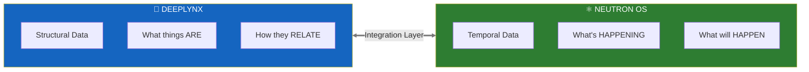
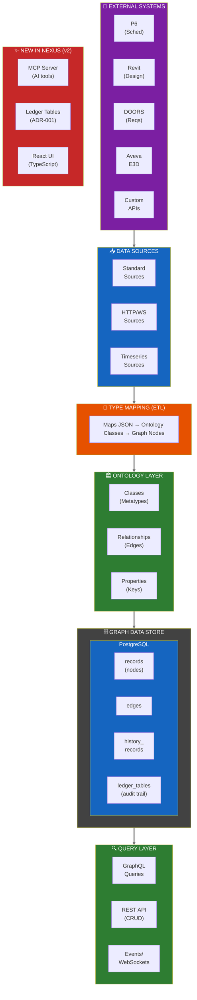
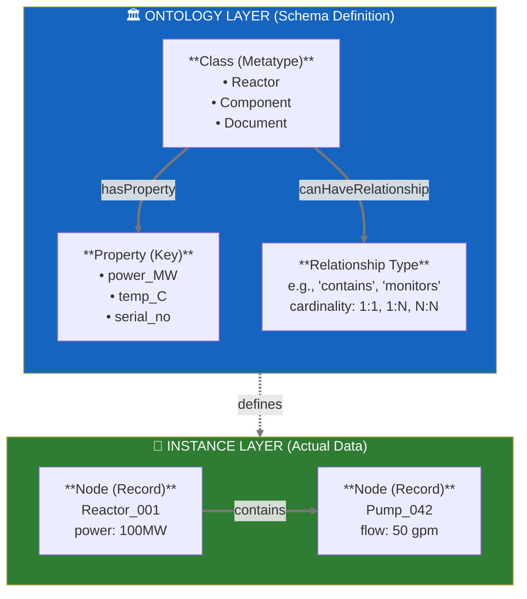
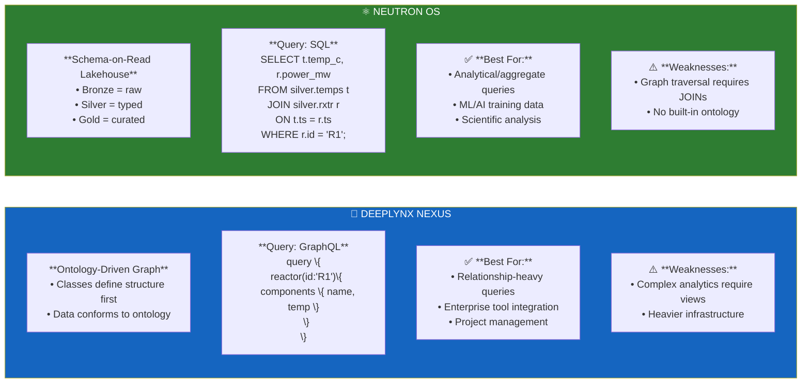
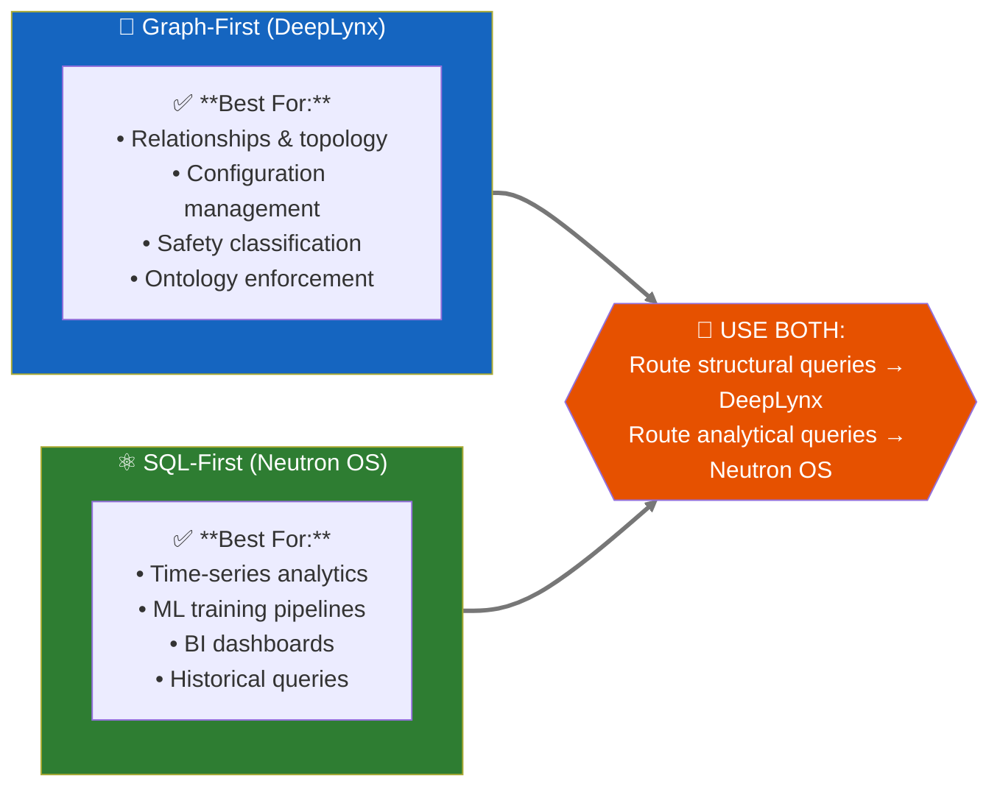
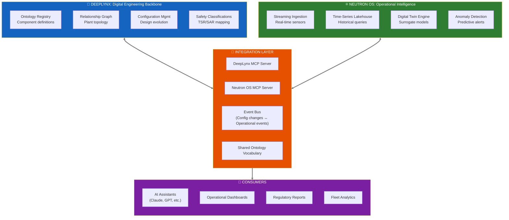
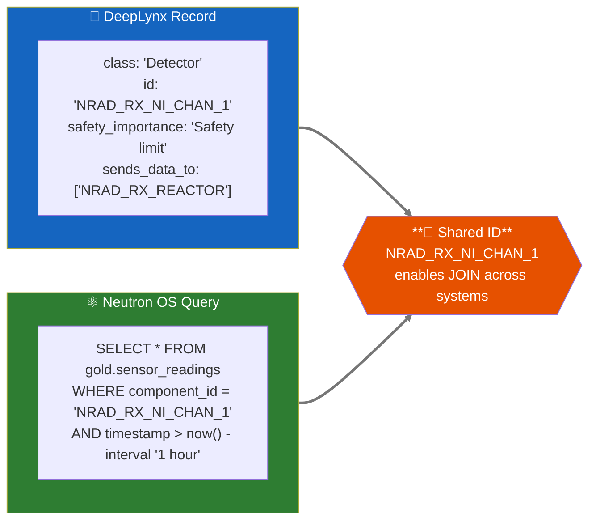
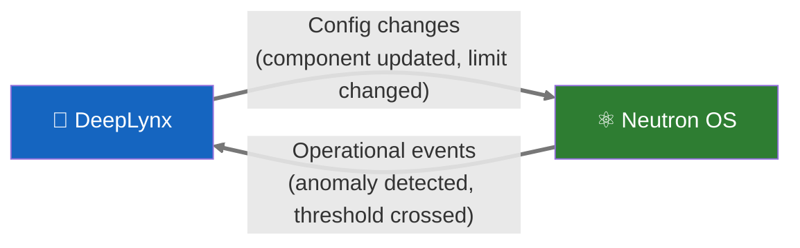

# DeepLynx + Neutron OS: Integrated Architecture Assessment

**Technical Analysis of Complementary Capabilities**

---

> **Document Status:** Technical Reference  
> **Date:** January 21, 2026 (Updated)  
> **Lead Author:** Ben Booth, UT Computational NE  
> **Classification:** Internal Planning Document

---

## Table of Contents

1. [Executive Summary](#1-executive-summary)
2. [DeepLynx Technical Deep Dive](#2-deeplynx-technical-deep-dive)
3. [Architecture Comparison](#3-architecture-comparison)
4. [Integrated Architecture Vision](#4-integrated-architecture-vision)
5. [Collaboration Roadmap](#5-collaboration-roadmap)
6. [Technical Appendix](#6-technical-appendix)

---

## 1. Executive Summary

### The Core Insight

DeepLynx and Neutron OS are **complementary systems optimized for different data patterns**. Together, they provide capabilities neither can achieve alone. This is not competition—it's specialization.



### 1.1 What Each System Does Best

| Capability | DeepLynx | Neutron OS |
|------------|----------|------------|
| **Ontology management** | ✅ Excellent | ❌ Not its job |
| **Relationship graphs** | ✅ Excellent | ❌ Not its job |
| **Configuration tracking** | ✅ Excellent | ⚠️ Basic |
| **Streaming time-series** | ⚠️ Batch-oriented | ✅ Sub-second |
| **Historical analytics** | ⚠️ File-based queries | ✅ Iceberg lakehouse |
| **ML/surrogate training** | ⚠️ Not optimized | ✅ Native workflows |
| **Uncertainty quantification** | ❌ Not its job | ✅ Core capability |
| **Agentic AI integration** | ✅ MCP Server | ✅ MCP Server |

### 1.2 The Integration Opportunity

**Scenario:** An operator asks: "Which safety-related components are showing anomalous trends?"

| Step | System | Action |
|------|--------|--------|
| 1 | **Neutron OS** | Streaming anomaly detection flags 3 sensors |
| 2 | **Neutron OS → DeepLynx** | "What components are these sensors monitoring?" |
| 3 | **DeepLynx** | Returns: Pump A (safety-related), Valve B (not safety), Detector C (safety-related) |
| 4 | **DeepLynx** | "What are the safety limits for Pump A and Detector C?" |
| 5 | **Neutron OS** | Queries time-series: "How close to limits?" |
| 6 | **AI Assistant** | Synthesizes full picture for operator |

**Neither system could answer this alone.** DeepLynx knows structure and safety classification. Neutron OS knows trends and predictions.

### 1.3 Technical Property Comparison

| Property | DeepLynx Nexus (v2) | Neutron OS |
|----------|---------------------|------------|
| **Primary Focus** | Digital engineering backbone | Operational intelligence layer |
| **Data Model** | Graph (ontology-driven) | Lakehouse (Iceberg tables) |
| **Tech Stack** | C# + React + PostgreSQL | Python + dbt + Kafka |
| **Query Language** | GraphQL + DataFusion SQL | SQL (DuckDB/Trino) |
| **Time-Series** | File-based, batch queries | Streaming-first, interactive |
| **AI Integration** | MCP Server (C#) | MCP Server (Python) |
| **License** | MIT | MIT (proposed) |

### 1.4 What We're Adopting From DeepLynx

| Pattern | Implementation | Status |
|---------|---------------|--------|
| **Ledger table pattern** | Denormalized historical snapshots for audit | Adopted |
| **Ontology vocabulary** | DIAMOND class names, properties, relationships | Aligned |
| **MCP architecture** | AI agents query both systems via MCP | In progress |
| **Limits schema** | Safety importance, voting logic, TSR references | Adopted |

### 1.5 Why Two Systems Instead of One?

**The question:** "Why not just use DeepLynx for everything?"

**The answer:** Different data patterns need different architectures.

| Pattern | DeepLynx Optimized | Neutron OS Optimized |
|---------|-------------------|---------------------|
| "What components exist in Reactor X?" | ✅ Graph traversal | ❌ Would need to JOIN many tables |
| "Show power readings for last 6 months" | ❌ File scan, batch job | ✅ Partition pruning, milliseconds |
| "Train ML model on sensor history" | ❌ Export to files first | ✅ Native DataFrame access |
| "What's the safety classification?" | ✅ Single GraphQL query | ❌ Would need DeepLynx anyway |
| "Predict state at t+10ms" | ❌ Not its job | ✅ Surrogate model inference |

**Trying to make one system do both leads to architectural compromise.** The integrated approach lets each system excel at what it's designed for.

---

## 2. DeepLynx Technical Deep Dive

### 2.1 Architecture Overview



### 2.2 Core Technical Components

| Component | Technology | Purpose |
|-----------|------------|---------|
| **Backend** | C# (.NET 10) | API server, business logic |
| **Frontend** | React + TypeScript | Admin UI, data exploration |
| **Database** | PostgreSQL | Graph storage (records/edges) |
| **ORM** | Entity Framework | Database migrations, CRUD |
| **API** | REST + GraphQL | Data access |
| **Docs** | Next.js (MDX) | Documentation site |
| **Auth** | OAuth2 + API Keys | Multi-tenant access |
| **Deploy** | Kubernetes + Docker | Container orchestration |
| **AI** | MCP Server (C#) | LLM tool integration |

### 2.3 Data Model Philosophy

DeepLynx uses an **ontology-driven graph model**:



### 2.4 Key Features

| Feature | Description | Maturity |
|---------|-------------|----------|
| **Ontology Import** | Import .owl files (DIAMOND ontology) | Mature |
| **Ontology Versioning** | Track schema changes over time | Mature |
| **Ontology Inheritance** | Classes can inherit properties | Mature |
| **Type Mapping** | Map JSON→Classes automatically | Mature |
| **GraphQL Queries** | Client-defined queries | Mature |
| **Event System** | Pub/sub for data changes | Mature |
| **Data Targets** | Export to external systems | Mature |
| **Timeseries Data** | Tabular data alongside graph | Mature |
| **Ledger Tables** | ADR-001: Historical snapshots | New (v2) |
| **MCP Server** | AI tool integration | New (v2) |

### 2.5 Ledger Table Pattern (ADR-001)

This is **highly relevant** to Neutron OS's audit requirements:

```
┌─────────────────────────────────────────────────────────────────┐
│           DEEPLYNX LEDGER TABLE PATTERN (ADR-001)               │
├─────────────────────────────────────────────────────────────────┤
│                                                                 │
│   CURRENT STATE (Normalized)                                    │
│   ┌─────────────────────────────────────────────────────────┐  │
│   │   records                                                │  │
│   │   ┌────────┬─────────┬──────────┬─────────┬──────────┐  │  │
│   │   │   id   │ class_id│   data   │created_at│modified_at│  │
│   │   ├────────┼─────────┼──────────┼─────────┼──────────┤  │  │
│   │   │   1    │    5    │ {json}   │ ts_1    │ ts_3     │  │  │
│   │   │   2    │    3    │ {json}   │ ts_2    │ ts_2     │  │  │
│   │   └────────┴─────────┴──────────┴─────────┴──────────┘  │  │
│   └─────────────────────────────────────────────────────────┘  │
│                          │                                      │
│                          │ On any UPDATE/DELETE                 │
│                          ▼                                      │
│   HISTORICAL STATE (Denormalized Snapshot)                      │
│   ┌─────────────────────────────────────────────────────────┐  │
│   │   historical_records                                     │  │
│   │   ┌───┬──────────┬────────────┬────────┬──────────────┐ │  │
│   │   │id │record_id │ class_name │  tags  │ snapshot_at  │ │  │
│   │   ├───┼──────────┼────────────┼────────┼──────────────┤ │  │
│   │   │ 1 │    1     │ "Reactor"  │[a,b]   │ ts_1         │ │  │
│   │   │ 2 │    1     │ "Reactor"  │[a,b,c] │ ts_2         │ │  │
│   │   │ 3 │    1     │ "Reactor"  │[a,b,c] │ ts_3         │ │  │
│   │   └───┴──────────┴────────────┴────────┴──────────────┘ │  │
│   │                                                          │  │
│   │   Key insight: Snapshot includes denormalized names      │  │
│   │   (class_name, tags) so history is self-contained        │  │
│   └─────────────────────────────────────────────────────────┘  │
│                                                                 │
│   WHY THIS MATTERS:                                             │
│   • If class is renamed/deleted, history still accurate        │
│   • No JOINs needed for historical queries                     │
│   • Audit trail is independent of current schema               │
│                                                                 │
└─────────────────────────────────────────────────────────────────┘
```

### 2.6 MCP (Model Context Protocol) Integration

DeepLynx has an early MCP server implementation:

```
deeplynx.mcp/
├── tools/
│   ├── ProjectTools.cs    # List/search projects
│   └── RecordTools.cs     # Query/create records
├── helpers/
│   └── ...
├── Program.cs             # MCP server entry point
└── .env_sample
```

This allows AI agents to:
- Query project data
- Search records
- Create/update data programmatically

---

## 3. Architecture Comparison

### 3.1 Side-by-Side Comparison



### 3.2 Feature Matrix

| Feature | DeepLynx | Neutron OS | Notes |
|---------|:--------:|:----------:|-------|
| **Data Storage** |
| Time-travel queries | ⚠️ Via ledger | ✅ Native Iceberg | Iceberg is purpose-built |
| Schema versioning | ✅ Ontology versions | ✅ Schema evolution | Both good |
| ACID transactions | ✅ PostgreSQL | ✅ Iceberg | Both good |
| Columnar storage | ❌ Row-based | ✅ Parquet | Neutron faster for analytics |
| **Query Capabilities** |
| SQL analytics | ⚠️ Requires views | ✅ Native | Neutron wins |
| Graph traversal | ✅ Native | ⚠️ Via JOINs | DeepLynx wins |
| GraphQL | ✅ Built-in | ❌ Not planned | Different philosophy |
| **Integrations** |
| Enterprise tools | ✅ Many | ❌ Not focus | DeepLynx wins |
| ML/AI workflows | ⚠️ Basic MCP | ✅ Designed for | Neutron wins |
| BI dashboards | ⚠️ Custom needed | ✅ Superset native | Neutron wins |
| **Operations** |
| Local development | ✅ Docker Compose | ✅ K3D + Docker | Both good |
| Kubernetes ready | ✅ Helm charts | ✅ Terraform + Helm | Both good |
| Multi-tenant | ✅ Containers | ⚠️ Planned | DeepLynx ahead |
| **Audit/Compliance** |
| Immutable audit log | ✅ Ledger tables | ✅ Hyperledger | Different approaches |
| Change tracking | ✅ Per-record | ✅ Per-table | DeepLynx more granular |
| Regulatory compliance | ✅ Designed for | ⚠️ In progress | DeepLynx more mature |

---

## 4. What's Valuable for Neutron OS

### 4.1 Highly Valuable: Ledger Table Pattern

**Adopt this pattern** for elog entries, reactor data, and simulation outputs.

```python
# Proposed implementation for Neutron OS
# dbt model: models/audit/elog_entries_historical.sql

{{
  config(
    materialized='incremental',
    unique_key='snapshot_id'
  )
}}

WITH snapshots AS (
  SELECT
    {{ dbt_utils.generate_surrogate_key(['elog_id', 'snapshot_ts']) }} AS snapshot_id,
    elog_id,
    -- Denormalized fields (self-contained history)
    author_name,        -- Not author_id (avoids JOIN)
    facility_name,      -- Not facility_id
    tag_names,          -- Array of strings, not IDs
    -- Full content at snapshot time
    entry_content,
    attachments,
    -- Metadata
    snapshot_ts,
    change_type         -- 'created', 'updated', 'archived'
  FROM {{ ref('elog_entries_bronze') }}
)

SELECT * FROM snapshots

WHERE snapshot_ts > (SELECT MAX(snapshot_ts) FROM {{ this }})

```

### 4.2 Valuable: Ontology Concepts

Consider adopting **lightweight ontology support** without the full graph overhead:

```yaml
# neutron_os/schemas/ontology/reactor.yaml
classes:
  Reactor:
    description: "Nuclear reactor system"
    properties:
      - name: thermal_power_mw
        type: float
        unit: MW
        required: true
      - name: coolant_type
        type: enum
        values: [water, sodium, helium, salt]
    relationships:
      - type: contains
        target: ReactorComponent
        cardinality: one_to_many

  ReactorComponent:
    description: "Component within a reactor"
    parent: PhysicalAsset  # Inheritance
    properties:
      - name: serial_number
        type: string
        required: true
      - name: install_date
        type: date
```

This YAML-based ontology can:
1. Generate Pydantic validators
2. Generate dbt schema tests
3. Provide LLM context for semantic queries
4. Document the domain model

### 4.3 Valuable: MCP Server Pattern

DeepLynx's MCP implementation shows the path for Neutron OS:

```python
# Proposed: neutron_os/mcp/tools/reactor_tools.py
from mcp.server import Server
from mcp.types import Tool, TextContent

server = Server("neutron-os")

@server.tool()
async def query_reactor_timeseries(
    reactor_id: str,
    metric: str,
    start_time: str,
    end_time: str
) -> list[TextContent]:
    """Query reactor time-series data via DuckDB"""
    sql = f"""
    SELECT timestamp, {metric}
    FROM gold.reactor_metrics
    WHERE reactor_id = '{reactor_id}'
      AND timestamp BETWEEN '{start_time}' AND '{end_time}'
    """
    result = duckdb_conn.execute(sql).fetchdf()
    return [TextContent(type="text", text=result.to_markdown())]

@server.tool()
async def search_elog_entries(
    query: str,
    facility: str | None = None,
    limit: int = 10
) -> list[TextContent]:
    """Semantic search over elog entries using pgvector"""
    # ... vector search implementation
```

### 4.4 Moderately Valuable: Event System

DeepLynx's event system for real-time data propagation could inform Dagster sensors:

```python
# Instead of WebSockets (DeepLynx), use Dagster sensors
@sensor(job=process_new_reactor_data)
def reactor_data_sensor(context):
    """Trigger pipeline when new data arrives"""
    new_files = list_new_iceberg_files(
        table="bronze.reactor_timeseries",
        since=context.last_tick_time
    )
    if new_files:
        yield RunRequest(run_key=new_files[0].snapshot_id)
```

---

## 5. Query Interface Integration

### 5.1 GraphQL + SQL: Best of Both Worlds

**DeepLynx's GraphQL Strength:** According to their documentation, DeepLynx "**dynamically generates a schema** each time you interact with the GraphQL endpoint for a given container... the generated schema's types map 1:1 to a Class in the container you are querying." This auto-reflection from ontology to API is genuinely elegant—when you add a new Class (e.g., "Detector"), a corresponding GraphQL type becomes immediately available without code changes.

**Neutron OS's SQL Strength:** Time-series analytics and ML workflows are SQL-native. LLMs are highly capable at generating SQL from natural language.

**Integration Strategy:** Use both query interfaces with intelligent routing

```
┌─────────────────────────────────────────────────────────────────┐
│                    QUERY EVOLUTION                               │
├─────────────────────────────────────────────────────────────────┤
│                                                                 │
│   2015-2020: GraphQL Era                                        │
│   ─────────────────────────────                                 │
│   User: "I want reactor data with components"                   │
│   Developer: *writes GraphQL query*                             │
│                                                                 │
│   query {                                                       │
│     reactor(id: "R1") {                                         │
│       thermalPower                                              │
│       components { name, serialNumber }                         │
│     }                                                           │
│   }                                                             │
│                                                                 │
│   2024+: Natural Language Era                                   │
│   ────────────────────────────                                  │
│   User: "Show me reactor R1's power and all its components"     │
│   LLM: *generates SQL directly*                                 │
│                                                                 │
│   SELECT r.thermal_power, c.name, c.serial_number               │
│   FROM gold.reactors r                                          │
│   JOIN gold.components c ON r.id = c.reactor_id                 │
│   WHERE r.id = 'R1';                                            │
│                                                                 │
│   ADVANTAGE: No schema memorization required                    │
│                                                                 │
└─────────────────────────────────────────────────────────────────┘
```

### 5.2 Schema Management Approaches

**DeepLynx Approach:** Manual JSON→Ontology mapping rules provide explicit control over data modeling.

**Neutron OS Approach:** LLM-assisted schema inference for rapid iteration

```python
# Old way (DeepLynx type mapping)
# Manually configure: JSON field "T_inlet" → Class "Sensor" → Property "temperature"

# New way (LLM-assisted)
async def infer_schema(sample_data: dict) -> OntologyMapping:
    """Use Claude to infer schema from sample data"""
    prompt = f"""
    Analyze this reactor data sample and suggest ontology mappings:
    {json.dumps(sample_data, indent=2)}
    
    Map to our domain classes: Reactor, Sensor, Component, Measurement
    """
    response = await claude.complete(prompt)
    return OntologyMapping.parse(response)
```

### 5.3 Different Integration Ecosystems

**DeepLynx's Ecosystem:** Enterprise engineering tools (P6, Revit, DOORS, AssetSuite)—critical for large construction projects like MARVEL and NRIC.

**Neutron OS's Ecosystem:** Scientific computing tools (Python/Jupyter, Git, HPC workflows)—critical for research and ML development.

**Integration Opportunity:** Projects may need both ecosystems. The integrated architecture allows data to flow between them.

### 5.4 Complementary Data Models

**Graph-First (DeepLynx):** Optimized for structural queries—"What components does Reactor X contain? What safety limits apply to Detector Y?"

**SQL-First (Neutron OS):** Optimized for analytical queries—"What was the average power last month? Train a model on this sensor history."



### 5.5 Technology Stack Alignment

**DeepLynx Stack:** C#/.NET + React—aligned with enterprise engineering teams and INL's broader infrastructure.

**Neutron OS Stack:** Python-first (dbt, Dagster, FastAPI)—aligned with research teams and ML workflows.

**No need to unify stacks.** MCP servers provide a common interface for AI agents to access both systems regardless of underlying technology.

---

## 6. Integrated Architecture Vision

### 6.1 The Complete Picture

DeepLynx and Neutron OS together provide a complete digital twin infrastructure:



### 6.2 Integration Mechanisms

| Mechanism | Purpose | Status |
|-----------|---------|--------|
| **Shared Ontology Vocabulary** | Same names for same things across systems | Aligned with DIAMOND |
| **MCP Servers (Both Systems)** | AI agents query either system seamlessly | DeepLynx: C#, Neutron OS: Python |
| **Event Bus** | Real-time sync between systems | Planned |
| **Data Contracts** | Schema guarantees for cross-system references | In progress |

### 6.3 Integration Patterns

**Pattern 1: Component ID Cross-Reference**



**Pattern 2: Event-Driven Sync**



**Pattern 3: Unified AI Agent Access**

```mermaid
sequenceDiagram
    participant U as 👤 User
    participant AI as 🤖 AI Agent
    participant NO as ⚛️ Neutron OS
    participant DL as 🔷 DeepLynx

    U->>AI: "What safety-related components are showing anomalies?"
    AI->>NO: query_neutron_os("anomalies in last hour")
    NO-->>AI: [NI_CHAN_1, PUMP_A, DETECTOR_C]
    AI->>DL: query_deeplynx("safety classification for [...]")
    DL-->>AI: {NI_CHAN_1: "Safety limit", PUMP_A: "LCO"}
    AI->>U: "Two safety-related components have anomalies:<br/>NI Channel 1 (Safety limit) and Pump A (LCO)"
    linkStyle default stroke:#777777,stroke-width:3px
```

### 6.4 What We've Adopted from DeepLynx

| Pattern | Implementation in Neutron OS | Status |
|---------|------------------------------|--------|
| **Ledger tables** | dbt incremental model for audit snapshots | ✅ Adopted |
| **NRAD ontology vocabulary** | Class names, tag naming, limits schema | ✅ Aligned |
| **MCP server architecture** | Python MCP SDK with SQL + GraphQL tools | 🔄 In progress |
| **Safety importance schema** | `safety_importance`, `required_logic`, `reference` fields | ✅ Adopted |
| **Tag naming convention** | `NETL_RX_*` pattern (matches `NRAD_RX_*`) | ✅ Adopted |
| **GraphQL for relationships** | Strawberry Python dynamic schema | 📋 Planned |

---

## 7. Collaboration Roadmap

### 7.1 Phase 1: Ontology Alignment (Now - Q2 2026)

**Objective:** Ensure DeepLynx and Neutron OS speak the same language.

| Deliverable | Owner | Status |
|-------------|-------|--------|
| Adopt NRAD class names (Detector, Control Element, Limits) | UT | ✅ Complete |
| Align tag naming (`NETL_RX_*` ↔ `NRAD_RX_*`) | UT | ✅ Complete |
| Adopt limits schema (safety_importance, required_logic) | UT | ✅ Complete |
| Document vocabulary alignment | Joint | 📋 In progress |

### 7.2 Phase 2: MCP Integration (Q3-Q4 2026)

**Objective:** AI agents can query both systems seamlessly.

| Deliverable | Owner | Status |
|-------------|-------|--------|
| DeepLynx MCP Server (C#) | INL | ✅ Exists |
| Neutron OS MCP Server (Python) | UT | 🔄 In progress |
| Cross-system query demo | Joint | 📋 Planned |
| Shared tool interface specification | Joint | 📋 Planned |

### 7.3 Phase 3: Event Integration (2027)

**Objective:** Real-time sync between systems.

| Deliverable | Owner | Status |
|-------------|-------|--------|
| Config change event feed (DeepLynx → Neutron OS) | INL | 📋 Planned |
| Operational event feed (Neutron OS → DeepLynx) | UT | 📋 Planned |
| Shared data lake access protocol | Joint | 📋 Planned |

### 7.4 Phase 4: Fleet Deployment (2028+)

**Objective:** Reference architecture for new reactor projects.

| Deliverable | Owner | Status |
|-------------|-------|--------|
| Integrated deployment guide | Joint | 📋 Future |
| NEUP/ARPA-E proposal for advanced capabilities | Joint | 📋 Future |
| Commercial vendor engagement | Joint | 📋 Future |

### 7.3 Architectural Principles

| Principle | Rationale |
|-----------|----------|
| **Use each system for what it's best at** | DeepLynx for structure, Neutron OS for time-series |
| **Integrate via MCP and shared vocabulary** | Loose coupling, independent evolution |
| **Don't duplicate functionality** | If DeepLynx has an ontology, reference it—don't copy it |
| **Start with integration points, not merge** | Prove value before deeper coupling |

---

## 8. Appendix: Technical Details

### 8.1 DeepLynx Repository Structure

```
idaholab/DeepLynx/
├── deeplynx.api/           # C# REST API
├── deeplynx.UI/            # React frontend
├── deeplynx.business/      # Business logic
├── deeplynx.datalayer/     # Entity Framework + PostgreSQL
├── deeplynx.models/        # Domain models
├── deeplynx.interfaces/    # Abstractions
├── deeplynx.helpers/       # Utilities
├── deeplynx.tests/         # Test suite
├── deeplynx.mcp/           # MCP server (AI tools) ← INTERESTING
├── deeplynx.docs/          # Next.js documentation
├── documentation/adr/      # Architecture decisions
├── kubernetes/             # K8s manifests
└── Dockerfiles/            # Container builds
```

### 8.2 Key Technical Specifications

| Spec | Value |
|------|-------|
| Runtime | .NET 10 |
| Database | PostgreSQL 14+ |
| Container | Docker + Kubernetes |
| Auth | OAuth2 + API Keys |
| API | REST + GraphQL |
| Frontend | React + TypeScript |
| Docs | Next.js + MDX |
| MCP SDK | C# (custom impl) |

### 8.3 Useful Links

| Resource | URL |
|----------|-----|
| GitHub Repo | https://github.com/idaholab/DeepLynx |
| Product Page | https://inlsoftware.inl.gov/product/deep-lynx |
| Documentation | https://deeplynx.inl.gov/docs |
| Wiki (v1, deprecated) | https://github.com/idaholab/DeepLynx/wiki |
| DIAMOND Ontology | https://github.com/idaholab/DIAMOND |
| Contact | GRP-deeplynx-team@inl.gov |

---

## Document History

| Version | Date | Author | Changes |
|---------|------|--------|---------|
| 0.1 | 2026-01-15 | UT Team | Initial assessment |
| 0.2 | 2026-01-15 | UT Team | **Major revision**: Added timeseries capabilities, INL TRIGA context |

---

## 9 Collaboration Scenarios

### 9.1 Scenario: Active INL Partnership

```
┌─────────────────────────────────────────────────────────────────────────────────────┐
│                    SCENARIO: ACTIVE PARTNERSHIP                           │
├─────────────────────────────────────────────────────────────────────────────────────┤
│                                                                                     │
│   IMMEDIATE OPPORTUNITIES                                                           │
│                                                                                     │
│   ┌─────────────────────────────────────────────────────────────────────────────┐   │
│   │   1. TRIGA DT ONTOLOGY ALIGNMENT                                            │   │
│   │                                                                             │   │
│   │   • Ryan already sent Cole and Nick their TRIGA DT ontology.                │   │
│   │   • Compare with our NETL TRIGA schema                                      │   │
│   │   • Propose unified ontology for reactor DTs                                │   │
│   │                                                                             │   │
│   │   Effort: 2-4 weeks | Value: Very High                                      │   │
│   └─────────────────────────────────────────────────────────────────────────────┘   │
│                                                                                     │
│   ┌─────────────────────────────────────────────────────────────────────────────┐   │
│   │   2. DATA EXCHANGE PROTOCOL                                                 │   │
│   │                                                                             │   │
│   │   DeepLynx GraphQL                   Neutron OS SQL                         │   │
│   │   ┌───────────────┐                  ┌───────────────┐                      │   │
│   │   │  Timeseries   │◄────────────────►│    Iceberg    │                      │   │
│   │   │  Data Source  │    Shared        │    Tables     │                      │   │
│   │   └───────────────┘    Schema        └───────────────┘                      │   │
│   │                                                                             │   │
│   │   • Define common CSV/Parquet interchange format                            │   │
│   │   • Enable data sharing between INL/UT TRIGA deployments                    │   │
│   │                                                                             │   │
│   │   Effort: 1-2 months | Value: High                                          │   │
│   └─────────────────────────────────────────────────────────────────────────────┘   │ 
│                                                                                     │
│   ┌─────────────────────────────────────────────────────────────────────────────┐   │
│   │   3. MCP SERVER INTEROPERABILITY                                            │   │
│   │                                                                             │   │
│   │   INL DeepLynx MCP (C#)              UT Neutron OS MCP (Python)             │   │
│   │   ┌───────────────┐                  ┌───────────────┐                      │   │
│   │   │ ProjectTools  │                  │ ReactorTools  │                      │   │
│   │   │ RecordTools   │──── Shared ───── │ SensorTools   │                      │   │
│   │   │ QueryTools    │   Tool Spec      │ SimTools      │                      │   │
│   │   └───────────────┘                  └───────────────┘                      │   │
│   │                                                                             │   │
│   │   • AI agents can work with both systems                                    │   │
│   │   • Shared tool interface specification                                     │   │
│   │                                                                             │   │
│   │   Effort: 2-3 months | Value: High                                          │   │
│   └─────────────────────────────────────────────────────────────────────────────┘   │
│                                                                                     │
│   FUNDING OPPORTUNITY                                                               │
│                                                                                     │
│   ┌─────────────────────────────────────────────────────────────────────────────┐   │
│   │   NEUP IRP (Integrated Research Project)                                    │   │
│   │                                                                             │   │
│   │   Concept: "Multi-Lab Reactor Digital Twin Infrastructure"                  │   │
│   │                                                                             │   │
│   │   Partners:                                                                 │   │
│   │   • UT Austin (Lead): Neutron OS data platform                              │   │
│   │   • INL: DeepLynx integration, TRIGA deployment                             │   │
│   │   • [Additional labs/facilities with reactors]                              │   │
│   │                                                                             │   │
│   │   Funding: $2-5M over 3 years                                               │   │
│   │   Deadline: Full proposal June 9, 2026                                      │   │
│   │                                                                             │   │
│   │   Key advantage: INL already has working TRIGA DT deployment                │   │ 
│   └─────────────────────────────────────────────────────────────────────────────┘   │
│                                                                                     │
│   REVISED RECOMMENDATION: ✅ **ACTIVELY PURSUE**                                    │
│                                                                                     │
└─────────────────────────────────────────────────────────────────────────────────────┘
```

### 9.2 NRAD Ontology Analysis (January 15, 2026 - Evening)

**Source:** `nrad_dt_generic_ontology_v4.txt` shared by Ryan via Nick

#### 9.2.1 Ontology Structure

```
┌─────────────────────────────────────────────────────────────────────────────────────┐
│                         NRAD DIGITAL TWIN ONTOLOGY                                  │
├─────────────────────────────────────────────────────────────────────────────────────┤
│                                                                                     │
│   CLASSES (10)                          RELATIONSHIPS (4)                           │
│   ├── Digital Twin                      ├── consists_of                             │
│   ├── Control Element                   ├── sends_data_to                           │
│   ├── Detector                          ├── has_setting_limits                      │
│   ├── Limits                            └── allows                                  │
│   ├── Data Acquisition System                                                       │
│   ├── Data File                                                                     │
│   ├── Analysis                                                                      │
│   ├── Visualization                                                                 │
│   ├── Modes of Operation                                                            │
│   └── Remote Monitoring                                                             │
│                                                                                     │
│   DATA FLOW (via sends_data_to edges)                                               │
│                                                                                     │
│   ┌──────────────┐    ┌──────────────┐    ┌──────────────┐    ┌──────────────┐     │
│   │  Detectors   │───▶│  TINA DAQ    │───▶│  Data File   │───▶│   Analysis   │     │
│   │  (25+ nodes) │    │   System     │    │  (CSV)       │    │  (ML/SM)     │     │
│   └──────────────┘    └──────────────┘    └──────────────┘    └──────┬───────┘     │
│                                                                      │              │
│                                                                      ▼              │
│                                                               ┌──────────────┐     │
│                                                               │    User      │     │
│                                                               │  Interface   │     │
│                                                               └──────────────┘     │
│                                                                                     │
└─────────────────────────────────────────────────────────────────────────────────────┘
```

#### 9.2.2 What's Excellent About This Ontology

| Feature | Implementation | Why It Matters |
|---------|---------------|----------------|
| **Limits as first-class** | Separate `Limits` class with structured arrays | LCO/TSR compliance built-in |
| **Safety importance** | `"safety importance": "LCO"/"Safety limit"/"Scram function"` | Regulatory traceability |
| **ML integration** | `Analysis` nodes for LSTM, Gaussian process | Model-aware digital twin |
| **Explicit data flow** | `sends_data_to` relationship chain | Clear data lineage |
| **Reference citations** | `"reference": "SAR-406 pg 3-16"` | Audit trail to safety docs |

### 9.2.3 Sensors in NRAD vs NETL TRIGA

| Category | NRAD Sensors | NETL TRIGA Equivalent |
|----------|--------------|----------------------|
| **Control** | Shim Rod 1, 2 + Regulating Rod | Safety, Shim, Reg rods |
| **Power** | Multi-Range Linear Ch 1-3, Wide-Range Log | NI channels (similar) |
| **Fuel Temp** | Fuel Temperature Detector | IFE thermocouples |
| **Cooling** | HX inlet/outlet, Primary/Secondary flow | Pool temp, flow sensors |
| **Tank** | Water level, Tank temp | Pool level, temp |
| **Radiation** | Room RAM, CAM, gaseous monitors | ARM, CAM |

**Key Finding:** ~80% sensor overlap between NRAD and NETL TRIGA. Ontology is highly transferable.

### 9.2.4 What's Missing (Opportunities for Neutron OS)

| Gap in NRAD Ontology | Neutron OS Could Add |
|---------------------|---------------------|
| No time-series aggregation classes | Trend analysis, anomaly detection |
| No historical state | Iceberg time-travel queries |
| No experiment/sample tracking | `sample_tracking` schema (per Nick's feedback) |
| No elog integration | Unified log system |
| `tag name` fields empty | Tag mapping infrastructure |
| No dashboard/BI concept | Superset integration |

### 9.2.5 Revised Architecture: Complementary Systems

```
┌─────────────────────────────────────────────────────────────────────────────────────┐
│                    HYBRID ARCHITECTURE: DEEPLYNX + NEUTRON OS                        │
├─────────────────────────────────────────────────────────────────────────────────────┤
│                                                                                     │
│   DEEPLYNX (Operations Layer)           NEUTRON OS (Analytics Layer)                │
│   ─────────────────────────────         ────────────────────────────                │
│                                                                                     │
│   ┌─────────────────────────────┐      ┌─────────────────────────────┐             │
│   │   Asset Ontology            │      │   Time-Series Lakehouse     │             │
│   │   • Detector definitions    │      │   • Iceberg tables          │             │
│   │   • Control elements        │◀────▶│   • Historical data         │             │
│   │   • Relationship graph      │ sync │   • dbt transformations     │             │
│   └─────────────────────────────┘      └─────────────────────────────┘             │
│                                                                                     │
│   ┌─────────────────────────────┐      ┌─────────────────────────────┐             │
│   │   Limits & Compliance       │      │   Analytics & ML            │             │
│   │   • LCO tracking            │      │   • Trend analysis          │             │
│   │   • Safety limits           │─────▶│   • Anomaly detection       │             │
│   │   • Scram logic (2/3, etc.) │alerts│   • Predictive models       │             │
│   └─────────────────────────────┘      └─────────────────────────────┘             │
│                                                                                     │
│   ┌─────────────────────────────┐      ┌─────────────────────────────┐             │
│   │   Real-time State           │      │   Historical Analysis       │             │
│   │   • Current sensor values   │      │   • "What happened?"        │             │
│   │   • Operational mode        │─────▶│   • Root cause analysis     │             │
│   │   • WebSocket streaming     │      │   • SQL/BI dashboards       │             │
│   └─────────────────────────────┘      └─────────────────────────────┘             │
│                                                                                     │
│   BEST FOR:                            BEST FOR:                                    │
│   • "Is this sensor in limits?"        • "Show me last month's trends"             │
│   • "What's connected to what?"        • "Train a model on this data"              │
│   • "What's the current state?"        • "Build a Superset dashboard"              │
│                                                                                     │
└─────────────────────────────────────────────────────────────────────────────────────┘
```

### 9.3 Summary: The Integrated Vision

**Core Insight:** DeepLynx and Neutron OS are **complementary, not competing**:

| System | Excels At |
|--------|-----------|
| **DeepLynx** | Asset relationships, limits/compliance, configuration tracking, safety classification |
| **Neutron OS** | Time-series analytics, ML workflows, BI dashboards, historical queries, streaming |

**The integrated architecture** lets each system do what it's best at while sharing data through MCP servers, event buses, and aligned vocabularies.

### 9.4 What This Enables

| Capability | Neither System Alone | Integrated Systems |
|------------|---------------------|-------------------|
| "Which safety components have anomalies?" | Partial answer | ✅ Full answer |
| "Train model with component context" | Structure OR history | ✅ Both |
| "AI assistant with full reactor context" | Limited | ✅ Complete |
| "Fleet-wide pattern detection" | Topology OR trends | ✅ Correlated |
| "Regulatory query across systems" | Manual JOIN | ✅ Unified |

---

## Addendum: Supporting References

### Data Lakehouse Architecture Patterns

| Topic | Reference | Relevance |
|-------|-----------|----------|
| **Medallion Architecture** | [Databricks: What is a Medallion Architecture?](https://www.databricks.com/glossary/medallion-architecture) | Bronze/Silver/Gold pattern we adopt |
| **Apache Iceberg** | [Iceberg: An Open Table Format](https://iceberg.apache.org/) | Time-travel, schema evolution, open format |
| **Apache Hudi** | [Hudi: Upserts on Data Lakes](https://hudi.apache.org/) | Iceberg predecessor; similar problem space |
| **dbt** | [dbt: Transform Data in Your Warehouse](https://www.getdbt.com/) | SQL-first transformation layer |

### Hyperscale Data Platform Case Studies

| Topic | Reference | Key Insight |
|-------|-----------|-------------|
| **Raw → Modeled Tiering** | [Uber's Big Data Platform: 100+ PB](https://www.uber.com/blog/uber-big-data-platform/) | EL not ETL; separation of ingestion from transformation |
| **Incremental Processing** | [Uber: Hoodie (now Hudi)](https://www.uber.com/blog/hoodie/) | Upserts on immutable storage; incremental reads |
| **Schema Enforcement** | [Uber: Marmaray Ingestion](https://www.uber.com/blog/marmaray-hadoop-ingestion-open-source/) | Generic ingestion platform; schema validation |
| **Query Federation** | [Presto: SQL on Everything](https://prestodb.io/) | Interactive queries across heterogeneous sources |

### DeepLynx Documentation

| Topic | Reference | Notes |
|-------|-----------|-------|
| **DeepLynx Nexus Docs** | [deeplynx.inl.gov/docs](https://deeplynx.inl.gov/docs) | Official v2 documentation |
| **DeepLynx GitHub** | [github.com/idaholab/DeepLynx](https://github.com/idaholab/DeepLynx) | Source code and wiki |
| **Timeseries 2 Feature** | [DeepLynx Wiki: Querying Tabular Data](https://github.com/idaholab/DeepLynx/wiki/Querying-Tabular-Data-in-DeepLynx) | DataFusion-based SQL queries |
| **DIAMOND Ontology** | INL internal | TRIGA digital twin ontology (shared via collaboration) |

### Modern Data Stack Components

| Component | Reference | Our Usage |
|-----------|-----------|----------|
| **DuckDB** | [duckdb.org](https://duckdb.org/) | Embedded analytics (Phase 1-3) |
| **Trino** | [trino.io](https://trino.io/) | Distributed queries (Phase 4+) |
| **Dagster** | [dagster.io](https://dagster.io/) | Pipeline orchestration |
| **Apache Superset** | [superset.apache.org](https://superset.apache.org/) | Self-service dashboards |
| **LangGraph** | [langchain-ai.github.io/langgraph](https://langchain-ai.github.io/langgraph/) | LLM workflow orchestration |

---

*End of Document*
