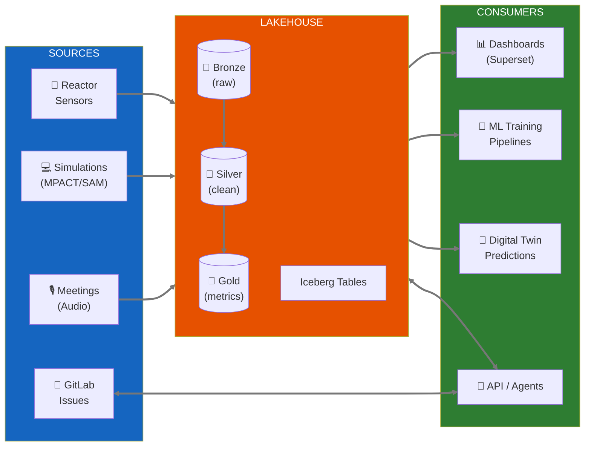

# Neutron OS: Executive Summary

**Version:** 1.0 DRAFT  
**Date:** January 2026  
**Authors:** UT Computational Nuclear Engineering Group

---

> **Document Scope:** This specification focuses on **data architecture**—the foundation that everything else builds on. Detailed specifications for **user interfaces** (dashboards, portals) and **Hyperledger blockchain integration** (audit trails, multi-facility consensus) are reserved for subsequent documents.
>
> **Dual-Track Approach:** We're not waiting for perfect architecture to deliver value. The plan is to **sandwich MVP analytics immediately** (a "data puddle" with Superset dashboards connected to the DMSRI-web PostgreSQL database) **while building the full lakehouse foundation in parallel**. Jay can stand up queryable dashboards now; we evolve the underlying infrastructure without blocking visibility. Early wins fund patience for solid architecture.
>
> **Current state:** DMSRI-web PostgreSQL does minimal aggregation and scrubbing of raw data for display in Plotly today. This doesn't scale, but connecting Superset to it delivers immediate value.

---

## What Is Neutron OS?

Neutron OS is an **agentic data ecosystem for nuclear digital twins**—a streaming-first platform that connects reactor sensors, physics simulations, and operational decisions in real time.

**Core capabilities:**

- **Streaming-first architecture** with real-time data flow and intelligent batch fallback
- **Digital twin simulation** that predicts reactor state between sensor readings (~10ms predictions vs ~100ms sensors)
- **Agentic data access** via MCP, enabling AI assistants to query reactor data, documentation, and operational context
- **Multi-facility design** built for fleet operations, from research reactors to commercial deployments

Think of it as the "operating system" for nuclear data: sensors stream to it, digital twins query it, AI assistants reason over it, and regulators audit it.

**Why build this?** Nuclear digital twins require infrastructure that doesn't exist today—real-time pipelines with sub-second latency, physics-informed ML training loops, and blockchain-grade audit trails. As nuclear energy commercializes at scale (50+ units/year), the industry needs common data infrastructure. Neutron OS provides that foundation, starting with UT Austin's research portfolio.

---

## The Problem We're Solving

Nuclear research generates enormous volumes of data across disconnected systems:

| Current State | Pain Point |
|--------------|------------|
| Sensor data in CSV files on Box | No queryable history; manual analysis |
| Simulation outputs scattered across HPC | Results disconnected from measurements |
| Meeting notes in Slack, Teams, Word docs, voice transcripts | Requirements lost; action items forgotten |
| Each project builds custom tooling | Duplicated effort; inconsistent quality |

**The core tension:** Digital twin capabilities are advancing rapidly, but the data infrastructure to support them—reliable ingestion, versioned storage, reproducible transforms, validated predictions—lags behind. We're building sophisticated ML models on fragile data foundations.

---

## What Neutron OS Delivers

### For Researchers
- Query any historical reactor state with SQL
- Compare simulation predictions to actual measurements
- Reproduce any analysis from any point in time

### For Operators
- Real-time dashboards showing reactor status
- Predictions that fill gaps between sensor readings
- Alerts when predictions diverge from measurements

### For Project Managers
- Automated extraction of action items from meetings
- Traceability from requirements to implementation
- Cross-project visibility into data quality

### For Regulators
- Immutable audit trail of all data and predictions
- Blockchain-backed proof of prediction accuracy
- Multi-facility consensus on model validity

---

## Architecture at a Glance

**Key technology choices:**
- **Apache Iceberg** for versioned, time-travel-capable storage
- **DuckDB** for fast embedded analytics (scales to Trino for multi-facility)
- **dbt** for reproducible data transformations
- **Dagster** for observable pipeline orchestration
- **Superset** for self-service dashboards

---

## Development Phases

| Phase | Deliverable | Timeline | Status |
|-------|-------------|----------|--------|
| **1a. Data Puddle (MVP)** | Superset dashboards on DMSRI-web PostgreSQL; immediate visibility | **Now** | 🟢 Jay can start |
| **1b. Foundation** | Iceberg lakehouse, dbt models, proper data contracts | Q1 2026 | 🟡 In Progress |
| **2. Core Analytics** | Full medallion architecture, Dagster orchestration; migrate puddle → lakehouse | Q2 2026 | ⚪ Planned |
| **3. Batch Digital Twin** | Offline model training, historical validation | Q3 2026 | ⚪ Planned |
| **4. Real-Time Streaming** | Live sensor ingest, <1s predictions | Q4 2026 | ⚪ Planned |
| **5. Agentic Workflows** | Meeting extraction, automated issue creation | Q1 2027 | ⚪ Planned |
| **6. Closed-Loop Control** | Predictions inform control systems | TBD | ⚪ Research |

**Phase 1 is dual-track:** 1a delivers dashboards stakeholders can see *now*; 1b ensures we don't have to rebuild when scale or complexity increases. The "puddle" migrates onto proper infrastructure in Phase 2.

---

## Why Open Lakehouse (Not Databricks/Snowflake)?

Some stakeholders ask: "Why not just pay Databricks to maintain this?"

| Factor | Databricks/Snowflake | Open Lakehouse |
|--------|---------------------|----------------|
| **Data sovereignty** | Vendor control plane has access; proprietary format | You choose where data lives; open Iceberg format is portable |
| **Nuclear compliance** | Export control complexity | Full control over data residency |
| **Cost trajectory** | DBU pricing scales with usage | Fixed TACC allocation; marginal cost ~$0 |
| **Customization** | Limited to platform APIs | Full access for DT integration |
| **Skills transfer** | Vendor-specific knowledge | Industry-standard patterns |
| **Lock-in risk** | High switching costs | Portable Iceberg format |

**Our position:** For nuclear research with sensitive data, regulatory requirements, and deep customization needs, building capability beats buying a platform. The open lakehouse stack (Iceberg + DuckDB + dbt) has reached maturity where it's the right choice for our context.

See [Platform Comparison: Databricks](platform-comparison-databricks.md) for detailed analysis.

---

## Relationship to INL DeepLynx

INL's DeepLynx is a **graph-based digital thread platform** focused on engineering data management and ontology modeling. Neutron OS is a **time-series lakehouse** focused on sensor data, simulations, and ML pipelines.

| Aspect | DeepLynx | Neutron OS |
|--------|----------|------------|
| **Data model** | Graph + separate time-series files | Unified columnar tables |
| **Primary use case** | Engineering data management | Reactor operations + DT simulation |
| **Query interface** | GraphQL (graph), batch SQL (time-series) | Interactive SQL |
| **Deployment** | INL infrastructure | TACC / local Kubernetes |

### Why Not Just Use DeepLynx and Extend It?

This is a fair question. The short answer: **different data patterns require different architectures.**

- DeepLynx optimizes for **relationship traversal** ("what components are affected by this requirement?")
- Neutron OS optimizes for **time-series analytics** ("average power over 24 hours with 10ms granularity")

DeepLynx does have time-series capabilities ("Timeseries 2" via DataFusion), but uses a batch workflow (submit query → poll → download CSV). For interactive dashboards and ML inference, we need millisecond response times. Extending DeepLynx to serve our use case would require adding columnar storage, interactive queries, time-travel, and medallion architecture—effectively building Neutron OS inside DeepLynx.

**They're complementary, not competing.** The right architecture uses DeepLynx for engineering ontology (component relationships, requirements traceability) and Neutron OS for operational data (sensor readings, predictions, ML training). Integration happens via shared identifiers and APIs.

See [DeepLynx Assessment](deeplynx-assessment.md) for detailed analysis, including Section 1.3 "Why Not Just Use DeepLynx and Extend It?"

---

## Future Directions: What This Architecture Enables

The data platform is designed to grow. The same data contracts that power digital twin predictions can support additional capabilities as needs evolve:

| Future Capability | How Data Platform Enables It |
|-------------------|-----------------------------|
| **Compliance & Audit** | Append-only tables + blockchain anchoring → regulatory evidence packages |
| **AI Assistants** | Structured data + embeddings → LLM + RAG for natural language queries |
| **Multi-Facility Collaboration** | Tenant isolation + federated queries → cross-site benchmarking |
| **Operations Modules** | Gold-layer APIs → experiment planning, fuel management dashboards |
| **Sensor Integration** | Streaming ingest patterns → real-time DAQ connectors |

These are not current deliverables—they're architectural options. The platform doesn't lock us out of future directions, and pursuing them becomes straightforward once the data foundation is solid.

---

## Current Status

**What exists today:**
- TRIGA sensor data flowing: NETL → Box → TACC → Plotly dashboards
- Historical data archive: 18 months of reactor operations
- Prototype Iceberg tables with basic dbt models
- Meeting transcription pipeline (Whisper + LLM extraction)

**What's in development:**
- Full medallion architecture (Bronze → Silver → Gold)
- Dagster orchestration for automated pipelines
- Superset dashboards replacing custom Plotly code

**What's planned:**
- Real-time streaming ingest
- Digital twin surrogate model training
- Multi-facility tenant isolation

---

## Resource Requirements

| Category | Year 1 | Year 2 | Year 3 |
|----------|--------|--------|--------|
| **Personnel** | 1.5 FTE (grad students + PI time) | 2 FTE | 2 FTE |
| **Compute** | TACC Lonestar6 allocation | TACC + local K8s | Multi-facility |
| **Software** | Open source (no license cost) | Same | Same |
| **Estimated Budget** | $300K | $400K | $400K |

**Total 3-year estimate:** $800,000 - $1,200,000 (pending CINR NOFO confirmation)

---

## Documentation Structure

This executive summary is part of a modular documentation set:

| Document | Audience | Content |
|----------|----------|---------|
| **Executive Summary** (this doc) | Leadership, PIs, reviewers | High-level overview |
| [Master Tech Spec](neutron-os-master-tech-spec.md) | Technical leads | Binding architecture decisions |
| [Databricks Comparison](platform-comparison-databricks.md) | Stakeholders | Platform strategy rationale |
| [DeepLynx Assessment](deeplynx-assessment.md) | INL collaborators | Integration opportunities |
| [Component Specs](components/) | Engineers | Deep implementation details |
| [Design Prompts](design-prompts/) | Developers | Actionable build specifications |

---

## Next Steps

1. **Complete Phase 1** (Q1 2026): Full Iceberg lakehouse with dbt models
2. **Submit CINR PreApp** (Jan 28, 2026): Funding request for 3-year development
3. **Stakeholder review**: Circulate this summary for feedback
4. **Begin component builds**: Use design prompts to drive implementation

---

*For technical details, see the [Master Technical Specification](neutron-os-master-tech-spec.md).*
