# Neutron OS Technical Specification

**Nuclear Energy Unified Technology for Research, Operations & Networks**

---

> ⚠️ **DRAFT - FOR INTERNAL REVIEW ONLY** ⚠️
>
> Version 0.1 | Generated: January 15, 2026 | Status: Draft for Colleague Review

---

> **Document Scope:** This specification provides comprehensive coverage of **data architecture**—lakehouse design, ingestion patterns, transformation pipelines, and digital twin data flows. Detailed specifications for **user interfaces** and **Hyperledger blockchain integration** are intentionally deferred to subsequent documents.
>
> **Dual-Track Development:** We pursue two parallel tracks:
> 1. **MVP Analytics Now** — Stand up a "data puddle" with basic Superset dashboards connected to the existing DMSRI-web PostgreSQL database. Immediate visibility for stakeholders. Jay can build this while architecture solidifies.
> 2. **Solid Foundation** — Design the full lakehouse (Iceberg, dbt, Dagster) to production standards. Migrate the data puddle onto proper infrastructure once validated.
>
> This avoids the false choice between "wait for perfect architecture" and "build on sand." Early dashboards demonstrate value; proper data contracts ensure we don't have to rebuild everything later.

---

| Property | Value |
|----------|-------|
| Document Type | Technical Specification |
| Version | 0.1 DRAFT |
| Last Updated | 2026-01-22 |
| Status | Draft - Pending Review |
| Authors | Ben, UT Computational NE Team |
| Reviewers | [TBD - Add reviewer names] |

---

## Table of Contents

1. [Executive Summary](#1-executive-summary)
2. [Technical Summary](#2-technical-summary)
3. [System Architecture Overview](#3-system-architecture-overview)
4. [Digital Twin Architecture](#4-digital-twin-architecture)
5. [Data Architecture](#5-data-architecture)
6. [Component Specifications](#6-component-specifications)
7. [API Specifications](#7-api-specifications)
8. [Security Architecture](#8-security-architecture)
9. [Infrastructure & Deployment](#9-infrastructure--deployment)
10. [Integration Points](#10-integration-points)
11. [Performance Requirements](#11-performance-requirements)
12. [Appendices](#12-appendices)

---

## Documentation Structure

This technical specification is the **binding architecture document** for Neutron OS. It's complemented by additional documents for different audiences and purposes:

| Document | Audience | Purpose |
|----------|----------|---------|
| [Executive Summary](neutron-os-executive-summary.md) | Leadership, PIs, DOE reviewers | 2-3 page high-level overview |
| **Master Tech Spec** (this document) | Technical leads | Authoritative architecture decisions |
| [Platform Comparison: Databricks](platform-comparison-databricks.md) | "Just pay someone" stakeholders | Why open lakehouse > vendor lock-in |
| [DeepLynx Assessment](deeplynx-assessment.md) | INL collaborators | Integration opportunities |
| [Design Prompts](design-prompts/) | Developers, Claude Code | Actionable implementation specs |

### Design Prompts (Implementation Specs)

The [design-prompts/](design-prompts/) directory contains detailed specifications for each component, suitable for direct use with AI-assisted development:

| Prompt | Phase | Description |
|--------|-------|-------------|
| [Bronze Layer Ingest](design-prompts/prompt-bronze-layer-ingest.md) | 1 | CSV → Iceberg ingestion pipeline |
| [dbt Silver Models](design-prompts/prompt-dbt-silver-models.md) | 1-2 | Data transformation and validation |
| [Dagster Orchestration](design-prompts/prompt-dagster-orchestration.md) | 2 | Pipeline scheduling and monitoring |
| [Superset Dashboards](design-prompts/prompt-superset-dashboards.md) | 2 | Visualization and self-service analytics |

---

## 1. Executive Summary

### 1.1 Vision

**Neutron OS** is a unified data and digital twin platform for nuclear facilities. It transforms how operators, researchers, and regulators interact with reactor data—replacing fragmented spreadsheets, manual logs, and disconnected systems with a single source of truth.

### 1.2 Problem Statement

Nuclear facilities today operate with:
- **Fragmented data**: Sensor readings in one system, operator logs in another, experiment results in spreadsheets
- **Manual compliance**: Hours spent compiling reports that regulators require
- **Reactive operations**: Anomalies detected after they occur, not predicted before
- **Siloed knowledge**: Institutional expertise locked in individuals, not accessible to the team

These problems compound as nuclear energy scales. Research reactors are the proving ground—but the solutions must work for commercial fleets.

### 1.3 Solution Overview

Neutron OS provides:

| Capability | Value Delivered |
|------------|-----------------|
| **Unified Data Platform** | All reactor data—sensors, logs, experiments, simulations—queryable from one place |
| **Digital Twin Analytics** | Physics-informed predictions that anticipate equipment behavior and validate operations |
| **Automated Compliance** | Audit trails and reports generated automatically, not manually compiled |
| **AI-Assisted Operations** | Natural language queries, automated meeting notes, intelligent anomaly alerts |
| **Multi-Facility Ready** | One platform serving multiple reactors with appropriate data isolation |

### 1.4 Target Users

| User | Primary Needs |
|------|---------------|
| **Reactor Operators** | Streamlined shift logs, clear dashboards, predictive alerts |
| **Researchers** | Experiment tracking, data access for analysis, simulation validation |
| **Facility Managers** | Compliance reporting, resource utilization, strategic visibility |
| **Regulators** | Immutable audit trails, standardized reporting, inspection support |

### 1.5 Scope

**This Document Covers:**
- Data architecture (lakehouse design, ingestion, transformation)
- Digital twin integration patterns
- Platform modules and their relationships
- Technical implementation approach

**Deferred to Companion Documents:**
- User interface specifications
- Hyperledger blockchain integration details
- Individual module PRDs (Operations Log, Experiment Manager, etc.)

### 1.6 Application Modules

Neutron OS is designed as a **modular platform**. Facilities enable only the modules relevant to their mission.

| Module | Description | PRD | Default |
|--------|-------------|-----|---------|
| **Core Platform** | Data lakehouse, dashboards, authentication | N/A (always on) | Required |
| **Reactor Ops Log** | Operations logging, experiment log, compliance | [Reactor Ops Log PRD](../prd/reactor-ops-log-prd.md) | On |
| **Experiment Manager** | Sample tracking, scheduling, researcher workflow | [Experiment Manager PRD](../prd/experiment-manager-prd.md) | On |
| **Analytics Dashboards** | Superset visualizations, executive reports | [Analytics PRD](../prd/analytics-dashboards-prd.md) | On |
| **Medical Isotope Production** | Customer orders, production batching, QA/QC, shipping | [Medical Isotope PRD](../prd/medical-isotope-prd.md) | **Off** |
| **Digital Twin Analytics** | Model integration, prediction validation | *(future PRD)* | On |
| **Training** | Personnel onboarding, certification currency, skills development, **operator requalification tracking (4hr/quarter minimum)** | *(future PRD)* | Off |
| **Personnel** | Staff directory with roles, certifications, contact info, availability | *(future PRD)* | Off |
| **Search / AI** | RAG, workflow-enabled agents, tuned LLMs, semantic search | *(future PRD)* | Off |
| **Connections** | Integrations hub for external systems (within Settings) | *(future PRD)* | Off |

**Module Architecture:**

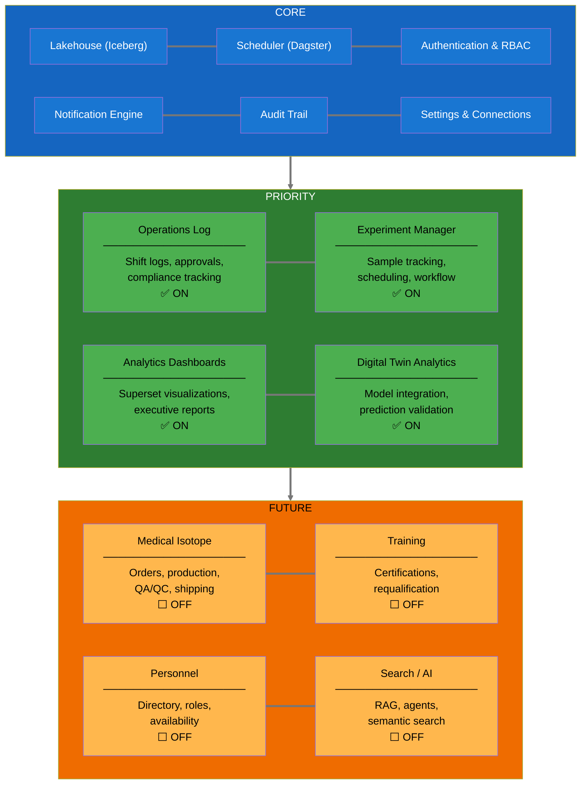

**Multi-Facility Configurability:**

All facility-specific aspects are configuration, not code:

| Aspect | Example (NETL) | Example (NRAD) | Configuration |
|--------|----------------|----------------|---------------|
| Facility names | TPNT, EPNT, CT | PTS, CT, RSR | Admin dropdown editor |
| License limits | 1 MW | 250 kW | Settings page |
| Approval workflow | ROC → RM | Similar | Workflow builder |
| Isotope catalog | I-131, Mo-99 | Different set | Catalog editor |
| Branding | UT Austin | INL | Theme settings |

### 1.6 Development Roadmap

Development follows a **multi-track approach**: deliver visible analytics immediately while building infrastructure AND agentic capabilities in parallel.

| Phase | Name | Components | Delivers | Target |
|-------|------|------------|----------|--------|
| **1a** | **Data Puddle (MVP)** | Superset on DMSRI-web PostgreSQL (direct) | Dashboards stakeholders can see **now** | **Immediate** |
| **1b** | Data Foundation | Iceberg lakehouse, proper CSV ingest, Bronze layer | Historical data in proper format | Q1 2026 |
| **2** | Core Platform | dbt transforms (Silver/Gold), migrate puddle → lakehouse, audit tables<br/>+ **Basic semantic search** | Cleaned data, data contracts, compliance foundation<br/>+ **Natural language query for Gold tables** | Q2 2026 |
| **3** | Batch DT | MPACT parser, ML training pipeline, offline predictions<br/>+ **Meeting transcription pipeline** | Fuel analytics, experiment planning, model validation<br/>+ **Automated meeting → action items** | Q3 2026 |
| **4** | Real-Time | Streaming ingest, low-latency inference, prediction overlay<br/>+ **LangGraph for anomaly narratives** | Live predictions in ops dashboard<br/>+ **AI-generated incident summaries** | Q4 2026 |
| **5** | Advanced Agentic | Multi-agent orchestration, complex reasoning chains | Autonomous experiment design, regulatory document generation | 2027 |
| **6** | Closed-Loop | Actuation interface, regulatory approval | Simulation-driven control (vision) | TBD |

**Why Multi-Track Development?**
- **1a (Data Puddle):** Jay can stand up Superset pointing directly at the DMSRI-web PostgreSQL database—the same source that powers today's Plotly dashboards. No Iceberg, no dbt—just immediate visibility. Stakeholders see dashboards this month. (Note: DMSRI-web does minimal aggregation/scrubbing; this doesn't scale, but it delivers value now.)
- **1b (Foundation):** Meanwhile, we design the proper lakehouse. When ready, we migrate 1a's queries onto proper infrastructure (Phase 2). The puddle doesn't block the lake.
- **Agentic in Parallel:** AI/LLM capabilities aren't a "Phase 5 luxury"—they deliver immediate value. Meeting transcription can start in Phase 3, semantic search enhances Phase 2's Gold layer, and anomaly narratives add context to Phase 4's real-time alerts. Each phase gets smarter with embedded AI features rather than waiting until 2027.

**Component Dependencies:**

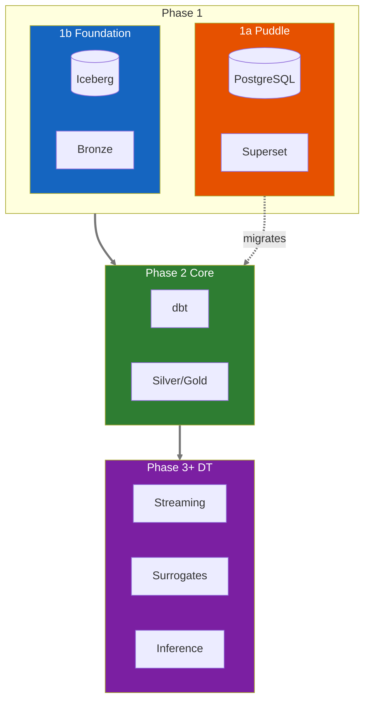

**Current Status (Jan 2026):** Phase 1a ready to start (Jay). Phase 1b in progress. NETL TRIGA data currently flows: Box → TACC Lonestar6 → DMSRI-web PostgreSQL → Plotly. Phase 1a connects Superset to this same PostgreSQL; doesn't scale, but delivers immediate dashboards.

---

## 2. Technical Summary

This section provides the technical foundation for architects and developers. For strategic context, see [Executive Summary](#1-executive-summary).

### 2.1 Core Architecture Concept

Neutron OS follows a **sensor → lakehouse → prediction → validation** loop:

1. **Ingest**: Sensor data streams into Bronze layer (Iceberg lakehouse, immutable, time-travel enabled)
2. **Transform**: dbt pipelines clean data into Silver/Gold layers
3. **Train**: ML models learn from historical data (physics-informed, with uncertainty quantification)
4. **Predict**: Digital twin surrogates predict state in ~10ms (vs ~100ms sensor latency)
5. **Validate**: Compare predictions to actual readings; retrain when accuracy degrades
6. **Future**: Closed-loop control (predictions drive actuation—requires regulatory approval)

**Why this matters:** The 10x speed advantage enables predictive safety margins (act before anomalies manifest) and tighter operating envelopes.

### 2.2 Digital Twin Use Cases

Digital twins serve **multiple purposes** in reactor operations. The platform enables all five categories below, though implementation phases differ:

| Use Case | Key Capabilities | Development Phase |
|----------|------------------|-------------------|
| **Real-Time State Estimation** | Fill sensor gaps (~10ms predictions vs ~100ms sensors); estimate unmeasurable quantities | Phase 4 (requires streaming) |
| **Fuel Management** | Track burnup, identify hot spots, optimize reload patterns, predict xenon poisoning | Phase 3 (batch analytics) |
| **Predictive Maintenance** | Anticipate component degradation, track thermal cycling stress | Phase 5 (requires history) |
| **Experiment Planning** | Simulate irradiations before execution, predict activation levels, support SAR/TSR | Phase 3 (batch analytics) |
| **Research Validation** | Compare physics codes to operational data, generate ML training datasets | Phase 2 (data foundation)

### 2.3 Key Technical Decisions

| Decision Area | Choice | Rationale |
|--------------|--------|-----------|
| Build System | Bazel | Polyglot support (Python, TS, Go, C, Mojo), hermetic builds |
| Infrastructure | Terraform + K8s + Helm | Production-grade IaC, K3D for local dev |
| Data Lakehouse | Apache Iceberg + DuckDB | Time-travel, schema evolution, fast analytics |
| Transforms | dbt-core + Dagster | SQL-first transforms, observable orchestration |
| Analytics | Apache Superset | Open-source BI, test-driven dashboard development |
| Audit Layer | Hyperledger Fabric | Multi-facility blockchain, regulatory compliance |
| Vector Store | pgvector + RLS | Meeting context, semantic search, access control |

### 2.4 Multi-Tenancy Architecture

Neutron OS supports **multi-tenant deployments** with strict data isolation. Current focus: UT Austin NETL. Architecture designed for future multi-org collaboration.

**Data Isolation Model:**

| Aspect | Implementation |
|--------|----------------|
| **Row-Level Security** | All tables include `org_id`, `reactor_id` columns |
| **Default Access** | Org can only see their own data |
| **Cross-Org Sharing** | Explicit grants (e.g., shared benchmarking datasets) |
| **Shared Resources** | Ontology schema, tag conventions, model registry |
| **Isolated Resources** | Sensor data, ops log entries, meeting transcripts |

**Deployment Options:**

| Model | Description | Use Case |
|-------|-------------|----------|
| **Shared Cloud** (default) | Single platform, multi-tenant RLS, shared compute | Most orgs |
| **Federated** | Org-local DTs, shared analytics, federated queries | Sensitive data + collaboration |
| **Air-Gapped** | Full local deployment, no external connection | High-security facilities |

---

## 3. System Architecture Overview

The proposed platform would be organized in layers, each with specific responsibilities:

### 2.1 Architecture Layers

> **Design Pattern:** The Bronze/Silver/Gold "medallion" architecture separates raw ingestion from transformation—a pattern proven at organizations handling 100+ petabytes with minute-level latency. It enables fast backfill, reproducible transformations, and clear data quality contracts.

| Layer | Components | Responsibility |
|-------|------------|----------------|
| **External** | NETL TRIGA sensors, MPACT/SAM simulations, GitLab, Slack | Data sources outside Neutron OS boundary |
| **Ingestion** | CSV loaders, HDF5 parsers, LangGraph pipelines | Normalize and route incoming data |
| **Storage (Bronze)** | Iceberg tables: `reactor_timeseries_raw`, `simulation_outputs_raw`, `elog_entries_raw` | Raw, immutable data exactly as received (EL, not ETL) |
| **Storage (Silver)** | Iceberg tables: `reactor_readings`, `xenon_dynamics`, `elog_entries_validated` | Cleaned, typed, deduplicated data |
| **Storage (Gold)** | Iceberg tables: `reactor_hourly_metrics`, `fuel_burnup_current` | Business-ready aggregates for dashboards |
| **DT Simulation** | ML training pipeline, TRIGA/MSR/MIT Loop/OffGas surrogate models, validation engine | Real-time state prediction (~10ms) |
| **Services** | dbt transforms, Dagster orchestration, DuckDB queries (embedded), Trino (distributed, Phase 4+), pgvector search | Data processing and analytics |
| **Presentation** | Superset dashboards, FastAPI endpoints, React apps | Human and machine interfaces |
| **Infrastructure** | Kubernetes (K3D), Terraform, Helm, Prometheus/Grafana | Deployment, scaling, observability |
| **Audit** | Hyperledger Fabric | Multi-facility blockchain for regulatory compliance |

### 2.2 Data Flow Summary

**Primary data flows:**

1. **Sensor → Analytics:** `Sensors → Bronze (raw) → Silver (cleaned) → Gold (aggregated) → Superset dashboards`
2. **Simulation → Validation:** `MPACT outputs → Bronze → Silver → ML training → Surrogate models → Predictions`
3. **Prediction → Dashboard:** `Surrogate model → Prediction (source='modeled') → Gold → Dashboard overlay vs measured`
4. **Meeting → Requirements:** `Audio → Whisper transcription → LLM extraction → Action items → GitLab issues`

### 2.3 External Integrations

| System | Integration | Data Flow |
|--------|-------------|-----------|
| **NETL TRIGA** | CSV files synced to Box | Sensors → Box → TACC → Bronze |
| **TACC Lonestar6** | HPC storage + compute | Pull from Box, run simulations, store outputs |
| **MPACT/SAM/Nek5000** | HDF5 output parsers | Simulation outputs → Bronze |
| **GitLab** | Issue creation API | Action items → GitLab issues |
| **Plotly/Jupyter** | Direct lakehouse queries | Gold/Silver → Visualization |

---

## 4. Digital Twin Architecture

**Digital twins serve multiple purposes** (see Section 2.2): real-time state estimation, fuel management, predictive maintenance, experiment planning, and research validation. This section focuses on the **real-time simulation architecture**—a technically demanding use case—but the same data infrastructure supports all five categories.

### 4.1 Real-Time State Estimation: The Core Challenge

As described in Section 2.1, the fundamental problem is **sensor latency** (~100ms round-trip) versus **transient timescales** (<50ms). Digital twins fill this temporal gap with predictions, enabling tighter operational margins—but with important caveats:

| Aspect | Sensor-Only Operations | DT-Augmented Operations |
|--------|------------------------|-------------------------|
| **State visibility** | Discrete measurements every ~100ms | Continuous estimates every ~10ms |
| **Inter-sample state** | Unknown | Estimated with uncertainty bounds |
| **Safety margins** | Conservative (account for unknowns) | Tighter (bounded uncertainty) |
| **Operational capacity** | Limited by uncertainty | Closer to optimal |
| **Key caveat** | Ground truth | Predictions are *estimates*, not measurements |

**Critical limitations:**
- Surrogate models trade fidelity for speed—they are approximations
- Uncertainty grows between sensor readings (see below)
- Novel scenarios outside training data may produce unreliable predictions
- Achieving trustworthy accuracy bounds is an active research area

#### 3.1.1 Uncertainty Growth Between Sensor Readings

Predictions fill the temporal gap between sensor readings, but **uncertainty grows** the further we extrapolate. When the next sensor reading arrives, we validate and recalibrate:

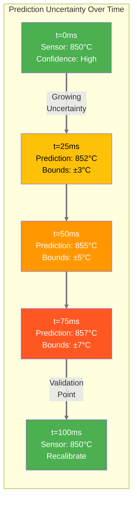

**Key Insight:**
- **At t=0:** High confidence (just measured)
- **At t=50ms:** Lower confidence (extrapolating) — uncertainty bounds widen
- **At t=100ms:** Validation arrives — bounds collapse, model recalibrates

We trade UNKNOWN state for ESTIMATED state with quantified uncertainty.  
This is better than nothing, but it's not the same as knowing.

### 3.2 The Closed-Loop Architecture

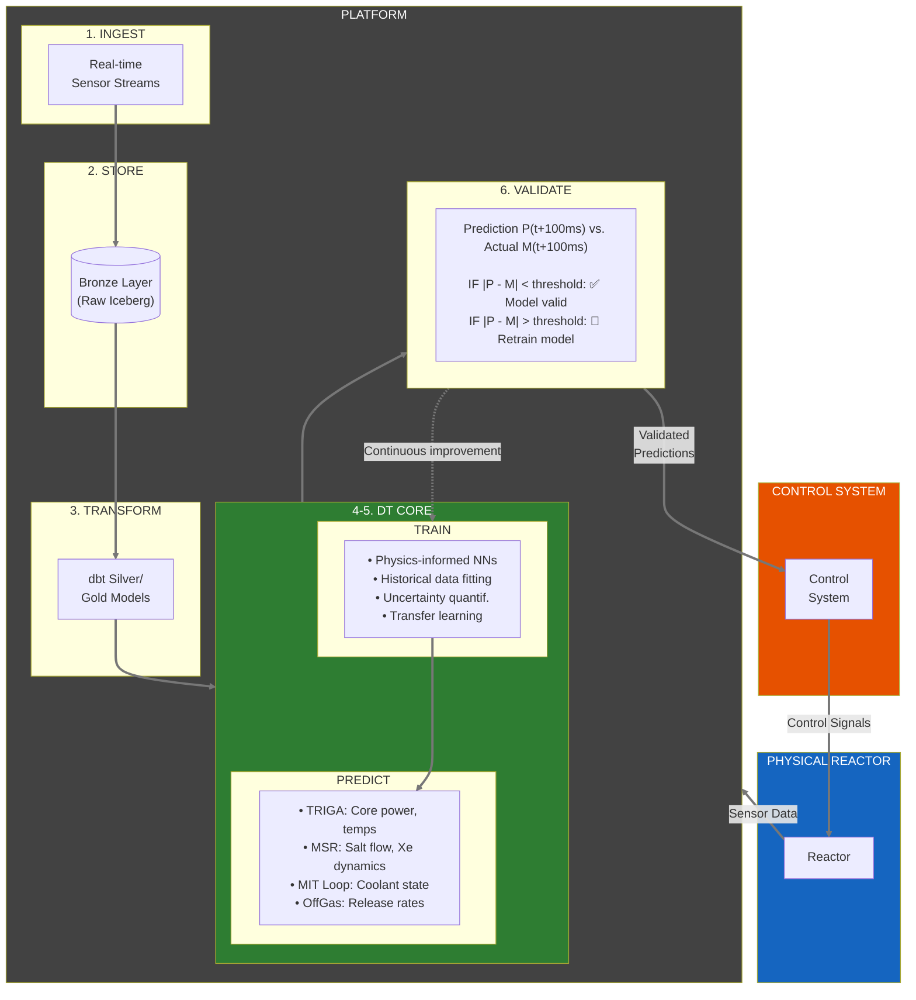

> **Ultimate Vision:** AI-assisted control decisions feed validated predictions back to the reactor control system, enabling tighter operational margins with quantified uncertainty.

### 3.3 Data Flow for Digital Twins

The digital twin simulation layer has specific data requirements:

| Data Flow | Source | Destination | Latency Requirement | Purpose |
|-----------|--------|-------------|---------------------|---------|
| **Sensor Ingest** | Physical sensors | Bronze layer | <10ms | Raw state capture |
| **Feature Engineering** | Bronze/Silver | ML Pipeline | <100ms | Model inputs |
| **Model Inference** | Trained models | DT Simulation | <10ms | State prediction |
| **Validation Comparison** | Prediction + Actual | Validation engine | <200ms | Model accuracy check |
| **Dashboard Updates** | Gold layer | Superset | <1s | Human visibility |
| **Control Signals** | Validated predictions | Control system | <50ms | Closed-loop actuation |

### 3.4 Per-Project Digital Twin Specifications

| Digital Twin | Primary Physics | ML Model Type | Prediction Target | Current Status | Known Limitations |
|--------------|-----------------|---------------|-------------------|----------------|-------------------|
| **TRIGA DT** | Point kinetics, thermal hydraulics | Physics-informed NN | Core power, fuel temps | Active development | Accuracy TBD; trained on steady-state data only |
| **MSR DT** | Multi-physics neutronics + TH | Surrogate models | Salt temp, Xe-135 conc | Research phase | Complex coupling limits surrogate fidelity |
| **MIT Loop DT** | Coolant flow, heat transfer | Reduced-order models | Coolant state, HX perf | Active development | Limited transient scenario coverage |
| **OffGas DT** | Noble gas transport | Empirical + ML hybrid | Release rates | Planning phase | Sparse training data; high uncertainty |

### 3.5 How Data Architecture Serves Digital Twin Use Cases

Every component of Neutron OS supports the full spectrum of digital twin applications:

| Component | Digital Twin Purpose |
|-----------|---------------------|
| **Apache Iceberg** | Time-travel enables training on any historical state; schema evolution as models require new features; ACID transactions for reliable sensor ingestion |
| **Bronze Layer** | Immutable sensor record for model validation; full fidelity data for retraining; regulatory audit trail |
| **dbt Transforms** | Consistent feature engineering for ML; reproducible pipelines; testable data quality |
| **DuckDB** | Fast analytical queries for training data prep; low latency for real-time feature lookup; embedded alongside simulation |
| **Hyperledger Fabric** | Immutable proof of predictions vs. actuals; multi-facility consensus on model validity; regulatory compliance |
| **Dagster Orchestration** | Trigger retraining when model accuracy drops; manage ML pipeline dependencies; observable model lineage |
| **pgvector + Semantic Search** | Find similar historical scenarios; anomaly detection via embedding distance; meeting context |
| **Superset Dashboards** | Real-time visibility into prediction accuracy; human-in-the-loop decisions; operational awareness |

### 3.6 Implementation Roadmap

| Phase | Milestone | Data Requirements | DT Integration | Target |
|-------|-----------|-------------------|----------------|--------|
| **Phase 1** | Historical model training | Bronze/Silver layers populated | Batch training on historical data | Q1 2026 |
| **Phase 2** | Near-real-time prediction | Streaming ingest, <10s latency | Models run on recent data | Q2 2026 |
| **Phase 3** | Real-time prediction | Streaming ingest, <100ms latency | Continuous state estimation | Q4 2026 |
| **Phase 4** | Validated predictions | Automated prediction vs. actual comparison | Confidence-scored outputs | Q2 2027 |
| **Phase 5** | Operator advisory | Dashboard alerts from predictions | Human-in-loop decisions | Q4 2027 |
| **Phase 6** | Closed-loop control | Ultra-low latency, <50ms | Predictions drive actuation | TBD |

> ⚠️ **Note:** Phase 6 (closed-loop control) requires extensive regulatory approval, safety validation, and is a long-term research goal rather than near-term deliverable.

### 3.7 Prediction Limitations & Honest Uncertainty

Digital twin predictions are **estimates, not measurements**. This section acknowledges the fundamental tradeoffs.

#### Why Surrogates Are Approximate

High-fidelity physics codes (MCNP, MPACT, Nek5000) can take minutes to days per simulation. Real-time prediction requires ~10ms response. We achieve this through surrogate models that approximate the full physics—but approximation means reduced fidelity.

| Approach | Runtime | Fidelity | Use Case |
|----------|---------|----------|----------|
| Full Monte Carlo (MCNP) | Hours–days | Highest | Offline analysis, benchmarking |
| Deterministic neutronics (MPACT) | Minutes–hours | High | Design studies, training data generation |
| **Surrogate/ROM** | **~10ms** | **Lower** | **Real-time prediction** |

#### What "Uncertainty Quantification" Means

When we say a prediction has "uncertainty bounds," we mean:
- **Point estimate**: "Power is ~850 kW"
- **With UQ**: "Power is 850 kW ± 15 kW (95% confidence)"

The bounds tell operators how much to trust the prediction. Wider bounds = less confidence.

#### Known Failure Modes

| Scenario | Risk | Mitigation |
|----------|------|------------|
| **Out-of-distribution** | Novel operating conditions not seen in training data | Conservative bounds; flag for human review |
| **Model drift** | Physics changes (burnup, aging) invalidate trained model | Continuous validation; scheduled retraining |
| **Transient extrapolation** | Rapid changes exceed model response assumptions | Widen bounds during transients; fall back to conservative limits |

#### Research Questions (Active Work)

- What accuracy levels are achievable for each DT project?
- How should uncertainty bounds propagate through decision-making?
- When should the system automatically distrust its own predictions?

> **Honest framing:** Simulation-augmented operations could potentially improve safety and efficiency, though validated accuracy numbers are still being established. Trustworthy uncertainty quantification remains a core research objective, not a solved problem.

### 3.8 Reactor Provider Interface: Factory/Provider Architecture

A key design goal is enabling **any reactor digital twin** to plug into Neutron OS, regardless of reactor type (TRIGA, MSR, PWR, BWR, LWR, Fusion, etc.). This section defines the standardized interface definition language (IDL) and factory/provider patterns that make this composability possible.

#### 3.8.1 Design Philosophy: Factory/Provider Pattern

Rather than hardcoding reactor-specific logic throughout the platform, Neutron OS uses a **factory/provider pattern** that allows reactor providers to register their implementations at runtime:

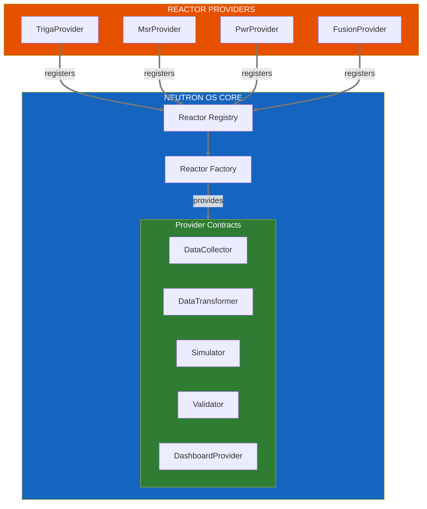

**Key Benefits:**
- **Decoupling:** Core platform knows nothing about specific reactor physics
- **Extensibility:** New reactor types added without modifying core code
- **Testing:** Mock implementations for unit testing
- **Versioning:** Multiple versions of same reactor type can coexist

#### 3.8.2 Core Interface Definitions (IDL)

Each reactor provider must implement these provider interfaces:

```python
 neutron_core/interfaces.py
from abc import ABC, abstractmethod
from typing import Dict, List, Any, Optional
from datetime import datetime
from pydantic import BaseModel

class ReactorMetadata(BaseModel):
    """Reactor identity and characteristics."""
    reactor_id: str                    # Unique identifier (e.g., "ut-triga-1")
    reactor_type: str                  # Category: "TRIGA" | "MSR" | "PWR" | "BWR" | "FUSION" | ...
    facility: str                      # Operating facility
    license_number: Optional[str]      # NRC license if applicable
    thermal_power_mw: float            # Rated thermal power
    coolant_type: str                  # "light_water" | "heavy_water" | "molten_salt" | "helium" | ...
    moderator_type: Optional[str]      # "graphite" | "water" | "heavy_water" | None
    fuel_type: str                     # "UZrH" | "UO2" | "molten_fluoride" | ...
    capabilities: List[str]            # ["real_time_state", "predictive", "closed_loop"]

class SensorReading(BaseModel):
    """Standardized sensor measurement."""
    sensor_id: str
    timestamp: datetime
    value: float
    unit: str
    uncertainty: Optional[float] = None
    quality_flag: str = "GOOD"         # "GOOD" | "SUSPECT" | "BAD"

class StateVector(BaseModel):
    """Reactor state at a point in time."""
    timestamp: datetime
    reactor_id: str
    power_thermal_kw: float
    power_uncertainty_kw: float
    temperatures: Dict[str, float]     # location -> temp_C
    flows: Dict[str, float]            # location -> flow_rate
    pressures: Dict[str, float]        # location -> pressure
    custom_fields: Dict[str, Any]      # Reactor-specific fields


class DataCollector(ABC):
    """Interface for collecting reactor data."""
    
    @abstractmethod
    def get_metadata(self) -> ReactorMetadata:
        """Return static reactor characteristics."""
        pass
    
    @abstractmethod
    def get_sensor_manifest(self) -> List[Dict[str, Any]]:
        """Return list of available sensors with metadata."""
        pass
    
    @abstractmethod
    def collect_readings(self) -> List[SensorReading]:
        """Collect current sensor readings."""
        pass
    
    @abstractmethod
    def get_historical_readings(
        self, 
        start: datetime, 
        end: datetime,
        sensors: Optional[List[str]] = None
    ) -> List[SensorReading]:
        """Query historical sensor data."""
        pass


class DataTransformer(ABC):
    """Interface for reactor-specific data transformations."""
    
    @abstractmethod
    def to_bronze_schema(self, readings: List[SensorReading]) -> Dict[str, Any]:
        """Transform raw readings to bronze layer format."""
        pass
    
    @abstractmethod
    def to_silver_schema(self, bronze_data: Dict[str, Any]) -> Dict[str, Any]:
        """Clean and validate data for silver layer."""
        pass
    
    @abstractmethod
    def to_state_vector(self, silver_data: Dict[str, Any]) -> StateVector:
        """Compute state vector from silver data."""
        pass
    
    @abstractmethod
    def get_dbt_models(self) -> List[str]:
        """Return paths to reactor-specific dbt models."""
        pass


class PredictionResult(BaseModel):
    """Result of a digital twin prediction."""
    timestamp: datetime
    prediction_horizon_ms: int
    state: StateVector
    confidence: float                  # 0.0 - 1.0
    uncertainty_bounds: Dict[str, tuple]  # field -> (lower, upper)
    model_version: str


class Simulator(ABC):
    """Interface for digital twin simulation/prediction."""
    
    @abstractmethod
    def get_model_info(self) -> Dict[str, Any]:
        """Return model metadata (type, version, training date)."""
        pass
    
    @abstractmethod
    def predict(
        self, 
        current_state: StateVector,
        horizon_ms: int = 100
    ) -> PredictionResult:
        """Predict future state from current state."""
        pass
    
    @abstractmethod
    def train(
        self,
        training_data: List[StateVector],
        validation_split: float = 0.2
    ) -> Dict[str, Any]:
        """Train/retrain the surrogate model."""
        pass
    
    @abstractmethod
    def get_uncertainty_model(self) -> Any:
        """Return uncertainty quantification model."""
        pass


class ValidationResult(BaseModel):
    """Result of prediction validation."""
    prediction: PredictionResult
    actual: StateVector
    errors: Dict[str, float]           # field -> error
    within_bounds: bool
    recommendation: str                # "VALID" | "RETRAIN" | "ALERT"


class Validator(ABC):
    """Interface for validating predictions against measurements."""
    
    @abstractmethod
    def validate(
        self,
        prediction: PredictionResult,
        actual: StateVector
    ) -> ValidationResult:
        """Compare prediction to actual measurement."""
        pass
    
    @abstractmethod
    def get_validation_history(
        self,
        start: datetime,
        end: datetime
    ) -> List[ValidationResult]:
        """Query historical validation results."""
        pass
    
    @abstractmethod
    def should_retrain(self) -> bool:
        """Determine if model should be retrained."""
        pass


class DashboardProvider(ABC):
    """Interface for reactor-specific dashboard components."""
    
    @abstractmethod
    def get_superset_datasets(self) -> List[Dict[str, Any]]:
        """Return Superset dataset definitions."""
        pass
    
    @abstractmethod
    def get_superset_charts(self) -> List[Dict[str, Any]]:
        """Return Superset chart definitions."""
        pass
    
    @abstractmethod
    def get_superset_dashboards(self) -> List[Dict[str, Any]]:
        """Return Superset dashboard definitions."""
        pass
    
    @abstractmethod
    def get_custom_visualizations(self) -> List[str]:
        """Return paths to custom visualization providers."""
        pass
```

#### 3.8.3 Reactor Factory Implementation

The factory manages provider registration and instantiation:

```python
 neutron_core/factory.py
from typing import Dict, Type, Optional
from .interfaces import (
    ReactorMetadata, DataCollector, DataTransformer,
    Simulator, Validator, DashboardProvider
)

class ReactorProvider:
    """Container for all reactor-specific implementations."""
    
    def __init__(
        self,
        metadata: ReactorMetadata,
        collector: DataCollector,
        transformer: DataTransformer,
        simulator: Simulator,
        validator: Validator,
        dashboard: DashboardProvider
    ):
        self.metadata = metadata
        self.collector = collector
        self.transformer = transformer
        self.simulator = simulator
        self.validator = validator
        self.dashboard = dashboard


class ReactorRegistry:
    """Singleton registry for reactor providers."""
    
    _instance = None
    _providers: Dict[str, Type[ReactorProvider]] = {}
    
    def __new__(cls):
        if cls._instance is None:
            cls._instance = super().__new__(cls)
        return cls._instance
    
    @classmethod
    def register(cls, reactor_type: str):
        """Decorator to register a reactor provider class."""
        def decorator(provider_class: Type[ReactorProvider]):
            cls._providers[reactor_type] = provider_class
            return provider_class
        return decorator
    
    @classmethod
    def get_provider_class(cls, reactor_type: str) -> Optional[Type[ReactorProvider]]:
        """Get registered provider class by type."""
        return cls._providers.get(reactor_type)
    
    @classmethod
    def list_registered(cls) -> List[str]:
        """List all registered reactor types."""
        return list(cls._providers.keys())


class ReactorFactory:
    """Factory for creating reactor provider instances."""
    
    def __init__(self, config: Dict[str, Any]):
        self.config = config
        self.registry = ReactorRegistry()
        self._instances: Dict[str, ReactorProvider] = {}
    
    def create(self, reactor_id: str, reactor_type: str) -> ReactorProvider:
        """Create or return cached reactor provider instance."""
        if reactor_id in self._instances:
            return self._instances[reactor_id]
        
        provider_class = self.registry.get_provider_class(reactor_type)
        if provider_class is None:
            raise ValueError(f"Unknown reactor type: {reactor_type}")
        
        reactor_config = self.config.get("reactors", {}).get(reactor_id, {})
        instance = provider_class(reactor_id, reactor_config)
        self._instances[reactor_id] = instance
        return instance
    
    def get_all_active(self) -> List[ReactorProvider]:
        """Return all active reactor provider instances."""
        return list(self._instances.values())
```

#### 3.8.4 Example Provider Implementation (TRIGA)

```python
 providers/triga/provider.py
from neutron_core.factory import ReactorRegistry, ReactorProvider
from neutron_core.interfaces import *

@ReactorRegistry.register("TRIGA")
class TrigaProvider(ReactorProvider):
    """TRIGA reactor digital twin provider."""
    
    def __init__(self, reactor_id: str, config: Dict[str, Any]):
        metadata = ReactorMetadata(
            reactor_id=reactor_id,
            reactor_type="TRIGA",
            facility=config.get("facility", "UT Austin NETL"),
            license_number="R-129",
            thermal_power_mw=1.1,
            coolant_type="light_water",
            moderator_type="water",
            fuel_type="UZrH",
            capabilities=["real_time_state", "predictive"]
        )
        
        super().__init__(
            metadata=metadata,
            collector=TrigaDataCollector(config),
            transformer=TrigaTransformer(config),
            simulator=TrigaSimulator(config),
            validator=TrigaValidator(config),
            dashboard=TrigaDashboardProvider(config)
        )


class TrigaDataCollector(DataCollector):
    """TRIGA-specific data collection."""
    
    def __init__(self, config: Dict[str, Any]):
        self.serial_port = config.get("serial_port", "/dev/ttyUSB0")
        self.baud_rate = config.get("baud_rate", 9600)
        # ... TRIGA-specific initialization
    
    def get_sensor_manifest(self) -> List[Dict[str, Any]]:
        return [
            {"id": "power_linear", "type": "power", "unit": "kW", "location": "core"},
            {"id": "power_log", "type": "power", "unit": "kW", "location": "core"},
            {"id": "temp_fuel_1", "type": "temperature", "unit": "C", "location": "fuel_element_1"},
            {"id": "temp_pool", "type": "temperature", "unit": "C", "location": "pool"},
            {"id": "rod_pos_reg", "type": "position", "unit": "steps", "location": "reg_rod"},
            {"id": "rod_pos_shim", "type": "position", "unit": "steps", "location": "shim_rod"},
            {"id": "rod_pos_safe", "type": "position", "unit": "steps", "location": "safe_rod"},
            # ... additional TRIGA sensors
        ]
    
    # ... implement other methods
```

#### 3.8.5 Touch Points: What Providers Must Provide

Every reactor provider must provide implementations for these integration points:

| Touch Point | Interface | Purpose | Required |
|-------------|-----------|---------|----------|
| **Data Collection** | `DataCollector` | Sensor reading ingestion | ✅ Yes |
| **Schema Transforms** | `DataTransformer` | Bronze → Silver → Gold mappings | ✅ Yes |
| **State Estimation** | `Simulator` | Real-time predictions | ⚠️ If DT enabled |
| **Model Validation** | `Validator` | Prediction accuracy tracking | ⚠️ If DT enabled |
| **Dashboards** | `DashboardProvider` | Visualization definitions | ✅ Yes |
| **Avro Schemas** | Files | Bronze/Silver/Gold schemas | ✅ Yes |
| **dbt Models** | SQL files | Transformation logic | ✅ Yes |
| **Config Schema** | Pydantic model | Provider configuration | ✅ Yes |

#### 3.8.6 Supporting Vastly Different Reactor Types

The interface abstractions are deliberately generic to support diverse reactor physics:

| Reactor Type | Key Differences | How Provider Adapts |
|--------------|-----------------|-------------------|
| **TRIGA** | Pulsing capability, ZrH moderator | Custom pulse detection in collector; specific thermal models |
| **MSR** | Flowing fuel, dissolved fission products | Salt flow sensors; continuous fuel tracking; Xe dynamics |
| **PWR/BWR** | High pressure, steam generation | Pressure/steam sensors; two-phase flow models |
| **HTGR** | Helium coolant, graphite moderator | Gas flow sensors; graphite temperature models |
| **Fusion** | Plasma physics, magnetic confinement | Plasma diagnostics; confinement time models |
| **Research Loops** | Various coolant types, specific experiments | Highly customized sensor sets; experiment-specific models |

**Handling Reactor-Specific Physics:**

```python
 The StateVector.custom_fields allows reactor-specific data:

 TRIGA custom fields
custom_fields = {
    "excess_reactivity_dollars": 2.5,
    "control_rod_worth_dollars": {"reg": 0.5, "shim": 1.2, "safe": 1.8},
    "pulse_energy_mj": None,  # Only during pulsing
}

 MSR custom fields
custom_fields = {
    "salt_flow_rate_kg_s": 45.2,
    "xenon_concentration_ppb": 12.3,
    "delayed_neutron_fraction": 0.0065,
    "fuel_salt_temperature_inlet_c": 650,
    "fuel_salt_temperature_outlet_c": 700,
}

 Fusion custom fields
custom_fields = {
    "plasma_current_ma": 15.0,
    "confinement_time_s": 0.5,
    "q_factor": 1.2,
    "neutron_rate_per_s": 1e17,
}
```

#### 3.8.7 Provider Discovery and Loading

Providers are discovered at startup via entry points:

```toml
 providers/triga/pyproject.toml
[project.entry-points."neutron_os.providers"]
triga = "triga_provider:TrigaProvider"

 providers/msr/pyproject.toml
[project.entry-points."neutron_os.providers"]
msr = "msr_provider:MsrProvider"
```

```python
 neutron_core/loader.py
from importlib.metadata import entry_points

def load_providers():
    """Discover and load all installed reactor providers."""
    providers = entry_points(group="neutron_os.providers")
    
    for provider_entry in providers:
        provider_class = provider_entry.load()
        # Provider auto-registers via @ReactorRegistry.register decorator
        print(f"Loaded provider: {provider_entry.name}")
    
    return ReactorRegistry.list_registered()
```

#### 3.8.8 Configuration Schema

Each reactor instance is configured via YAML:

```yaml
 config/reactors.yaml
reactors:
  ut-triga-1:
    type: TRIGA
    facility: "UT Austin NETL"
    enabled: true
    data_collection:
      serial_port: "/dev/ttyUSB0"
      baud_rate: 9600
      poll_interval_ms: 100
    digital_twin:
      enabled: true
      model_path: "models/triga_surrogate_v2.onnx"
      prediction_horizon_ms: 100
      retrain_threshold: 0.05
    dashboards:
      enabled: true
      refresh_interval_s: 5
  
  ornl-msre-sim:
    type: MSR
    facility: "ORNL (Historical Simulation)"
    enabled: true
    data_collection:
      source: "historical_database"
      replay_speed: 1.0
    digital_twin:
      enabled: true
      model_path: "models/msre_surrogate_v1.onnx"
```

> **[PLACEHOLDER: Detailed Provider Developer Guide]**
> → Full documentation for creating new reactor providers, including testing templates, validation requirements, and certification process.

---

### 3.9 Reactor Onboarding & Configuration Points

When a new reactor is added to Neutron OS, configuration spans multiple system layers. This section identifies the **configuration domains** that must flex per reactor type.

#### Configuration Domain Map

| Domain | What It Defines | Examples |
|--------|-----------------|----------|
| **Reactor Identity** | Type, facility, license class, operational envelope | TRIGA Mark II, 1.1 MW, pulsing-capable |
| **Sensor Schema** | Channel names, units, sampling rates, valid ranges | `fuel_temp_1` (°C), `pool_level` (cm) |
| **Data Ingest** | Source type, connection params, polling/push mode | Serial over TCP, OPC-UA endpoint, file drop |
| **Physics Models** | Applicable simulators, surrogate model paths | RELAP, TRACE, ONNX surrogate |
| **Alarm Thresholds** | Safety limits, warning bands, trip setpoints | Fuel temp < 400°C, pool level > 23.5 ft |
| **Dashboard Templates** | Which visualizations apply to this reactor type | Core map layout, control rod positions |
| **Compliance Rules** | Regulatory regime, reporting requirements | NRC Part 50 vs Part 70, 10 CFR 20 |
| **Module Enablement** | Which application modules are active | Medical Isotope: Off for research reactors |

#### Configuration Flow

```mermaid
graph TB
    subgraph "REACTOR ONBOARDING"
        subgraph "Phase 1: Foundation"
            ID["1. IDENTITY<br/>────────<br/>• Type<br/>• Facility<br/>• License"]
            DATA["2. DATA<br/>────────<br/>• Sensors<br/>• Ingest<br/>• Schema"]
            MODELS["3. MODELS<br/>────────<br/>• Physics<br/>• Surrogate<br/>• UQ Bounds"]
        end
        
        subgraph "Phase 2: Implementation"
            OPS["4. OPERATIONS<br/>────────<br/>• Alarms<br/>• Workflows<br/>• Modules"]
            PRES["5. PRESENTATION<br/>────────<br/>• Dashboards<br/>• Reports<br/>• Alerts"]
            COMP["6. COMPLIANCE<br/>────────<br/>• Reg Rules<br/>• Audit Req<br/>• Retention"]
        end
        
        ID --> DATA
        DATA --> MODELS
        ID --> OPS
        DATA --> PRES
        MODELS --> COMP
    end
    
    style ID fill:#E3F2FD,color:#000000,stroke:#1976D2
    style DATA fill:#E8F5E9,color:#000000,stroke:#388E3C
    style MODELS fill:#FFF3E0,color:#000000,stroke:#F57C00
    style OPS fill:#F3E5F5,color:#000000,stroke:#7B1FA2
    style PRES fill:#E0F2F1,color:#000000,stroke:#00796B
    style COMP fill:#FFEBEE,color:#000000,stroke:#C62828
    linkStyle default stroke:#777777,stroke-width:3px
```

#### Reactor-Type-Specific Variations

Different reactor types require different implementations of the same interface:

| Component | TRIGA | MSR | PWR/BWR |
|-----------|-------|-----|---------|
| **DataCollector** | Serial-over-TCP from DCS | SAM simulation output | Plant historian (PI/OSIsoft) |
| **DataTransformer** | Channel rename + unit conversion | Salt property calcs | Already normalized |
| **Simulator** | RELAP5/TRACE point kinetics | SAM/Moltres | Vendor-specific core sim |
| **StateVector** | Fuel temp, pool temp, power | Salt temps, flow, delayed precursors | Tave, pressurizer, rod positions |
| **DashboardProvider** | Core cross-section heatmap | Loop schematic | Mimic diagrams |

#### Configuration Storage

Configuration is stored in layers, with later layers overriding earlier:

```
defaults/              ← Shipped with Neutron OS
  reactor_types/
    triga.yaml         ← Base TRIGA configuration
    msr.yaml
    pwr.yaml
    
facilities/            ← Facility-specific overrides  
  ut_netl/
    config.yaml        ← Overrides for UT NETL
    sensors.yaml       ← Sensor mappings
    
instances/             ← Per-reactor-instance config
  netl_triga_001/
    config.yaml        ← This specific reactor
```

> **[PLACEHOLDER: Configuration Schema Reference]**
> → Full YAML schema definitions for each configuration domain.

---

### 3.10 Extension Points Catalog

Neutron OS is designed as an **extensible platform** with well-defined extension points. This enables the industry to adopt a common standard for nuclear digital twin interoperability.

#### Design Intent

The platform defines **factories** as internal mechanisms where **providers** plug in:

- **Factory**: Internal Neutron OS component that discovers and instantiates providers
- **Provider**: External module implementing a standard interface (developed per facility/vendor)
- **Extension Point**: The registration mechanism (Python `entry_points`)

This pattern enables:
- Reactor vendors to ship providers for their designs
- Plant historian vendors to provide data ingest adapters
- Regulatory bodies to define compliance providers for their jurisdiction
- ML platform vendors to integrate surrogate model hosting

#### Extension Point Catalog

| Factory | Provider Interface | Purpose | Example Providers |
|---------|-------------------|---------|-------------------|
| **ReactorFactory** | `ReactorProvider` | Reactor-type-specific digital twin logic | TRIGA, MSR, PWR, BWR, Fusion |
| **IngestFactory** | `IngestProvider` | Data source adapters | OPC-UA, PI Historian, Modbus, CSV, SCADA |
| **SimulatorFactory** | `SimulatorProvider` | Physics code wrappers | RELAP, TRACE, SAM, OpenMC, vendor codes |
| **SurrogateFactory** | `SurrogateProvider` | ML model inference | ONNX, PyTorch, TensorFlow, Gaussian Process |
| **ComplianceFactory** | `ComplianceProvider` | Regulatory reporting | NRC Part 50, NRC Part 70, IAEA, CNSC |
| **NotifyFactory** | `NotifyProvider` | Alert delivery | Email, SMS, PagerDuty, plant annunciator |
| **AuthFactory** | `AuthProvider` | Identity integration | LDAP, SAML, Active Directory, badge systems |
| **DashboardFactory** | `DashboardProvider` | Visualization adapters | Superset, Grafana, plant HMI, vendor displays |
| **AuditFactory** | `AuditProvider` | Provenance tracking | Hyperledger, append-only log, NRC-approved |
| **ModelRegistryFactory** | `ModelRegistryProvider` | ML model versioning | MLflow, custom, cloud-native |

#### Extension Point Architecture

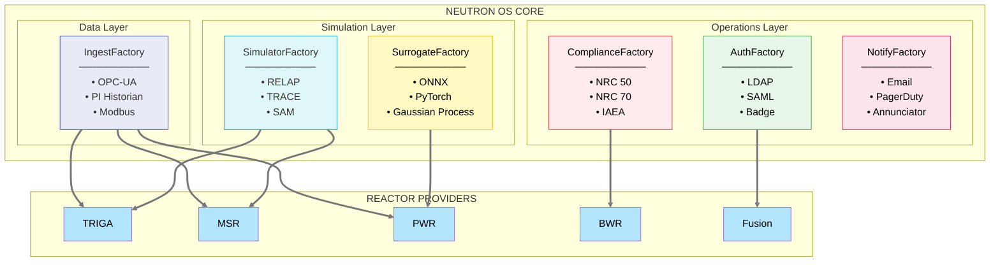

#### Industry Adoption Scenarios

| Stakeholder | What They Provide | Benefit |
|-------------|-------------------|---------|
| **Reactor vendors** (NuScale, X-energy, Kairos) | ReactorProvider + SimulatorProvider | Digital twin for their design works with any Neutron OS deployment |
| **Plant historian vendors** (OSIsoft, Honeywell) | IngestProvider | Their data flows into any nuclear digital twin |
| **Regulatory bodies** (NRC, IAEA, CNSC) | ComplianceProvider | Standard compliance reporting across facilities |
| **ML platform vendors** (Databricks, AWS) | SurrogateProvider, ModelRegistryProvider | Cloud-native ML integrates with nuclear operations |
| **Control room vendors** | DashboardProvider | Digital twin data surfaces in existing HMI |

#### What We Don't Extensibilize

Some components are standardized, not extensible:

| Component | Reason |
|-----------|--------|
| **Lakehouse (Iceberg)** | Industry-standard table format; no benefit to abstraction |
| **Orchestration (Dagster)** | Pipeline scheduling is generic; reactor-specific logic goes in providers |
| **Medallion pattern** | Bronze/Silver/Gold is the standard; transformation logic is in providers |
| **Query interface (DuckDB/Trino)** | SQL is the standard; no benefit to abstraction |

> **[PLACEHOLDER: Provider Developer SDK]**
> → SDK documentation, interface definitions, testing harness, and certification process for third-party providers.

---

## 5. Data Architecture

This section outlines the proposed specifications for the Neutron OS data architecture. The platform would employ a medallion architecture (Bronze → Silver → Gold) built on Apache Iceberg for time-travel capabilities and schema evolution, with DuckDB as the query engine.

### 5.1 Medallion Architecture Overview

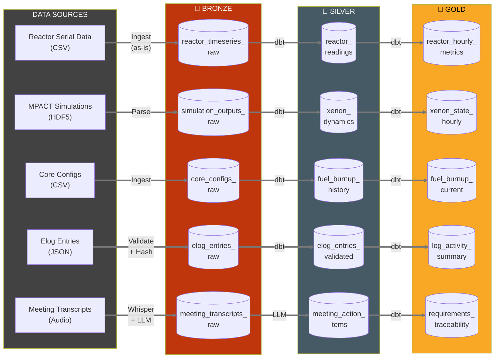

**Layer Characteristics:**

| Layer | Characteristics |
|-------|-----------------|
| **🥉 Bronze** | Raw, unprocessed • Schema-on-read • Append-only • Full history • Partition by date |
| **🥈 Silver** | Cleaned, validated • Deduplicated • Typed columns • Standardized formats • Partition by date+source |
| **🥇 Gold** | Business-ready • Aggregated metrics • Joined datasets • Dashboard-optimized • Partition by use |

### 5.2 Layer Specifications

#### 3.2.1 Bronze Layer

The Bronze layer stores raw, unprocessed data exactly as received from source systems. Data is append-only to preserve complete history and enable reprocessing.

| Table Name | Source | Schema | Partitioning | Retention |
|------------|--------|--------|--------------|-----------|
| reactor_timeseries_raw | Serial data CSV files | See Avro schema | **org_id**, **reactor_id**, date | Forever |
| simulation_outputs_raw | MPACT/SAM HDF5 outputs | See Avro schema | **org_id**, **reactor_id**, date, simulation_id | Forever |
| core_configs_raw | Core configuration CSVs | See Avro schema | **org_id**, **reactor_id**, config_date | Forever |
| elog_entries_raw | Elog JSON submissions | See Avro schema | **org_id**, **reactor_id**, date | Forever |
| meeting_transcripts_raw | Whisper transcriptions | See Avro schema | **org_id**, date, meeting_id | Forever |

> **Multi-Tenant Note:** All tables are partitioned first by `org_id` and `reactor_id` to enable efficient tenant isolation and RLS enforcement.

#### 3.2.2 Silver Layer

The Silver layer contains cleaned, validated, and deduplicated data. dbt transformations apply business rules and quality checks.

| Table Name | Source Bronze | Key Transformations | Quality Checks |
|------------|---------------|---------------------|----------------|
| reactor_readings | reactor_timeseries_raw | Null handling, unit conversion, outlier flagging, **add source='measured'** | Power >= 0, Temps within range |
| reactor_predictions | simulation_outputs_raw | Extract DT predictions, **add source='modeled'** | Within physical bounds |
| xenon_dynamics | simulation_outputs_raw | Extract Xe-135/I-135, calculate equilibrium | Conservation checks |
| fuel_burnup_history | core_configs_raw | Calculate delta burnup, join with positions | Monotonic burnup increase |
| log_entries_validated | log_entries_raw | Schema validation, hash verification, entry_type enum check | Required fields present |
| sample_tracking_validated | sample_tracking_raw | Validate metadata, assign sample_id if missing | Required fields, unique sample_name |
| meeting_action_items | meeting_transcripts_raw | LLM extraction, assignee resolution | Has owner, has date |

> **Note (Jan 2026):** Per Nick Luciano, all reactor metrics now include a `source` column (`'measured'` or `'modeled'`) to clearly distinguish sensor readings from MPACT shadow predictions. DT predictions should overlay measured data in dashboards with clear visual distinction.

#### 3.2.3 Gold Layer

The Gold layer contains business-ready, aggregated datasets optimized for analytics. These tables directly support Superset dashboards.

| Table Name | Business Purpose | Primary Consumers | Update Frequency |
|------------|------------------|-------------------|------------------|
| reactor_hourly_metrics | Aggregated reactor performance (measured + modeled with source column) | Ops Dashboard, Performance Analytics | Hourly |
| xenon_state_hourly | Hourly xenon poisoning state | Performance Analytics | Hourly |
| rod_height_xenon_correlation | Critical rod height as xenon proxy (derived) | Performance Analytics | Hourly |
| fuel_burnup_current | Current fuel element burnup | Performance Analytics, Core Planning | Daily |
| rod_positions_hourly | Control rod position history | Ops Dashboard, Performance Analytics | Hourly |
| log_activity_summary | Unified log metrics by entry_type | Log Activity Dashboard | Daily |
| sample_tracking_current | Current sample status and metadata | Experiment Tracking Dashboard | On insert/update |
| requirements_traceability | Meeting → GitLab linkage | Audit Dashboard, PM tools | On-demand |

> **Note (Jan 2026):** `ops_activity_summary` renamed to `log_activity_summary` to support unified log with entry_type breakdown. Added `rod_height_xenon_correlation` per Nick (cannot measure xenon directly, correlate with critical rod heights). Added `sample_tracking_current` for experiment tracking.

### 5.3 Data Flow Diagrams

#### Reactor Data Pipeline

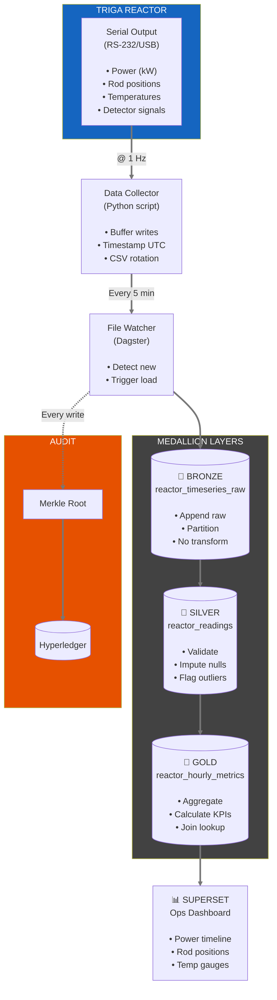

#### Agentic Data Ecosystem

The meeting intake pipeline below is **one instance of a broader agentic data pattern**. Neutron OS includes a master-planned ecosystem where LLM-powered agents process unstructured inputs and route to structured outputs. The architecture is designed to accommodate multiple input channels and output targets:

**Input Channels (Current & Planned):**
- Meeting recordings → transcription → action items
- Document uploads (PDFs, reports) → extraction → structured data
- Project updates (Slack, email) → parsing → status tracking
- Human notifications → triage → issue creation

**Output Targets:**
- GitLab/GitHub (issues, comments, merge requests)
- Slack/Teams (notifications, summaries)
- Dashboards (status updates, metrics)
- Elog (operational records)
- Calendar (scheduling, reminders)

The agentic layer uses **pgvector for RAG** (finding related context) and **configurable LLMs** for generation. Human-in-the-loop review ensures quality before automated actions.

##### Meeting Intake Pipeline (Example)

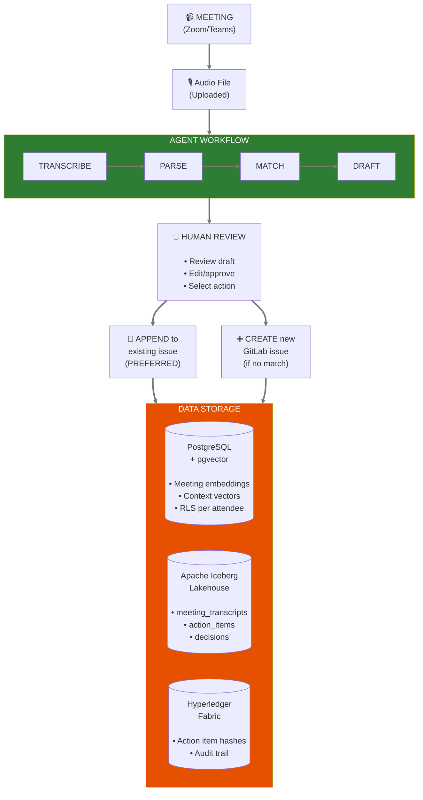

### 5.4 Gold Layer Schema Definitions

The following schemas define the structure of Gold layer tables that support Superset dashboards. All schemas use Apache Avro format for schema evolution and compatibility.

#### 3.4.1 reactor_hourly_metrics

> **Update (Jan 2026):** Added `source` column per Nick Luciano to distinguish measured vs modeled data. MPACT shadow predictions should be overlaid with measured data in dashboards with clear visual distinction.

| Field | Type | Description | Example |
|-------|------|-------------|---------|
| hour_timestamp | timestamp | Hour bucket (UTC) | 2026-01-15T14:00:00Z |
| source | enum | Data source: 'measured' or 'modeled' | measured |
| model_version | string | Model version if source='modeled' (nullable) | MPACT-v2.3 |
| avg_power_kw | float | Average power in kW | 950.5 |
| max_power_kw | float | Maximum power in hour | 1000.2 |
| min_power_kw | float | Minimum power in hour | 890.1 |
| avg_fuel_temp_c | float | Average fuel temperature °C | 285.3 |
| avg_water_temp_c | float | Average pool water temp °C | 32.1 |
| readings_count | int | Number of readings in hour | 3600 |
| data_quality_score | float | Quality metric (0-1) | 0.98 |

#### 3.4.2 xenon_state_hourly

> **Important (from Nick Luciano, Jan 2026):** *"[Xenon] cannot be measured directly, but can be correlated with critical rod heights."* This table contains **inferred** values from model calculations and/or rod height correlation, not direct measurements. Dashboard should display methodology note.

| Field | Type | Description | Example |
|-------|------|-------------|---------|
| hour_timestamp | timestamp | Hour bucket (UTC) | 2026-01-15T14:00:00Z |
| xe135_concentration | float | Xe-135 atoms/barn-cm (inferred) | 1.23e15 |
| i135_concentration | float | I-135 atoms/barn-cm (inferred) | 2.34e15 |
| reactivity_worth_pcm | float | Xenon reactivity worth (pcm) | -250.5 |
| equilibrium_flag | boolean | At equilibrium xenon? | true |
| source | enum | Data source | model, rod_correlation |
| critical_rod_height_pct | float | Rod height used for correlation | 72.5 |

#### 3.4.3 fuel_burnup_current

> **Stakeholder priority (Nick Luciano):** *"[Fuel burnup heatmap] would be great. Ultimately, a product of the code would be burnup values for individual fuel elements. I could see a time series of burnup being displayed."*
>
> **Operational insight (Jim):** *"We can ascertain a baseline fuel 'burn up' amount when starting up from a long period of shut down. During operation, fuel 'burn up' amounts can be tracked as well."*

| Field | Type | Description | Example |
|-------|------|-------------|---------|
| element_id | string | Fuel element identifier | B-04 |
| ring_position | string | Core ring (B,C,D,E,F,G) | B |
| angular_position | int | Position in ring (1-N) | 4 |
| u235_burnup_percent | float | U-235 depletion % | 12.5 |
| accumulated_mwd | float | Megawatt-days accumulated | 45.2 |
| baseline_mwd | float | Burnup at last long shutdown | 40.1 |
| delta_since_baseline | float | Burnup since baseline (operational tracking) | 5.1 |
| last_updated | timestamp | Last calculation date | 2026-01-15 |
| core_config_id | string | Source configuration | CONFIG_2026_01 |
| source | enum | Data source | model, manual |

#### 3.4.4 rod_positions_hourly

| Field | Type | Description | Example |
|-------|------|-------------|---------|
| hour_timestamp | timestamp | Hour bucket (UTC) | 2026-01-15T14:00:00Z |
| rod_name | string | Rod identifier | SHIM1 |
| avg_position_percent | float | Average position % | 75.2 |
| max_position_percent | float | Max position in hour | 80.0 |
| min_position_percent | float | Min position in hour | 70.5 |
| movement_count | int | Position changes | 3 |

#### 3.4.5 log_entries (Unified Log - Added Jan 2026)

> **Design Decision:** Single table with `entry_type` discriminator rather than separate tables. Enables cross-type queries while maintaining access control via RLS policies.

| Field | Type | Description | Example |
|-------|------|-------------|---------|
| entry_id | uuid | Unique entry identifier | 550e8400-e29b-41d4-a716-446655440000 |
| entry_number | string | Sequential number within year | 2026-042 |
| entry_type | enum | Type discriminator (see table below) | console_check |
| created_at | timestamp | Entry creation time (UTC, immutable) | 2026-01-15T14:32:00Z |
| author_id | string | User who created entry | j.smith |
| author_name | string | Display name | J. Smith (RO) |
| co_signer_id | string | Co-signing user (nullable) | m.jones |
| facility | string | Facility identifier | NETL |
| title | string | Entry title/summary | 30-min console check |
| content | text | Full entry content | All readings nominal. Power 950 kW... |
| category | string | Category tag (watch_type per Jim) | day_shift |
| run_number | int | Reactor run number (nullable) | 1234 |
| reactor_power_kw | decimal | Auto-populated from time-series | 950.0 |
| reactor_mode | enum | shutdown, startup, steady_state, power_change | steady_state |
| related_entry_ids | array[uuid] | Links to related entries | [] |
| supplements | array[object] | Correction supplements (see below) | [] |
| attachments | array[string] | File attachment URIs | [] |
| signature_hash | string | Cryptographic chain hash | 0x3a4b... |
| metadata | jsonb | Type-specific metadata (see below) | {} |

**Operations Entry Types (validated by Jim, Jan 2026):**

| Type | Description | Required Interval |
|------|-------------|-------------------|
| `console_check` | Mandatory 30-minute walkdown | Every 30 min while operating |
| `startup` | Reactor startup sequence | Per startup |
| `shutdown` | Reactor shutdown | Per shutdown |
| `scram` | Unplanned shutdown | Per event |
| `radiation_survey` | HP survey reading | Per survey |
| `experiment_log` | Sample insertion/removal | Per sample action |
| `maintenance` | Equipment issues/repairs | As needed |
| `general_note` | Miscellaneous notes | As needed |

> **Critical Requirement (from Jim):** *"A gap would mean that the :30 minute check was not performed when operating."* Dashboard must flag gaps > 30 min during operating periods.

**Supplement Schema (per Jim: "No deleting an entry—you should simply be able to add a supplement"):**

```json
{
  "supplement_id": "uuid",
  "timestamp": "2026-01-15T14:35:12Z",
  "author_id": "j.smith",
  "reason": "correction|clarification|addition",
  "body": "Correction: Power was 850 kW, not 950 kW."
}
```

**Type-Specific Metadata:**

| entry_type | metadata fields |
|------------|-----------------|
| console_check | `{instrument_readings: {channel_a: %, channel_b: %, pool_temp: °F}}` |
| ops (legacy) | `{shift_id, operator_initials, safety_system_status}` |
| dt | `{simulation_id, model_version, prediction_horizon_s, validation_mse}` |
| experiment | `{sample_id, experiment_id, pi_name}` |

**Access Control (PostgreSQL RLS):**

```sql
-- Operations staff see ops entries
CREATE POLICY ops_access ON log_entries 
  FOR SELECT USING (entry_type = 'ops' AND current_user_role() IN ('operator', 'facility_manager', 'dept_head'));

-- DT researchers see dt entries, optionally ops
CREATE POLICY dt_access ON log_entries
  FOR SELECT USING (entry_type = 'dt' OR (entry_type = 'ops' AND user_setting('include_ops') = 'true'));

-- Department heads see all
CREATE POLICY dept_head_access ON log_entries
  FOR SELECT USING (current_user_role() = 'dept_head');
```

#### 3.4.6 sample_tracking (Validated Jan 2026)

> **Source:** Requirements validated by Khiloni Shah (Jan 2026 questionnaire).  
> **Related PRD:** [Experiment Manager PRD](../prd/experiment-manager-prd.md)

| Field | Type | Description | Example | Required |
|-------|------|-------------|---------|----------|
| sample_id | uuid | System-assigned unique identifier | 550e8400-... | Auto |
| sample_name | string | Unique human-readable name | Au-foil-2026-001 | Yes |
| sample_description | string | Physical description (solid/liquid/gas) | "Gold foil, solid" | Yes |
| chemical_composition | string | Chemical formula (if known) | Au (99.99%) | **No** |
| isotopic_composition | jsonb | Isotope breakdown | {"Au-197": 1.0} | No |
| density_g_cm3 | float | Density in g/cm³ | 19.3 | No |
| mass_g | float | Mass in grams | 0.125 | Yes |
| irradiation_facility | enum | Facility (see dropdown) | CT | Yes |
| ops_request_number | string | 4-digit operations request number | 4521 | No |
| datetime_inserted | timestamp | When sample was inserted | 2026-01-15T10:00:00Z | On insert |
| datetime_removed | timestamp | When sample was removed (nullable) | 2026-01-15T12:00:00Z | On remove |
| reactor_power_kw | decimal | Power level during irradiation (correlated) | 950.0 | Auto |
| dose_rate_mrem_hr | decimal | Dose rate at removal (from yellow frisker) | 120.5 | On remove |
| decay_time_s | float | Decay time in seconds (calculated) | 7200 | Calculated |
| count_live_time_s | float | Counting live time | 1800 | On count |
| total_counts | int | Total detector counts | 1234567 | On count |
| total_activity_bq | float | Total activity in Becquerels | 1.5e6 | No |
| activity_by_isotope | jsonb | Activity breakdown by isotope | {"Au-198": 1.5e6} | No |
| spectra_uri | string | URI to raw spectrum file | s3://bucket/spectra/sample.h5 | No |
| status | enum | Sample status | completed | Yes |
| elog_entry_id | uuid | Link to operations log entry | 550e8400-... | Auto |

> **Key insight from Khiloni:** *"For 'unknown NAA samples'... you might be better off just asking for a description of the sample. Something like solid, liquid, gas. Molecular formula or composition might not always be available."*

**Prepopulated Dropdowns (validated by Khiloni Shah, Jan 2026):**

| Field | Options | Notes |
|-------|---------|-------|
| irradiation_facility | TPNT, EPNT, RSR, CT, F3EL, 3EL_Cd, 3EL_Pb, BP1, BP2, BP3, BP4, BP5 | See facility table below |
| status | planned, approved, scheduled, irradiating, removed, decaying, counting, analyzed, disposed | Reflects actual workflow |

**NETL Irradiation Facilities:**

| Code | Name | Type | Description |
|------|------|------|-------------|
| TPNT | Thermal Pneumatic | In-core | Standard NAA |
| EPNT | Epithermal Pneumatic | In-core | Epithermal activation |
| RSR | Rotary Specimen Rack | In-core | Long irradiations |
| CT | Central Thimble | In-core | Highest flux position |
| F3EL | Fast 3-Element | In-core | Fast neutron spectrum |
| 3EL_Cd | Cd-lined 3-Element | In-core | Cadmium-covered |
| 3EL_Pb | Pb-lined 3-Element | In-core | Lead-shielded |
| BP1-BP5 | Beam Ports 1-5 | Ex-core | External experiments |

> *Note from Khiloni: "you'll probably want someone on the reactor staff to look this over. They'll know better than me."*

### 5.5 Data Quality Framework

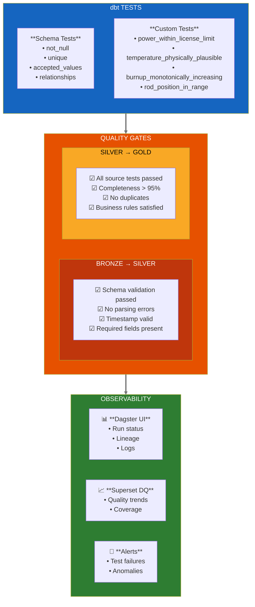

### 5.6 Apache Iceberg Configuration

Apache Iceberg would provide the table format for all lakehouse data, enabling:

- **Time-travel queries:** Query data as it existed at any point in time
- **Schema evolution:** Add/rename/drop columns without rewriting data
- **Partition evolution:** Change partitioning strategy without data movement
- **Hidden partitioning:** Automatic partition pruning for users
- **ACID transactions:** Concurrent reads and writes with consistency

#### 3.6.1 Catalog Configuration

| Property | Development | Production |
|----------|-------------|------------|
| Catalog Type | PostgreSQL (K3D) | AWS Glue or Hive Metastore |
| Storage | Local filesystem | S3 or equivalent object store |
| Snapshot Retention | 10 snapshots | 100 snapshots |
| Time-travel Window | 7 days | 90 days |

#### 3.6.2 Partitioning Strategy

| Table | Partition Columns | Rationale |
|-------|-------------------|-----------|
| reactor_timeseries_raw | year(timestamp), month(timestamp) | Time-based queries, archival |
| reactor_hourly_metrics | year(hour_timestamp), month(hour_timestamp) | Dashboard date filters |
| elog_entries_raw | year(created_at) | Audit queries by year |
| meeting_transcripts_raw | year(meeting_date), meeting_id | Per-meeting access |

### 5.7 Platform Comparison: Open-Source vs Commercial Data Platforms

We evaluated commercial data platforms (Databricks, Snowflake) against our open-source approach (Apache Iceberg + DuckDB + dbt). This section documents the trade-offs that informed our architecture decision.

#### 4.7.1 Evaluation Criteria

| Criterion | Weight | Rationale |
|-----------|--------|----------|
| Total Cost of Ownership | High | University budgets are constrained; multi-year sustainability matters |
| Data Sovereignty | Critical | Nuclear data may have export control, ITAR, or institutional policy constraints |
| Customization Depth | High | Nuclear DTs require deep integration with physics codes (MCNP, MPACT, SAM) |
| ML Pipeline Flexibility | High | UQ research requires custom model architectures, not just AutoML |
| Vendor Lock-in Risk | Medium | 5-10 year research programs shouldn't depend on vendor pricing changes |
| On-Premise Deployment | Medium | Some facilities may require air-gapped or isolated deployments |
| Community & Reproducibility | Medium | Open-source enables peer review of data pipelines in publications |

#### 4.7.2 Detailed Comparison

| Platform | Strengths | Limitations |
|----------|-----------|-------------|
| **Databricks** | • Unified analytics platform<br/>• MLflow integration<br/>• Collaborative notebooks<br/>• Delta Lake format<br/>• Enterprise support | • $15K-100K+/year<br/>• Cloud-only (mostly)<br/>• Vendor lock-in<br/>• Complex pricing (DBUs) |
| **Snowflake** | • Near-zero administration<br/>• Instant elastic scaling<br/>• Data marketplace<br/>• Time-travel queries<br/>• Enterprise support | • $20K-150K+/year<br/>• Cloud-only<br/>• Proprietary format<br/>• Costs can spike unexpectedly |
| **Neutron OS**<br/>(Open Source) | • Zero licensing cost<br/>• Full customization<br/>• No vendor lock-in<br/>• Physics code integration<br/>• On-premise or cloud<br/>• Reproducible research | • In-house expertise required<br/>• No vendor SLA<br/>• Integration effort<br/>• Documentation burden |

#### 4.7.3 Decision Matrix

| Factor | Databricks | Snowflake | Open-Source (Iceberg + DuckDB) |
|--------|------------|-----------|--------------------------------|
| **Annual Cost (est.)** | $15,000 - $100,000+ | $20,000 - $150,000+ | ~$0 (infrastructure only) |
| **Data Sovereignty** | ⚠️ Cloud tenant | ⚠️ Cloud tenant | ✅ Full control |
| **Physics Code Integration** | ⚠️ Custom connectors needed | ⚠️ Limited | ✅ Native Python/HDF5 |
| **ML/UQ Flexibility** | ✅ MLflow, but constrained | ⚠️ Limited ML | ✅ Any framework |
| **On-Premise Option** | ⚠️ Limited (Databricks on Azure Stack) | ❌ None | ✅ Full support |
| **Scaling to 100+ TB** | ✅ Excellent | ✅ Excellent | ⚠️ Requires tuning |
| **Admin Overhead** | ✅ Low | ✅ Very Low | ⚠️ Moderate |
| **Vendor Lock-in** | ⚠️ Delta Lake | ❌ Proprietary | ✅ Open standards |
| **Research Reproducibility** | ⚠️ Platform-dependent | ⚠️ Platform-dependent | ✅ Fully auditable |
| **Community Contribution** | ❌ Closed platform | ❌ Closed platform | ✅ Open-source |

#### 4.7.4 Use Case Fit Analysis

**Where Databricks/Snowflake Excel:**
- Large enterprise deployments with dedicated data engineering teams
- Organizations prioritizing time-to-production over customization
- Workloads requiring instant elastic scaling (100s of concurrent users)
- Teams without deep data infrastructure expertise
- Commercial applications with predictable, substantial budgets

**Where Open-Source Excels (Our Requirements):**
- Research environments requiring deep physics code integration
- Projects with uncertain long-term funding (no per-compute pricing risk)
- Applications requiring on-premise or air-gapped deployment options
- Custom ML/UQ pipelines that don't fit standard AutoML patterns
- Academic reproducibility requirements (peer-reviewable data pipelines)
- Multi-institution collaboration where licensing complexity is a barrier
- Building workforce skills transferable across industry (standard tools)

#### 4.7.5 Our Decision Rationale

We chose the open-source stack for Neutron OS based on:

1. **Budget sustainability:** University research operates on grant cycles; eliminating per-compute costs removes budget uncertainty
2. **Nuclear-specific integration:** MCNP, MPACT, SAM, and HDF5 outputs require custom parsers that integrate cleanly with Python-native tooling
3. **On-premise flexibility:** Some partner facilities may require isolated deployments; commercial platforms make this difficult or impossible
4. **Research integrity:** Open-source pipelines can be published, peer-reviewed, and reproduced by other institutions
5. **Workforce development:** Students learn industry-standard tools (dbt, Iceberg, K8s) rather than proprietary platforms
6. **Community leverage:** Contributions benefit the broader nuclear data community; improvements flow back to us

> **Note:** This decision is not permanent. If Neutron OS scales to support dozens of facilities with thousands of concurrent users, we would revisit commercial options for operational simplicity. The open formats (Iceberg, Parquet) we use today ensure migration remains feasible.

#### 4.7.6 Hybrid Considerations

A hybrid approach could capture benefits of both:

| Scenario | Recommendation |
|----------|----------------|
| UT Austin + 2-3 partners | Open-source (current approach) |
| 10+ facilities, heavy concurrent load | Consider Databricks for compute, keep Iceberg for storage |
| Commercial spin-off | Evaluate Snowflake/Databricks for enterprise customers |
| DOE lab deployment | Likely requires on-premise; open-source preferred |

### 5.8 Event-Driven Architecture & Streaming Readiness

> **Design Decision:** Build for streaming; use batch as fallback.
>
> See [ADR 007: Streaming-First Architecture](../adr/007-streaming-first-architecture.md)

#### 4.8.1 Design Principle

The proposed design would capture every data update as an **event** that flows through the streaming infrastructure. This would enable:
- **Real-time updates** (Primary): Events would flow through Kafka to WebSocket subscribers immediately
- **Batch aggregations** (Secondary): Same events could be consumed by Dagster for historical rollups
- **Graceful degradation**: If streaming fails, batch processing could catch up from event log
- **Audit completeness**: Event log would provide complete history for compliance

**Why streaming-first?** As commercial reactor deployments accelerate, data volumes will grow from megabytes to petabytes per facility. Fleet operators will manage dozens of units simultaneously. Streaming-first architecture handles this scale natively—real-time anomaly detection across a fleet, instant propagation of operating limits, coordinated load-following across multiple units. Building streaming from day one means we're ready for commercial scale without architectural rewrites.

#### 4.8.2 Event Schema Pattern

All domain events would follow a common envelope:

```json
{
  "event_id": "uuid-v7",
  "event_type": "elog.entry.created",
  "timestamp": "2026-01-21T14:32:00.000Z",
  "facility_id": "netl-triga",
  "user_id": "jsmith",
  "payload": {
    "entry_id": "...",
    "content": "..."
  },
  "metadata": {
    "source": "web-ui",
    "version": "1.0"
  }
}
```

#### 4.8.3 Latency Tiers

| Tier | Latency | Implementation | Use Cases |
|------|---------|----------------|-----------|
| **Real-time** | < 1 second | WebSocket push via Kafka | Concurrent editing, 30-min check timer, alerts |
| **Streaming** | < 10 seconds | Kafka + Flink | Ops Log sync, position tracking, production queue |
| **Near-real-time** | 5-15 minutes | Polling fallback | Degraded mode when streaming unavailable |
| **Batch** | 1-24 hours | Dagster scheduled jobs | Historical aggregations, burnup calculations, NRC reports |

#### 4.8.4 UI Freshness Pattern

With streaming-first, **"Live" is the default**. UI only shows warnings when streaming is degraded:

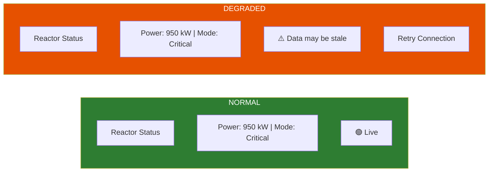

**Connection status:**
- 🟢 **Live**: WebSocket connected, receiving events
- 🟠 **Stale**: WebSocket disconnected, showing cached data
- 🔴 **Offline**: No connection, batch fallback active

#### 4.8.5 Streaming Architecture

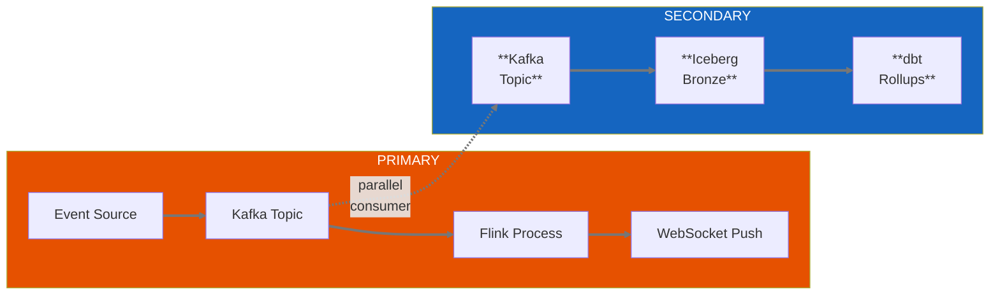

**Batch fallback activates automatically** when streaming is unavailable. Users see a warning; system continues operating.

#### 4.8.6 Module Streaming Priority

Based on user impact and safety considerations:

| Priority | Module / Feature | Rationale |
|----------|-----------------|-----------|
| **High** | Ops Log console sync | Safety: concurrent editing awareness |
| **High** | 30-minute check timer | Compliance: shared countdown across consoles |
| **High** | Facility entrance display | Visibility: high-traffic, simple data |
| **Medium** | Sample location tracking | Efficiency: real-time position status |
| **Medium** | Production order status | Customer satisfaction: order tracking |
| **Medium** | Approval notifications | Workflow: unblock researchers quickly |
| **Low** | Burnup dashboard | Physics: changes slowly over days/weeks |
| **Low** | Historical analytics | By definition, not time-sensitive |

#### 4.8.7 API Design (WebSocket-First)

WebSocket is the primary API; REST provides fallback and initial data load:

```typescript
// PRIMARY: WebSocket subscription
const ws = new NeutronOSClient('wss://api.neutron-os.io/v1/stream');
ws.subscribe('opslog.entries', { facility: 'netl-triga' }, (event) => {
  appendEntry(event.data);  // Real-time updates
});

// FALLBACK: REST for initial load or degraded mode
GET /api/v1/opslog/entries?facility=netl-triga&since=2026-01-21T14:00:00Z
Response: { 
  entries: [...], 
  last_updated: "2026-01-21T14:32:00Z",
  streaming_available: true,
  ws_endpoint: "wss://api.neutron-os.io/v1/stream"
}
```

---

## 6. Component Specifications

### 6.1 Component Overview

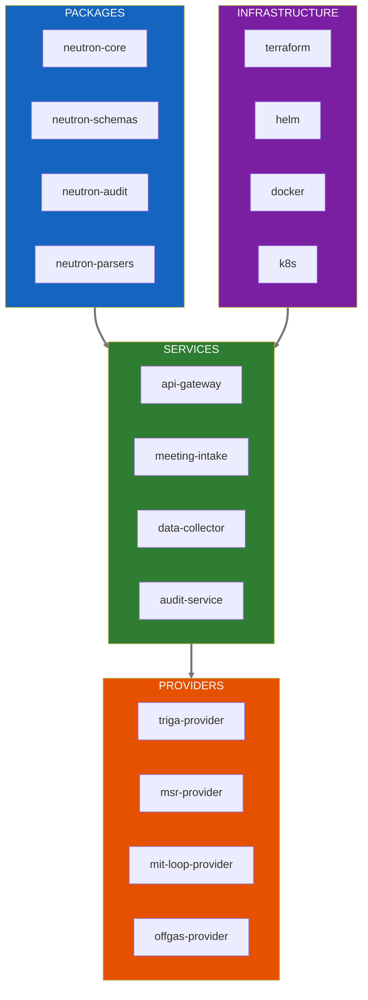

### 6.2 Package Specifications

#### 4.2.1 neutron-core

| Property | Value |
|----------|-------|
| Language | Python 3.11+ |
| Purpose | Shared configuration, logging, and utilities |
| Dependencies | pydantic, structlog, python-dotenv |
| Status | Planned |

> **[PLACEHOLDER: neutron-core API documentation]**
> → Document configuration loaders, logging setup, and utility functions

#### 4.2.2 neutron-schemas

| Property | Value |
|----------|-------|
| Language | Avro schemas + Python bindings |
| Purpose | Schema definitions and validation |
| Dependencies | fastavro, pydantic |
| Status | In Progress |

#### 4.2.3 neutron-audit

| Property | Value |
|----------|-------|
| Language | Python + Go |
| Purpose | Blockchain integration and audit trail |
| Dependencies | hyperledger-fabric-sdk, merkle-tree |
| Status | Planned |

> **[PLACEHOLDER: neutron-audit API documentation]**
> → Document Merkle tree computation, Fabric SDK usage, proof generation

### 6.3 Service Specifications

#### 4.3.1 meeting-intake Service

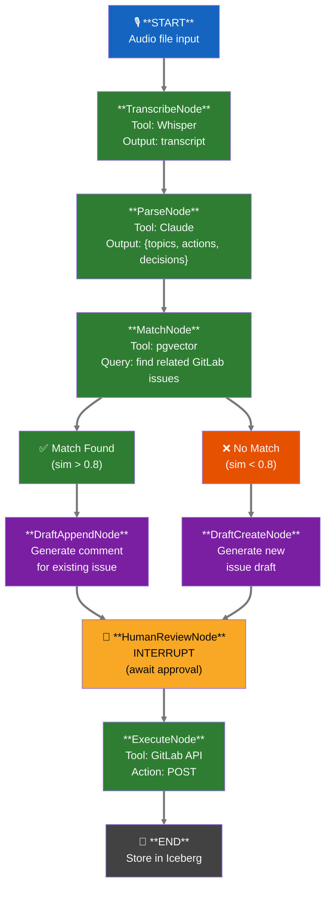

---

## 7. API Specifications

### 7.1 Unified Query Architecture

The proposed architecture would support both **SQL and GraphQL** interfaces, potentially through integration with INL's DeepLynx or a custom-built GraphQL layer, unified through an intelligent query router.

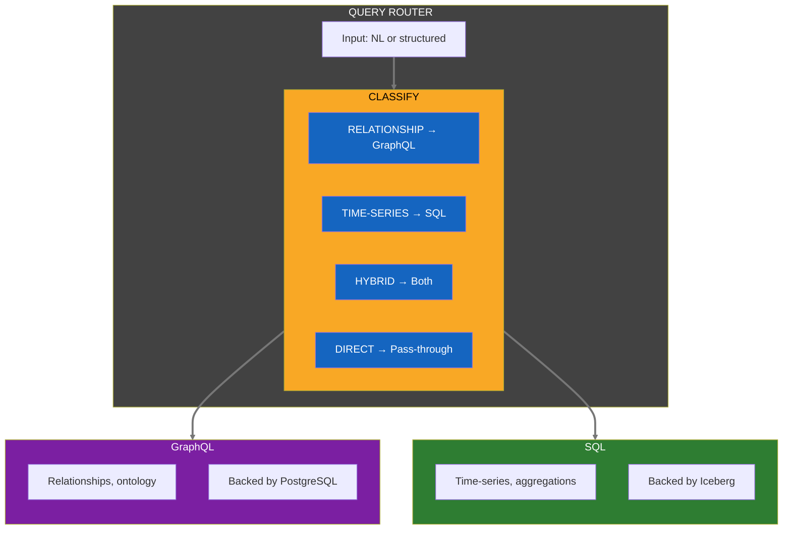

#### 6.1.1 Why Both GraphQL AND SQL?

| Query Pattern | Best Interface | Example | Reason |
|---------------|----------------|---------|--------|
| Asset relationships | **GraphQL** | "What detectors are in the primary loop?" | Graph traversal is native |
| Limit definitions | **GraphQL** | "What limits apply to fuel temp?" | Hierarchical data |
| Time-series trends | **SQL** | "Show power for last 7 days" | Aggregation, window functions |
| ML training data | **SQL** | Extract features for model training | pandas/DuckDB native |
| BI dashboards | **SQL** | Superset queries | SQL-native tool |
| INL interoperability | **GraphQL** | Compatible with DeepLynx API pattern | Ontology alignment |

#### 6.1.2 Dynamic Schema Generation (DeepLynx Pattern)

Like INL's DeepLynx, our GraphQL schema is **dynamically generated** from the ontology:

```python
 Schema auto-reflects ontology changes
 When you add a Detector class → GraphQL type becomes available

query {
    __schema {
        types { name }  # Returns: Detector, ControlElement, Limits, etc.
    }
}

 Query by class (metatype in DeepLynx terminology)
query {
    metatypes {
        Detector(nrad_class: {operator: "eq", value: "Control Element"}) {
            tag_name
            limits { safety_importance, reference }
        }
    }
}
```

### 7.2 REST API Endpoints

| Endpoint | Method | Purpose | Auth |
|----------|--------|---------|------|
| /api/v1/reactor/metrics | GET | Query reactor metrics | API Key |
| /api/v1/elog/entries | POST | Submit elog entry | JWT + Role |
| /api/v1/elog/entries/{id} | GET | Retrieve elog entry | JWT |
| /api/v1/audit/verify/{hash} | GET | Verify data integrity | API Key |
| /api/v1/audit/evidence/{id} | GET | Download evidence package | JWT + Auditor |
| /api/v1/meetings/intake | POST | Submit meeting recording | JWT |

### 7.3 GraphQL Endpoint

| Endpoint | Method | Purpose | Auth |
|----------|--------|---------|------|
| /graphql | POST | Ontology queries, relationships, limits | JWT |
| /graphql/introspect | POST | Schema introspection | JWT |

### 7.4 SQL Endpoint

| Endpoint | Method | Purpose | Auth |
|----------|--------|---------|------|
| /sql | POST | Time-series, analytics queries | JWT |
| /sql/explain | POST | Query plan explanation | JWT |

---

## 8. Security Architecture

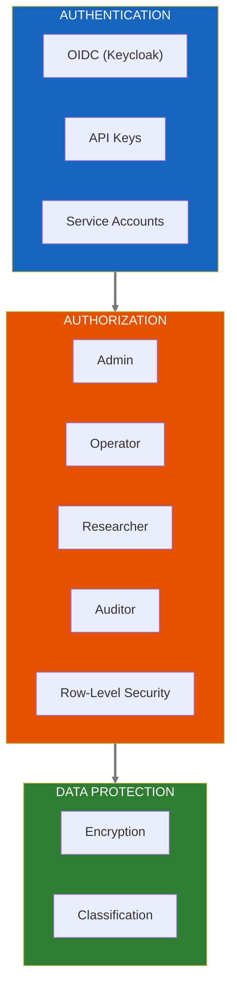

---

## 9. Infrastructure & Deployment

### 9.1 Environment Overview

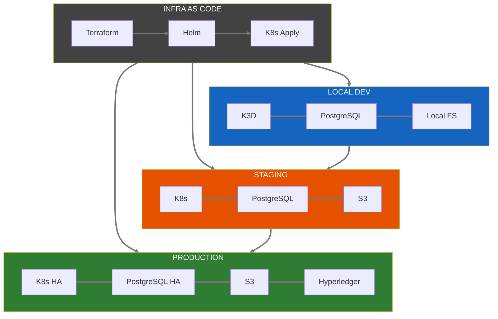

### 9.2 Resource Requirements

| Component | Local Dev | Staging | Production |
|-----------|-----------|---------|------------|
| Kubernetes Nodes | 1 (K3D) | 1-2 | 3+ (HA) |
| CPU (total cores) | 4 | 8 | 32+ |
| Memory (GB) | 8 | 16 | 64+ |
| Storage (GB) | 50 | 200 | 1000+ |
| GPU (Whisper) | Optional | 1x T4 | 2x T4 |

> **[PLACEHOLDER: Terraform Module Documentation]**
> → Document terraform modules for AWS/Azure/GCP deployment

> **[PLACEHOLDER: Helm Chart Documentation]**
> → Document helm charts for each service

---

## 10. Integration Points

### 10.0 Proposed INL Partnership: Complementary Platform Model

> **January 2026:** Neutron OS and DeepLynx are independent platforms. This section outlines optional interoperability for facilities using both.

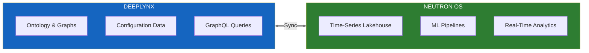

> **Vision:** INL keeps DeepLynx for ontology management; Neutron OS adds the analytics layer.

#### What We Would Adopt from DeepLynx/NRAD

| Category | Adopted Standards |
|----------|-------------------|
| **Ontology Vocabulary** | Class names (Detector, Control Element, Limits, Analysis), Property names (safety_importance, required_logic), Tag naming `{ORG}_{REACTOR}_*` pattern, Relationship types (consists_of, sends_data_to) |
| **Limits Schema** | Safety importance levels ('Safety limit', 'LCO', 'Scram function'), Voting logic ('2 of 3', '3 of 3'), SAR/TSR references ('TSR-406 pg. 17') |
| **Dynamic GraphQL Schema** | Schema auto-generated from ontology, Introspection for discovery, Tenant-scoped queries by default |

#### Proposed Multi-Tenant Features for INL

| Feature | Capabilities |
|---------|--------------|
| **Tenant Isolation (RLS)** | All queries scoped by org_id automatically, INL sees only INL data by default, Cross-tenant sharing requires explicit grant |
| **Independent Reactor Namespaces** | NRAD, TREAT, ATR each get reactor_id, Separate DT models per reactor, Independent elog streams |
| **Shared Resources (Cross-Tenant)** | Ontology registry (read access), Benchmarking datasets (opt-in), Model validation results (opt-in), TRIGA-to-TRIGA comparisons |
| **Org-Specific Customization** | Custom dashboards per org, Org-specific LLM fine-tuning, Integration with existing tools (GitLab, Slack) |

#### Potential Cross-Facility Analytics (Opt-In)

With consent, this integration could enable powerful multi-facility analysis:

- **TRIGA Benchmarking:** Compare NETL vs NRAD xenon dynamics, control rod response, fuel burnup patterns
- **Model Validation:** Test DT models against multiple reactor datasets
- **Anomaly Detection:** Train on combined fleet data for rare event detection
- **Regulatory Harmonization:** Consistent audit formats across facilities

#### Proposed Phased Onboarding for INL

```mermaid
flowchart LR
    subgraph P1["Phase 1"]
        P1A["NRAD DT onboarding"]
        P1B["Tag mapping"]
        P1C["Read-only dashboards"]
    end

    subgraph P2["Phase 2"]
        P2A["Full NRAD pipeline"]
        P2B["INL elog integration"]
        P2C["TREAT DT pilot"]
    end

    subgraph P3["Phase 3"]
        P3A["ATR DT integration"]
        P3B["TRIGA benchmarking"]
        P3C["Shared model registry"]
    end

    P1 --> P2 --> P3

    style P1 fill:#1565c0,color:#fff
    style P2 fill:#e65100,color:#fff
    style P3 fill:#2e7d32,color:#fff
    linkStyle default stroke:#777777,stroke-width:3px
```

### 10.1 Internal Integration Architecture

```mermaid
flowchart LR
    subgraph EXTERNAL["EXTERNAL"]
        direction TB
        GITLAB["GitLab"]
        SLACK["Slack"]
        MPACT["MPACT"]
        SAM["SAM"]
        NEK["Nek5000"]
    end

    subgraph HUB["NEUTRON OS HUB"]
        direction TB
        EVENTBUS["Event Bus"]
        APIGATEWAY["API Gateway"]
        DATALAKE["Data Lake"]
    end

    subgraph PROJECTS["PROJECTS"]
        direction TB
        TRIGA["TRIGA DT"]
        MSR["MSR DT"]
        MIT["MIT Loop"]
        OFFGAS["OffGas DT"]
    end

    GITLAB <-->|"REST API"| HUB
    SLACK <-->|"Webhooks"| HUB
    MPACT -->|"HDF5 Parser"| HUB
    SAM -->|"Parser"| HUB
    NEK -->|"Parser"| HUB

    HUB <-->|"Provider"| TRIGA
    HUB <-->|"Provider"| MSR
    HUB <-->|"Provider"| MIT
    HUB <-->|"Provider"| OFFGAS

    style EXTERNAL fill:#1565c0,color:#fff
    style HUB fill:#e65100,color:#fff
    style PROJECTS fill:#2e7d32,color:#fff
    linkStyle default stroke:#777777,stroke-width:3px
```

---

## 11. Performance Requirements

### 11.1 Latency Requirements

| Operation | Target Latency | Measurement Point |
|-----------|---------------|-------------------|
| Dashboard page load | < 3 seconds | Browser to rendered charts |
| Simple query (single table) | < 500ms | API request to response |
| Complex query (joins) | < 2 seconds | API request to response |
| Data ingestion | < 5 minutes | Source to Bronze layer |
| Transform pipeline | < 10 minutes | Bronze to Gold refresh |
| Audit hash computation | < 1 second | Per data batch |

### 11.2 Throughput Requirements

| Metric | Target | Notes |
|--------|--------|-------|
| Reactor data ingestion | 1 Hz sustained | Per serial connection |
| Concurrent dashboard users | 50+ | With caching |
| Daily data volume | 1+ GB | All sources combined |
| Meeting transcriptions | 10/day | Whisper processing |

> **[PLACEHOLDER: Performance Testing Plan]**
> → Define load testing scenarios and acceptance criteria

---

## 12. Appendices

 A. Architecture Decision Records

The following ADRs document key technical decisions:

| ADR | Title | Status |
|-----|-------|--------|
| ADR-001 | Build System: Bazel for Polyglot Monorepo | Proposed |
| ADR-002 | Blockchain: Hyperledger Fabric for Multi-Facility Audit | Proposed |
| ADR-003 | Lakehouse: Apache Iceberg + DuckDB | Proposed |
| ADR-004 | Infrastructure: Terraform + K8s + Helm | Proposed |
| ADR-005 | Meeting Intake: LangGraph + pgvector | Proposed |

 B. Glossary

#### Nuclear & Regulatory Terms

| Term | Definition |
|------|------------|
| ATR | Advanced Test Reactor (INL) |
| Control Rod | Neutron-absorbing element used to regulate reactor power |
| DT | Digital Twin - virtual representation synchronized with physical asset |
| eLOG | Electronic logbook for operator entries and reactor events |
| Flux | Neutron flux - measure of neutron intensity (neutrons/cm²/s) |
| FSAR | Final Safety Analysis Report |
| LCO | Limiting Condition for Operation - safety limit from Technical Specifications |
| NETL | Nuclear Engineering Teaching Laboratory (UT Austin) |
| NRAD | Neutron Radiography Reactor (INL) |
| NRC | Nuclear Regulatory Commission |
| Reactivity | Measure of departure from criticality (ρ or Δk/k) |
| SAR | Safety Analysis Report |
| SCRAM | Emergency reactor shutdown (Safety Control Rod Axe Man) |
| TREAT | Transient Reactor Test Facility (INL) |
| TRIGA | Training, Research, Isotopes, General Atomics - reactor type |
| TSR | Technical Safety Requirements |
| Xenon Dynamics | Transient poisoning effects from Xe-135 buildup/decay |

#### Data Architecture Terms

| Term | Definition |
|------|------------|
| Bronze Layer | Raw, unprocessed data as received from sources |
| Silver Layer | Cleaned, validated, and deduplicated data |
| Gold Layer | Business-ready, aggregated datasets for analytics |
| Iceberg | Open table format for large analytic datasets with time-travel |
| Lakehouse | Architecture combining data lake flexibility with warehouse structure |
| Merkle Root | Cryptographic hash representing data integrity of a dataset |
| Parquet | Columnar storage format optimized for analytics |
| RLS | Row-Level Security - database access control per row |
| Time-travel | Ability to query data as it existed at a past point in time |

#### Architecture & Integration Terms

| Term | Definition |
|------|------------|
| Extension Point | Registration mechanism for external providers |
| Factory | Internal instantiation pattern that creates provider instances |
| GraphQL | Query language for APIs with typed schema |
| Helm | Package manager for Kubernetes applications |
| K3D | Lightweight Kubernetes in Docker for local development |
| MCP | Model Context Protocol - standard for LLM tool integration |
| OPC-UA | Open Platform Communications Unified Architecture - industrial protocol |
| Provider | External implementation conforming to a factory interface |
| SPI | Service Provider Interface - plugin discovery pattern |
| Terraform | Infrastructure as Code tool for cloud provisioning |

#### ML & Analytics Terms

| Term | Definition |
|------|------------|
| Agentic | AI system capable of autonomous reasoning and tool use |
| Embedding | Dense vector representation of text or data for similarity search |
| Fine-tuning | Adapting a pre-trained model to domain-specific data |
| LLM | Large Language Model |
| RAG | Retrieval-Augmented Generation - combining search with LLM |
| Surrogate Model | Fast approximation of expensive physics simulations |
| Vector Store | Database optimized for similarity search on embeddings |

#### Neutron OS-Specific Terms

| Term | Definition |
|------|------------|
| Compliance Module | Automated NRC reporting and audit trail generation |
| DataTransformer | Interface for Bronze→Silver→Gold data transformations |
| Ingest Module | Data acquisition from OPC-UA, Modbus, file uploads |
| Reactor Provider | Configuration bundle defining reactor type characteristics |
| Simulator Module | Physics model execution (SAM, RELAP, PARCS) |
| Surrogate Module | ML-based fast approximations of physics models |

 C. References

- Apache Iceberg: https://iceberg.apache.org/
- DuckDB: https://duckdb.org/
- Apache Superset: https://superset.apache.org/
- Hyperledger Fabric: https://www.hyperledger.org/use/fabric
- LangGraph: https://github.com/langchain-ai/langgraph
- dbt: https://www.getdbt.com/
- Dagster: https://dagster.io/

> **[PLACEHOLDER: Additional Appendices]**
> → Add detailed schemas, API specs, test plans as developed

---

*Document generated: January 15, 2026*
